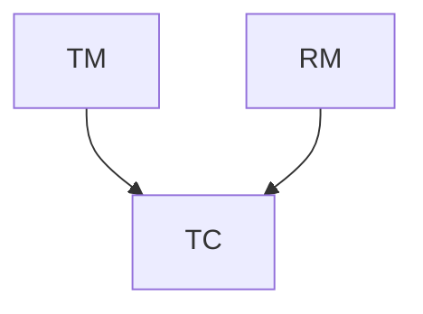
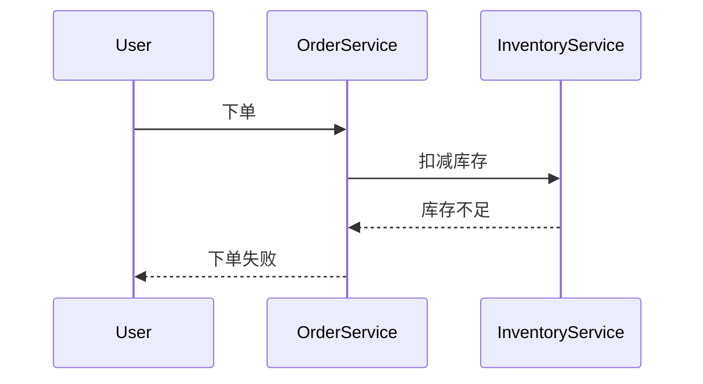

# Seata 生产环境部署

## 介绍

Seata 是一款开源的分布式事务解决方案，旨在解决微服务架构下的数据一致性问题。在生产环境中，Seata 的部署和配置至关重要，因为它直接影响到系统的稳定性和性能。本文将逐步讲解如何在生产环境中部署 Seata，并提供实际案例和代码示例。

## Seata 架构概述

Seata 的架构主要由三个核心组件组成：

1. **Transaction Coordinator (TC)**: 事务协调器，负责全局事务的提交和回滚。
2. **Transaction Manager (TM)**: 事务管理器，负责开启、提交或回滚全局事务。
3. **Resource Manager (RM)**: 资源管理器，负责管理分支事务的资源。



## 生产环境部署步骤

### 1. 环境准备

在部署 Seata 之前，确保你的生产环境满足以下要求：

- JDK 1.8 或更高版本
- MySQL 或其他支持的数据库
- Nacos、Zookeeper 或 Consul 作为注册中心和配置中心

### 2. 下载和配置 Seata

首先，从 [Seata 官方 GitHub 仓库](https://github.com/seata/seata) 下载最新版本的 Seata。

解压后，进入 `conf` 目录，编辑 `file.conf` 和 `registry.conf` 文件。

#### 配置 `file.conf`

```plaintext
## 事务存储配置
store {
  ## 存储模式，支持 file、db、redis
  mode = "db"

  ## 数据库存储配置
  db {
    datasource = "druid"
    dbType = "mysql"
    driverClassName = "com.mysql.cj.jdbc.Driver"
    url = "jdbc:mysql://127.0.0.1:3306/seata"
    user = "root"
    password = "password"
  }
}
```

#### 配置 `registry.conf`

```plaintext
registry {
  type = "nacos"
  nacos {
    serverAddr = "127.0.0.1:8848"
    namespace = ""
    cluster = "default"
  }
}

config {
  type = "nacos"
  nacos {
    serverAddr = "127.0.0.1:8848"
    namespace = ""
    group = "SEATA_GROUP"
  }
}
```

### 3. 启动 Seata Server

在配置完成后，可以通过以下命令启动 Seata Server：

```bash
sh bin/seata-server.sh
```

:::tip
在生产环境中，建议将 Seata Server 部署为集群模式，以提高可用性和性能。
:::

### 4. 集成 Seata 到微服务

在微服务中集成 Seata 时，需要在每个服务中添加 Seata 的依赖，并配置 `application.yml` 文件。

#### Maven 依赖

```xml
<dependency>
    <groupId>io.seata</groupId>
    <artifactId>seata-spring-boot-starter</artifactId>
    <version>1.4.2</version>
</dependency>
```

#### 配置 `application.yml`

```yaml
seata:
  enabled: true
  application-id: ${spring.application.name}
  tx-service-group: my_tx_group
  service:
    vgroup-mapping:
      my_tx_group: default
    grouplist:
      default: 127.0.0.1:8091
```

### 5. 测试分布式事务

在微服务中，可以通过以下代码示例测试分布式事务：

```java
@GlobalTransactional
public void purchase(String userId, String commodityCode, int orderCount) {
    // 扣减库存
    storageService.deduct(commodityCode, orderCount);
    // 创建订单
    orderService.create(userId, commodityCode, orderCount);
}
```

:::note
`@GlobalTransactional` 注解用于标记一个全局事务，确保所有分支事务要么全部提交，要么全部回滚。
:::

## 实际案例

假设我们有一个电商系统，包含订单服务和库存服务。当用户下单时，订单服务会调用库存服务扣减库存。如果库存不足，整个事务需要回滚，确保数据一致性。



## 总结

在生产环境中部署 Seata 需要仔细配置和测试，以确保系统的稳定性和数据一致性。本文介绍了 Seata 的架构、部署步骤以及如何集成到微服务中，并通过实际案例展示了 Seata 的应用场景。

## 附加资源

- [Seata 官方文档](https://seata.io/zh-cn/docs/overview/what-is-seata.html)
- [Seata GitHub 仓库](https://github.com/seata/seata)

## 练习

1. 尝试在本地环境中部署 Seata，并配置一个简单的微服务项目。
2. 修改 `file.conf` 和 `registry.conf` 文件，使用不同的存储模式和注册中心。
3. 编写一个包含多个服务的分布式事务，并测试其回滚功能。

:::caution
在生产环境中，务必进行充分的测试和性能调优，以确保 Seata 的稳定运行。
:::