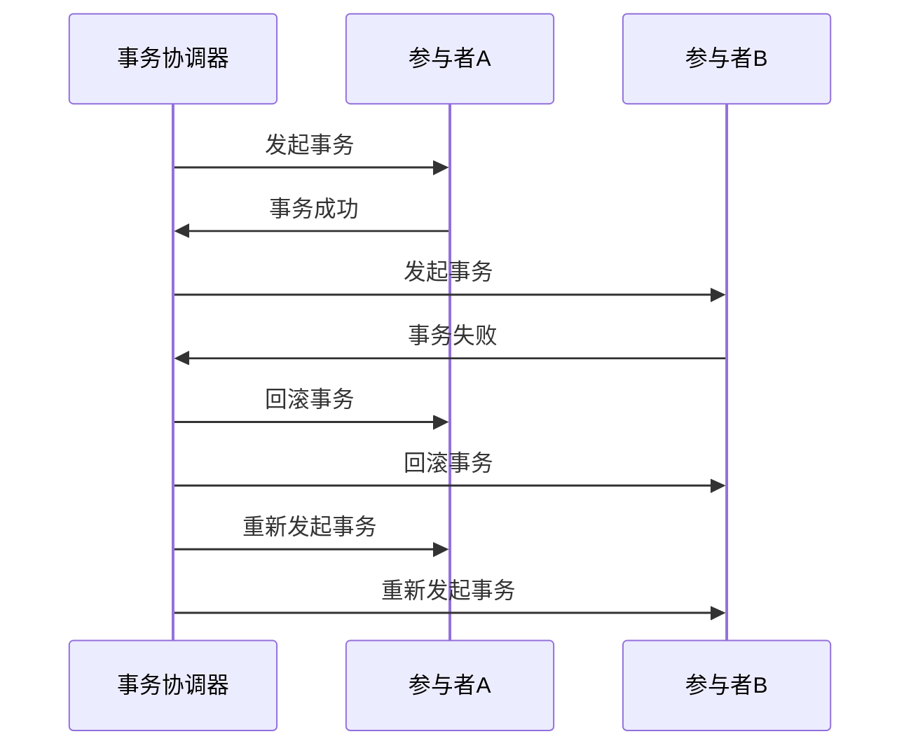

# Seata 重试机制设计

## 介绍

在分布式系统中，事务的可靠性是一个关键问题。由于网络延迟、服务不可用或其他异常情况，事务可能会失败。为了确保事务的最终一致性，Seata引入了重试机制。重试机制允许系统在事务失败后自动重试，从而提高事务的成功率。

本文将详细介绍Seata中的重试机制设计，包括其工作原理、配置方式以及实际应用场景。

## 重试机制的工作原理

Seata的重试机制主要分为两个部分：**本地重试**和**全局重试**。

### 本地重试

本地重试是指在事务参与者（如数据库或服务）内部进行的重试。当某个操作失败时，Seata会尝试在本地重新执行该操作，直到成功或达到最大重试次数。

```java
// 示例：本地重试代码
public void localRetry() {
    int retryCount = 0;
    while (retryCount < MAX_RETRY) {
        try {
            // 执行事务操作
            executeTransaction();
            break; // 成功则退出循环
        } catch (Exception e) {
            retryCount++;
            if (retryCount >= MAX_RETRY) {
                throw new RuntimeException("重试次数达到上限", e);
            }
        }
    }
}
```

### 全局重试

全局重试是指在分布式事务协调器（TC）层面进行的重试。当某个参与者的事务操作失败时，TC会通知所有参与者进行回滚，并在适当的时候重新发起事务。



## 配置重试机制

Seata提供了灵活的配置选项，允许开发者根据实际需求调整重试策略。

### 配置示例

```yaml
seata:
  client:
    retry:
      max-retry-times: 3 # 最大重试次数
      retry-interval: 1000 # 重试间隔时间（毫秒）
```

### 配置项说明

- `max-retry-times`：最大重试次数，超过该次数后不再重试。
- `retry-interval`：每次重试之间的间隔时间，单位为毫秒。

## 实际应用场景

### 场景一：网络抖动

在网络不稳定的环境中，事务操作可能会因为网络抖动而失败。通过配置合理的重试机制，可以在网络恢复后自动重试，确保事务的最终一致性。

### 场景二：服务不可用

当某个服务暂时不可用时，Seata的重试机制可以在服务恢复后自动重试事务操作，避免手动干预。

## 总结

Seata的重试机制是确保分布式事务可靠性的重要手段。通过合理的配置和使用，可以有效应对网络抖动、服务不可用等异常情况，提高事务的成功率。

## 附加资源

- [Seata官方文档](https://seata.io/zh-cn/docs/overview/what-is-seata.html)
- [分布式事务实践指南](https://example.com/distributed-transaction-guide)

## 练习

1. 尝试在本地环境中配置Seata的重试机制，并模拟网络抖动场景，观察重试机制的效果。
2. 修改`max-retry-times`和`retry-interval`配置项，测试不同配置下的重试行为。

:::tip
在实际生产环境中，建议根据业务需求和系统负载情况调整重试策略，避免因频繁重试导致系统资源耗尽。
:::