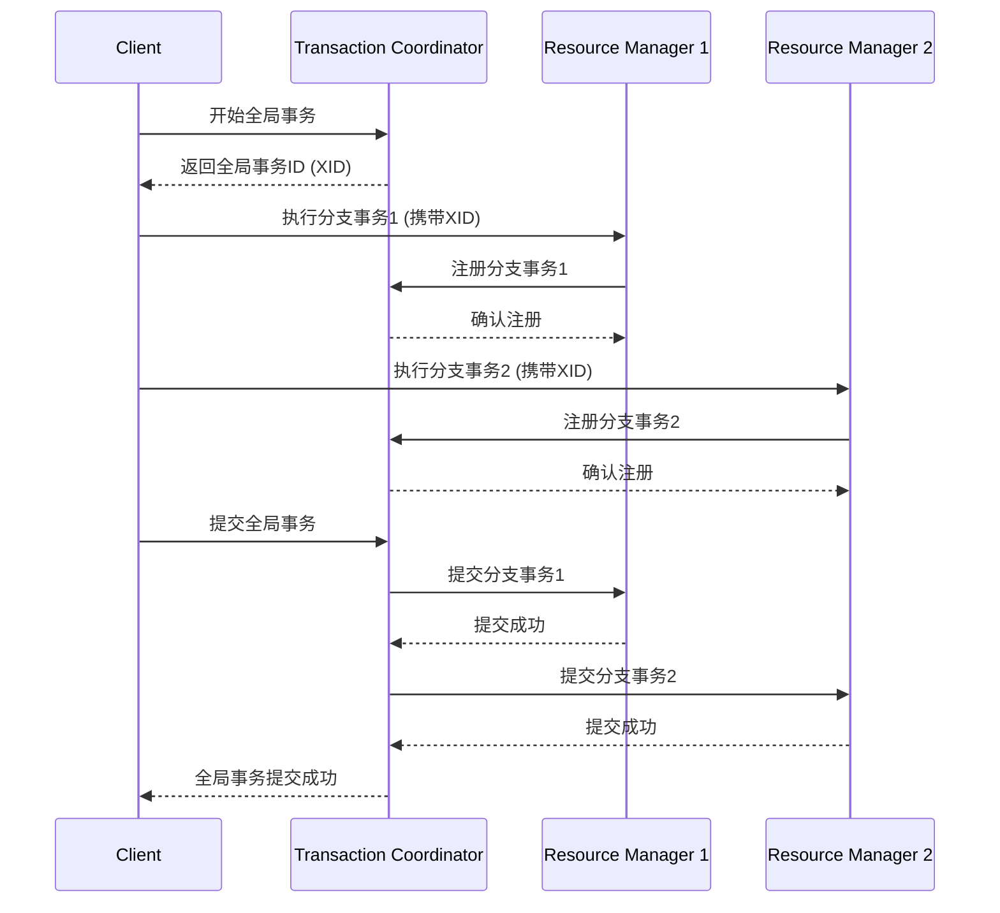

# Seata 数据一致性保证

在分布式系统中，数据一致性是一个关键问题。Seata（Simple Extensible Autonomous Transaction Architecture）是一个开源的分布式事务解决方案，旨在简化分布式事务的管理，并确保数据的一致性。本文将详细介绍Seata如何保证数据一致性，并通过实际案例帮助初学者理解其工作原理。

## 什么是数据一致性？

数据一致性指的是在分布式系统中，多个服务或数据库之间的数据状态保持一致。例如，在一个电商系统中，当用户下单时，订单服务和库存服务需要同时更新数据，以确保订单和库存的一致性。

## Seata 的核心概念

Seata通过以下几个核心概念来保证数据一致性：

1. **全局事务（Global Transaction）**：一个全局事务包含多个分支事务（Branch Transaction），每个分支事务对应一个本地事务。
2. **事务协调器（Transaction Coordinator）**：负责协调全局事务的提交或回滚。
3. **资源管理器（Resource Manager）**：负责管理本地事务的资源，如数据库连接。
4. **事务日志（Transaction Log）**：记录事务的状态，用于故障恢复。

## Seata 的工作流程

Seata的工作流程可以分为以下几个步骤：

1. **事务开始**：全局事务开始时，事务协调器会生成一个全局事务ID（XID）。
2. **分支事务注册**：每个分支事务在本地事务开始时，会向事务协调器注册。
3. **事务提交或回滚**：全局事务结束时，事务协调器会根据所有分支事务的状态决定提交或回滚。



## 实际案例

假设我们有一个电商系统，用户下单时需要同时更新订单服务和库存服务。使用Seata可以确保这两个服务的数据一致性。

```java
// 订单服务
@GlobalTransactional
public void createOrder(Order order) {
    // 创建订单
    orderService.create(order);
    // 扣减库存
    inventoryService.deduct(order.getProductId(), order.getQuantity());
}
```

在上述代码中，`@GlobalTransactional`注解标识了一个全局事务。如果订单创建成功但库存扣减失败，Seata会自动回滚订单创建操作，确保数据一致性。

## 总结

Seata通过全局事务管理、事务协调器和资源管理器的协作，确保了分布式系统中的数据一致性。对于初学者来说，理解Seata的核心概念和工作流程是掌握分布式事务管理的关键。

## 附加资源

- [Seata官方文档](https://seata.io/zh-cn/docs/overview/what-is-seata.html)
- [分布式事务理论与实践](https://www.infoq.cn/article/distributed-transaction-theory-and-practice)

## 练习

1. 尝试在一个简单的Spring Boot项目中集成Seata，并实现一个包含两个分支事务的全局事务。
2. 模拟一个分支事务失败的情况，观察Seata如何回滚全局事务。

通过以上内容，你应该对Seata如何保证数据一致性有了初步的了解。继续深入学习并实践，你将能够更好地掌握分布式事务的管理。