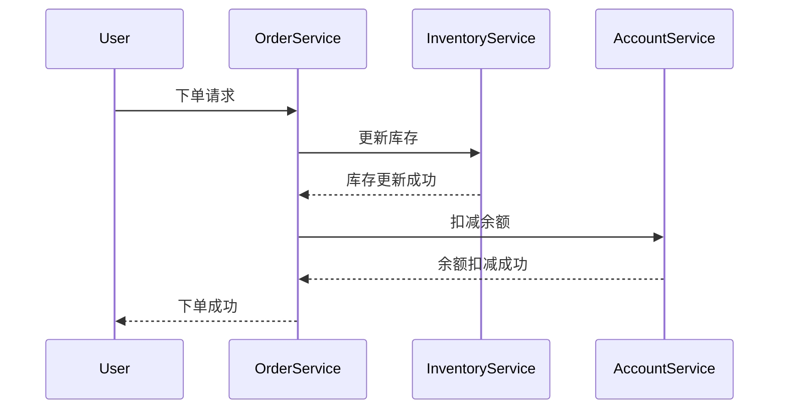

# Seata 大事务处理

## 介绍

在分布式系统中，事务管理是一个复杂且关键的问题。Seata（Simple Extensible Autonomous Transaction Architecture）是一个开源的分布式事务解决方案，旨在简化分布式事务的管理。然而，当处理大事务时，可能会遇到性能瓶颈和资源占用问题。本文将深入探讨如何在Seata中高效处理大事务，并提供实际案例和代码示例。

## 什么是大事务？

大事务通常指的是涉及多个服务、多个数据库操作的事务，且这些操作的数据量较大或执行时间较长。大事务可能会导致以下问题：

- **资源占用**：长时间占用数据库连接和锁资源。
- **性能瓶颈**：事务执行时间过长，影响系统整体性能。
- **故障恢复困难**：事务回滚或恢复时，可能会消耗大量时间和资源。

## Seata 中的大事务处理

Seata通过全局事务管理（Global Transaction Management）和分支事务管理（Branch Transaction Management）来处理分布式事务。对于大事务，Seata提供了以下几种优化策略：

### 1. 事务分片

将大事务拆分为多个小事务，每个小事务独立提交。这样可以减少单个事务的资源占用和执行时间。

```java
// 示例：事务分片
public void processLargeTransaction() {
    List<DataChunk> chunks = splitDataIntoChunks();
    for (DataChunk chunk : chunks) {
        try {
            // 开始一个小事务
            GlobalTransaction tx = GlobalTransactionContext.getCurrentOrCreate();
            tx.begin();
            // 处理数据块
            processChunk(chunk);
            // 提交小事务
            tx.commit();
        } catch (Exception e) {
            // 回滚小事务
            GlobalTransactionContext.reload().rollback();
        }
    }
}
```

### 2. 异步提交

将事务的提交操作异步化，减少事务提交时的等待时间。

```java
// 示例：异步提交
public void asyncCommit() {
    CompletableFuture.runAsync(() -> {
        try {
            GlobalTransaction tx = GlobalTransactionContext.getCurrentOrCreate();
            tx.begin();
            // 执行业务逻辑
            executeBusinessLogic();
            // 异步提交
            tx.commit();
        } catch (Exception e) {
            GlobalTransactionContext.reload().rollback();
        }
    });
}
```

### 3. 事务超时设置

为事务设置合理的超时时间，避免事务长时间占用资源。

```yaml
# Seata 配置示例：设置事务超时时间
seata:
  tx-service-group: my_tx_group
  service:
    vgroup-mapping:
      my_tx_group: default
  config:
    client:
      rm:
        report-retry-count: 5
        report-success-enable: false
      tm:
        commit-retry-count: 5
        rollback-retry-count: 5
        default-global-transaction-timeout: 60000 # 60秒
```

## 实际案例

假设我们有一个电商系统，用户下单时需要同时更新库存、生成订单和扣减用户余额。这是一个典型的大事务场景。



在这个案例中，我们可以将订单生成、库存更新和余额扣减拆分为多个小事务，并通过Seata的全局事务管理来确保数据一致性。

## 总结

处理大事务时，Seata提供了多种优化策略，如事务分片、异步提交和事务超时设置。通过这些策略，可以有效减少大事务对系统性能的影响，并提高系统的可靠性和可维护性。

## 附加资源

- [Seata官方文档](https://seata.io/zh-cn/docs/overview/what-is-seata.html)
- [分布式事务处理指南](https://dzone.com/articles/distributed-transactions-in-microservices-with-seata)
- [Seata GitHub仓库](https://github.com/seata/seata)

## 练习

1. 尝试在本地环境中配置Seata，并实现一个简单的大事务处理示例。
2. 修改事务超时时间，观察事务执行的变化。
3. 将一个大事务拆分为多个小事务，并测试其性能提升。

通过以上内容，你应该对Seata中的大事务处理有了更深入的理解。希望这些知识能帮助你在实际项目中更好地应用Seata。