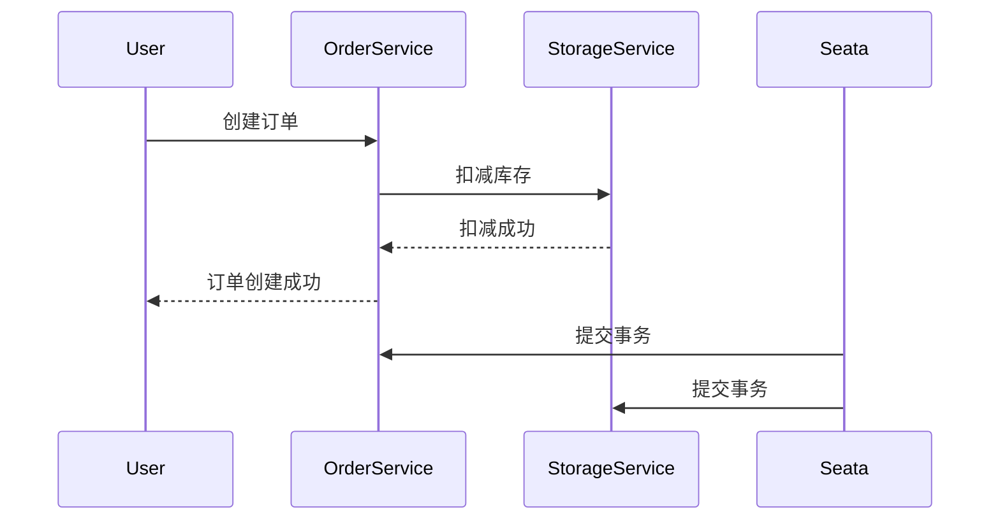

# Seata AT模式概述

Seata（Simple Extensible Autonomous Transaction Architecture）是一款开源的分布式事务解决方案，旨在解决微服务架构下的分布式事务问题。Seata提供了多种事务模式，其中AT（Automatic Transaction）模式是最常用的一种。本文将详细介绍Seata AT模式的基本概念、工作原理及其实际应用。

## 什么是Seata AT模式？

Seata AT模式是一种基于两阶段提交（2PC）的分布式事务解决方案。它通过自动补偿机制来保证事务的一致性，适用于大多数业务场景。AT模式的核心思想是：在事务执行过程中，Seata会自动记录事务的“前镜像”和“后镜像”，并在事务提交或回滚时，根据这些镜像数据自动进行补偿操作。

## AT模式的工作原理

Seata AT模式的工作原理可以分为以下几个步骤：

1. **事务开始**：当一个分布式事务开始时，Seata会为该事务生成一个全局唯一的事务ID（XID），并将其传播到所有参与事务的服务中。

2. **本地事务执行**：每个参与事务的服务会执行自己的本地事务，并在执行过程中记录“前镜像”和“后镜像”。这些镜像数据用于后续的补偿操作。

3. **事务提交**：当所有本地事务都执行成功后，Seata会向事务协调器（TC）发送提交请求。事务协调器会根据全局事务的状态决定是否提交或回滚事务。

4. **事务回滚**：如果任何一个本地事务执行失败，Seata会向事务协调器发送回滚请求。事务协调器会根据记录的“前镜像”数据自动进行补偿操作，将数据恢复到事务开始前的状态。

## 代码示例

以下是一个简单的Seata AT模式的使用示例：

```java
@GlobalTransactional
public void purchase(String userId, String commodityCode, int orderCount) {
    // 扣减库存
    storageService.deduct(commodityCode, orderCount);
    
    // 创建订单
    orderService.create(userId, commodityCode, orderCount);
}
```

在这个示例中，`@GlobalTransactional`注解用于标记一个全局事务。当`purchase`方法被调用时，Seata会自动管理其中的分布式事务。

## 实际应用场景

Seata AT模式适用于大多数需要保证数据一致性的分布式事务场景。例如，在电商系统中，用户下单时需要同时扣减库存和创建订单。这两个操作可能分布在不同的微服务中，使用Seata AT模式可以确保这两个操作要么同时成功，要么同时失败。



在上面的序列图中，用户首先向`OrderService`发送创建订单的请求，`OrderService`随后调用`StorageService`扣减库存。如果两个操作都成功，Seata会提交事务；如果任何一个操作失败，Seata会回滚事务。

## 总结

Seata AT模式通过自动补偿机制简化了分布式事务的管理，使得开发者可以更专注于业务逻辑的实现。它适用于大多数需要保证数据一致性的分布式事务场景，特别是在微服务架构中。

## 附加资源

- [Seata官方文档](https://seata.io/zh-cn/docs/overview/what-is-seata.html)
- [分布式事务解决方案比较](https://dzone.com/articles/distributed-transaction-solutions-comparison)

## 练习

1. 尝试在自己的项目中集成Seata AT模式，并实现一个简单的分布式事务场景。
2. 阅读Seata的源码，了解其内部实现机制。
