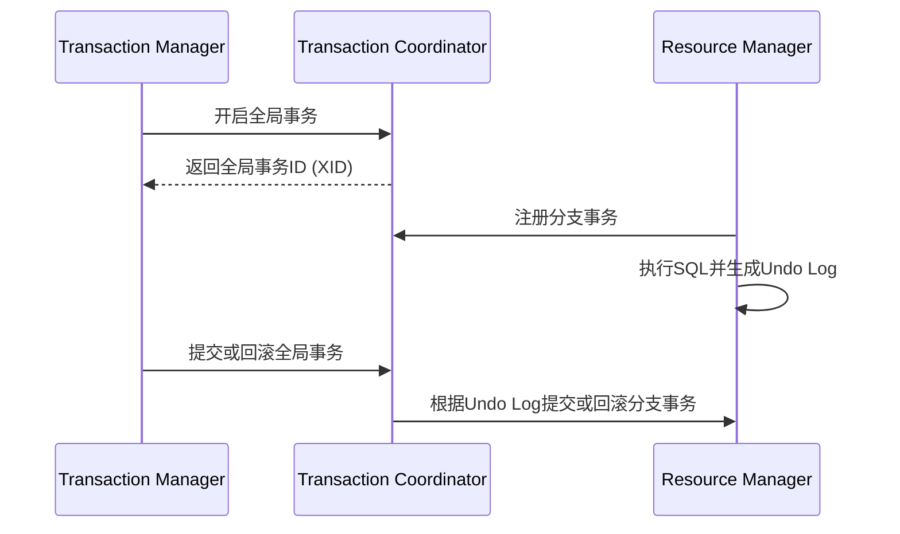

# Seata AT设计原理

Seata（Simple Extensible Autonomous Transaction Architecture）是一款开源的分布式事务解决方案，旨在解决微服务架构下的数据一致性问题。Seata AT（Automatic Transaction）模式是Seata的核心模式之一，它通过自动补偿机制实现分布式事务的最终一致性。本文将详细介绍Seata AT模式的设计原理，帮助初学者理解其工作机制。

## 什么是Seata AT模式？

Seata AT模式是一种基于两阶段提交（2PC）的分布式事务解决方案。它通过自动生成反向SQL（Undo Log）来实现事务的回滚，从而保证事务的最终一致性。AT模式的核心思想是：在事务提交时，先记录事务的修改操作（Undo Log），然后在事务提交成功后删除这些日志；如果事务失败，则通过Undo Log进行回滚。

## Seata AT模式的核心组件

Seata AT模式的核心组件包括：

1. **Transaction Coordinator (TC)**：事务协调器，负责全局事务的提交和回滚。
2. **Transaction Manager (TM)**：事务管理器，负责开启、提交或回滚全局事务。
3. **Resource Manager (RM)**：资源管理器，负责管理分支事务的资源，如数据库连接。

## Seata AT模式的工作流程

Seata AT模式的工作流程可以分为以下几个步骤：

1. **开启全局事务**：TM向TC发起全局事务的开启请求，TC生成全局事务ID（XID）。
2. **执行分支事务**：RM在本地执行SQL操作，并生成Undo Log。
3. **注册分支事务**：RM向TC注册分支事务，并将Undo Log发送给TC。
4. **提交或回滚全局事务**：TM根据全局事务的执行情况，向TC发起提交或回滚请求。TC根据Undo Log进行事务的提交或回滚。



## 代码示例

以下是一个简单的Seata AT模式的使用示例：

```java
// 开启全局事务
GlobalTransaction tx = GlobalTransactionContext.getCurrentOrCreate();
tx.begin();

try {
    // 执行分支事务
    jdbcTemplate.update("UPDATE account SET balance = balance - 100 WHERE id = 1");
    jdbcTemplate.update("UPDATE account SET balance = balance + 100 WHERE id = 2");

    // 提交全局事务
    tx.commit();
} catch (Exception e) {
    // 回滚全局事务
    tx.rollback();
}
```

在这个示例中，我们首先开启了一个全局事务，然后执行了两个SQL操作，最后根据执行结果提交或回滚事务。

## 实际应用场景

Seata AT模式适用于需要保证数据一致性的分布式系统，特别是在微服务架构中。例如，在电商系统中，用户下单后需要扣减库存、生成订单、扣减用户余额等操作。这些操作可能分布在不同的微服务中，使用Seata AT模式可以确保这些操作要么全部成功，要么全部失败，从而保证数据的一致性。

## 总结

Seata AT模式通过自动生成Undo Log和两阶段提交机制，实现了分布式事务的最终一致性。它简化了分布式事务的管理，适用于微服务架构下的复杂业务场景。通过本文的学习，你应该对Seata AT模式的设计原理有了初步的了解。

## 附加资源

- [Seata官方文档](https://seata.io/zh-cn/docs/overview/what-is-seata.html)
- [分布式事务解决方案比较](https://www.infoq.cn/article/distributed-transaction-solutions-comparison)

## 练习

1. 尝试在自己的项目中集成Seata AT模式，并模拟一个分布式事务场景。
2. 阅读Seata源码，深入理解其内部实现机制。
