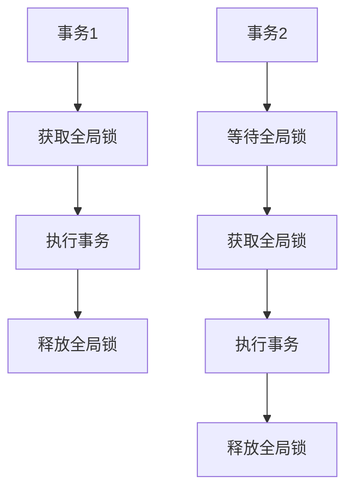

# Seata AT使用限制

Seata AT（Automatic Transaction）模式是一种分布式事务解决方案，它通过自动补偿机制来保证事务的一致性。虽然AT模式非常强大，但在实际使用中仍然存在一些限制。本文将详细介绍这些限制，并通过实际案例帮助你更好地理解。

## 1. 介绍

Seata AT模式的核心思想是通过在业务方法执行前后自动记录和回滚数据变更，从而实现分布式事务的一致性。然而，由于分布式系统的复杂性，AT模式在某些场景下可能无法完全满足需求。了解这些限制可以帮助你在设计和实现分布式事务时做出更明智的决策。

## 2. 使用限制

### 2.1 数据库支持

Seata AT模式目前仅支持部分关系型数据库。以下是支持的数据库列表：

- MySQL
- PostgreSQL
- Oracle
- SQL Server

如果你使用的是其他数据库，可能需要考虑其他分布式事务解决方案。

:::caution
注意：Seata AT模式不支持NoSQL数据库。
:::

### 2.2 事务隔离级别

Seata AT模式默认使用`Read Committed`隔离级别。如果你需要更高的隔离级别（如`Serializable`），可能需要手动调整数据库的隔离级别设置。

```sql
-- 设置事务隔离级别为Serializable
SET TRANSACTION ISOLATION LEVEL SERIALIZABLE;
```

### 2.3 全局锁

Seata AT模式通过全局锁来保证事务的一致性。在高并发场景下，全局锁可能会导致性能瓶颈。因此，在设计系统时需要考虑如何减少全局锁的竞争。



### 2.4 事务超时

Seata AT模式支持事务超时设置。如果事务在指定时间内未完成，Seata会自动回滚该事务。默认超时时间为60秒，你可以根据实际需求进行调整。

```java
// 设置事务超时时间为120秒
GlobalTransaction tx = GlobalTransactionContext.getCurrentOrCreate();
tx.begin(120 * 1000);
```

:::tip
建议：根据业务需求合理设置事务超时时间，避免因超时导致的事务回滚。
:::

### 2.5 数据一致性

Seata AT模式通过补偿机制来保证数据一致性。然而，在某些极端情况下（如网络分区），可能会出现数据不一致的情况。因此，在设计系统时需要考虑如何应对这些极端情况。

## 3. 实际案例

假设我们有一个电商系统，用户下单后需要扣减库存并生成订单。以下是使用Seata AT模式的代码示例：

```java
@GlobalTransactional
public void placeOrder(Order order) {
    // 扣减库存
    inventoryService.reduceStock(order.getProductId(), order.getQuantity());
    
    // 生成订单
    orderService.createOrder(order);
}
```

在这个例子中，`placeOrder`方法是一个全局事务。如果扣减库存或生成订单失败，Seata会自动回滚整个事务，保证数据的一致性。

## 4. 总结

Seata AT模式是一种强大的分布式事务解决方案，但在使用过程中需要注意其限制。通过了解这些限制，你可以更好地设计和实现分布式事务，避免潜在的问题。

## 5. 附加资源

- [Seata官方文档](https://seata.io/zh-cn/docs/overview/what-is-seata.html)
- [分布式事务理论与实践](https://www.oreilly.com/library/view/distributed-systems-principles/9781492043012/)

## 6. 练习

1. 尝试在本地环境中配置Seata AT模式，并运行一个简单的分布式事务示例。
2. 思考在高并发场景下如何优化全局锁的使用，减少性能瓶颈。

通过以上内容，你应该对Seata AT模式的使用限制有了更深入的了解。希望这些知识能帮助你在实际项目中更好地应用Seata AT模式。