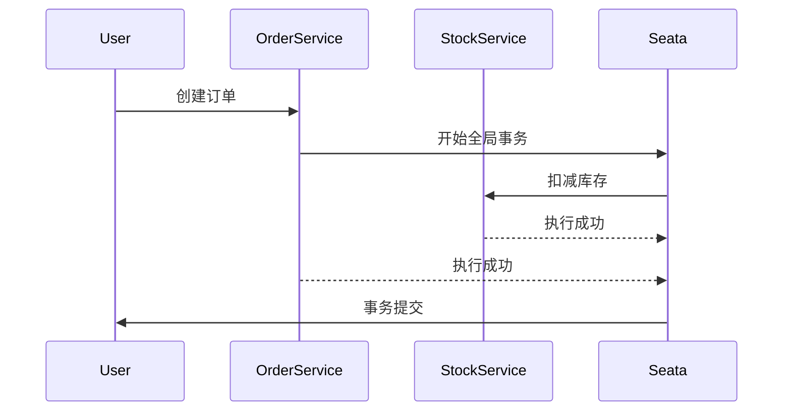

# Seata AT最佳实践

## 介绍

Seata（Simple Extensible Autonomous Transaction Architecture）是一个开源的分布式事务解决方案，旨在解决微服务架构中的分布式事务问题。Seata的AT（Automatic Transaction）模式是其最常用的模式之一，它通过自动补偿机制来保证事务的一致性。

AT模式的核心思想是：在事务执行过程中，Seata会自动记录事务的“前镜像”和“后镜像”，并在事务提交或回滚时，根据这些镜像数据自动进行补偿操作。这种方式大大简化了分布式事务的管理，使得开发者可以像使用本地事务一样使用分布式事务。

## AT模式的工作原理

在AT模式下，Seata通过以下步骤来保证事务的一致性：

1. **事务开始**：当一个分布式事务开始时，Seata会为该事务生成一个全局唯一的事务ID（XID）。
2. **SQL解析**：Seata会拦截并解析所有参与事务的SQL语句，记录下SQL执行前的数据状态（前镜像）和执行后的数据状态（后镜像）。
3. **事务提交**：如果所有参与者都成功执行了SQL，Seata会提交事务，并删除前镜像数据。
4. **事务回滚**：如果任何一个参与者执行失败，Seata会根据前镜像数据自动回滚事务，恢复数据到事务开始前的状态。

## 最佳实践

### 1. 合理设计事务边界

在设计分布式事务时，应尽量将事务边界控制在较小的范围内。过大的事务边界会增加事务的复杂性和失败的概率。例如，在微服务架构中，尽量将事务限制在单个服务内部，避免跨多个服务的分布式事务。

### 2. 避免长事务

长事务会占用数据库资源，增加锁冲突的概率，并可能导致事务超时。因此，应尽量避免长事务，将事务的执行时间控制在合理范围内。

### 3. 使用幂等性操作

在分布式事务中，由于网络抖动或重试机制，某些操作可能会被多次执行。因此，确保所有参与事务的操作都是幂等的，可以避免数据不一致的问题。

### 4. 合理配置超时时间

Seata允许为每个事务配置超时时间。如果事务在超时时间内未能完成，Seata会自动回滚事务。因此，应根据业务场景合理配置超时时间，避免事务因超时而失败。

### 5. 监控和日志

在生产环境中，应开启Seata的监控和日志功能，及时发现问题并进行处理。Seata提供了丰富的监控指标和日志信息，可以帮助开发者快速定位问题。

## 实际案例

假设我们有一个电商系统，用户下单时需要同时扣减库存和生成订单。这两个操作分别由库存服务和订单服务完成，且需要保证数据的一致性。

### 代码示例

```java
// 库存服务
@GlobalTransactional
public void reduceStock(String productId, int quantity) {
    // 扣减库存
    stockService.reduceStock(productId, quantity);
}

// 订单服务
@GlobalTransactional
public void createOrder(String userId, String productId, int quantity) {
    // 生成订单
    orderService.createOrder(userId, productId, quantity);
}
```

在上述代码中，`@GlobalTransactional`注解表示该方法是一个分布式事务的入口。Seata会自动管理该事务的提交和回滚。

### 事务流程



## 总结

Seata的AT模式通过自动补偿机制简化了分布式事务的管理，使得开发者可以像使用本地事务一样使用分布式事务。通过合理设计事务边界、避免长事务、使用幂等性操作、合理配置超时时间以及监控和日志，可以确保分布式事务的一致性和可靠性。

## 附加资源

- [Seata官方文档](https://seata.io/zh-cn/docs/overview/what-is-seata.html)
- [分布式事务解决方案](https://dubbo.apache.org/zh/docs/advanced/distributed-transaction/)

## 练习

1. 尝试在一个简单的微服务项目中集成Seata的AT模式，并模拟一个分布式事务场景。
2. 分析并优化一个现有的分布式事务，确保其符合Seata AT模式的最佳实践。