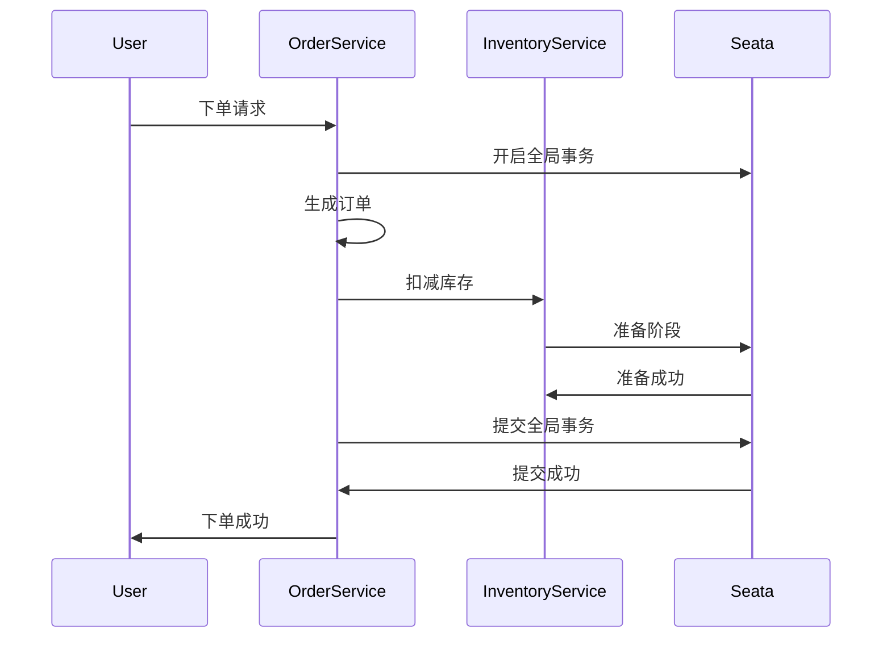

# Seata AT二阶段提交

## 介绍

Seata 是一个开源的分布式事务解决方案，支持多种事务模式，其中 AT（Automatic Transaction）模式是最常用的一种。AT 模式通过二阶段提交（Two-Phase Commit, 2PC）机制来保证分布式事务的一致性。本文将详细介绍 Seata AT 模式中的二阶段提交机制，并通过代码示例和实际案例帮助你更好地理解其工作原理。

## 什么是二阶段提交？

二阶段提交是一种分布式事务协议，用于确保多个参与者在事务提交时保持一致。它分为两个阶段：

1. **准备阶段（Prepare Phase）**：事务协调者（Transaction Coordinator）向所有参与者（Participants）发送准备请求，询问是否可以提交事务。参与者执行事务操作，并将结果（成功或失败）返回给协调者。
2. **提交阶段（Commit Phase）**：如果所有参与者都返回成功，协调者发送提交请求，参与者正式提交事务。如果有任何一个参与者返回失败，协调者发送回滚请求，参与者回滚事务。

## Seata AT 模式中的二阶段提交

在 Seata AT 模式中，二阶段提交的实现依赖于全局事务（Global Transaction）和分支事务（Branch Transaction）。以下是 Seata AT 二阶段提交的具体流程：

### 1. 准备阶段

在准备阶段，Seata 会记录事务的“前镜像”（Before Image）和“后镜像”（After Image），以便在需要回滚时恢复数据。

```java
// 示例：准备阶段的前镜像和后镜像记录
public void prepare() {
    // 记录前镜像
    BeforeImage beforeImage = recordBeforeImage();
    
    // 执行事务操作
    executeTransaction();
    
    // 记录后镜像
    AfterImage afterImage = recordAfterImage();
    
    // 将前后镜像保存到 undo_log 表中
    saveUndoLog(beforeImage, afterImage);
}
```

### 2. 提交阶段

在提交阶段，Seata 会根据准备阶段的结果决定是提交还是回滚事务。

```java
// 示例：提交阶段的逻辑
public void commit() {
    if (allParticipantsPreparedSuccessfully()) {
        // 提交事务
        commitTransaction();
    } else {
        // 回滚事务
        rollbackTransaction();
    }
}
```

### 3. 回滚机制

如果事务需要回滚，Seata 会使用准备阶段记录的“前镜像”来恢复数据。

```java
// 示例：回滚逻辑
public void rollback() {
    // 从 undo_log 表中获取前镜像
    BeforeImage beforeImage = getBeforeImageFromUndoLog();
    
    // 使用前镜像恢复数据
    restoreData(beforeImage);
}
```

## 实际案例

假设我们有一个电商系统，用户下单时需要同时扣减库存和生成订单。这两个操作分别由库存服务和订单服务处理，属于分布式事务。

### 场景描述

1. 用户下单，调用订单服务生成订单。
2. 订单服务调用库存服务扣减库存。
3. 如果库存扣减成功，订单服务提交事务；否则，回滚事务。

### 代码示例

```java
// 订单服务
public void createOrder(Order order) {
    // 开启全局事务
    GlobalTransaction tx = GlobalTransactionContext.getCurrentOrCreate();
    tx.begin();
    
    try {
        // 生成订单
        orderService.create(order);
        
        // 调用库存服务扣减库存
        inventoryService.deductStock(order.getProductId(), order.getQuantity());
        
        // 提交全局事务
        tx.commit();
    } catch (Exception e) {
        // 回滚全局事务
        tx.rollback();
        throw e;
    }
}
```

### 流程图



## 总结

Seata AT 模式的二阶段提交机制通过准备阶段和提交阶段来确保分布式事务的一致性。准备阶段记录事务的前后镜像，提交阶段根据准备结果决定提交或回滚事务。通过实际案例和代码示例，我们可以看到 Seata 如何在实际应用中处理分布式事务。

## 附加资源

- [Seata 官方文档](https://seata.io/zh-cn/docs/overview/what-is-seata.html)
- [分布式事务详解](https://zhuanlan.zhihu.com/p/183753774)

## 练习

1. 尝试在自己的项目中集成 Seata AT 模式，并实现一个简单的分布式事务。
2. 修改上述代码示例，增加日志记录功能，观察事务的提交和回滚过程。
