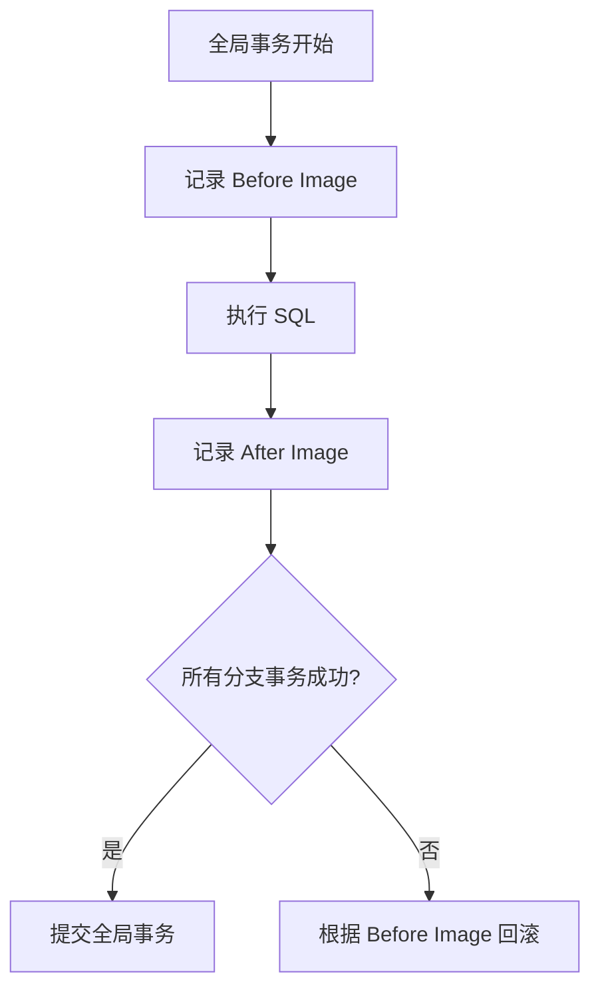

# Seata AT回滚原理

## 介绍

Seata 是一款开源的分布式事务解决方案，支持多种事务模式，其中 AT（Auto Transaction）模式是最常用的一种。AT 模式通过自动补偿机制实现事务的提交和回滚，确保分布式系统中的数据一致性。本文将详细介绍 Seata AT 模式中的回滚原理，帮助初学者理解其工作机制。

## 什么是 AT 模式？

AT 模式是 Seata 提供的一种自动事务模式，它通过代理数据源的方式，自动记录事务执行前后的数据快照（Before Image 和 After Image），并在事务提交或回滚时，利用这些快照进行数据补偿。AT 模式的核心思想是“先提交，后补偿”，即在事务提交时，先提交本地事务，再通过全局事务管理器协调各个分支事务的状态。

## AT 模式的回滚机制

在分布式事务中，如果某个分支事务执行失败，Seata 需要回滚已经提交的事务，以保证数据的一致性。AT 模式的回滚机制主要依赖于以下两个关键点：

1. **数据快照**：在事务执行前，Seata 会记录数据的 Before Image（事务执行前的数据状态），在事务执行后，记录 After Image（事务执行后的数据状态）。
2. **补偿操作**：当事务需要回滚时，Seata 会根据 Before Image 恢复数据到事务执行前的状态。

### 回滚流程

以下是 Seata AT 模式的回滚流程：

1. **事务开始**：全局事务开始时，Seata 会生成一个全局事务 ID（XID），并将其传播到各个分支事务中。
2. **记录 Before Image**：在每个分支事务执行前，Seata 会记录当前数据的 Before Image。
3. **执行 SQL**：分支事务执行 SQL 操作，修改数据库中的数据。
4. **记录 After Image**：在 SQL 执行后，Seata 会记录数据的 After Image。
5. **事务提交**：如果所有分支事务都执行成功，Seata 会提交全局事务。
6. **事务回滚**：如果某个分支事务执行失败，Seata 会根据 Before Image 恢复数据，实现回滚。



### 代码示例

以下是一个简单的代码示例，展示如何在 Seata AT 模式下执行事务并触发回滚：

```java
@GlobalTransactional
public void transferMoney(int fromAccountId, int toAccountId, BigDecimal amount) {
    // 扣减转出账户余额
    accountService.debit(fromAccountId, amount);
    
    // 增加转入账户余额
    accountService.credit(toAccountId, amount);
    
    // 模拟异常，触发回滚
    if (amount.compareTo(BigDecimal.ZERO) < 0) {
        throw new RuntimeException("转账金额不能为负数");
    }
}
```

在这个示例中，`@GlobalTransactional` 注解标记了一个全局事务。如果 `amount` 为负数，程序会抛出异常，Seata 会根据 Before Image 自动回滚已经执行的 SQL 操作。

## 实际应用场景

假设我们有一个电商系统，用户下单后需要扣减库存并生成订单。如果库存扣减成功但订单生成失败，系统需要回滚库存扣减操作，以保证数据一致性。使用 Seata AT 模式，我们可以轻松实现这一需求：

```java
@GlobalTransactional
public void createOrder(int userId, int productId, int quantity) {
    // 扣减库存
    inventoryService.decreaseStock(productId, quantity);
    
    // 生成订单
    orderService.createOrder(userId, productId, quantity);
    
    // 模拟订单生成失败
    if (quantity > 100) {
        throw new RuntimeException("订单数量超过限制");
    }
}
```

在这个场景中，如果订单数量超过限制，Seata 会自动回滚库存扣减操作，确保数据一致性。

## 总结

Seata AT 模式的回滚机制通过记录数据快照和自动补偿操作，实现了分布式事务中的数据一致性。对于初学者来说，理解 AT 模式的回滚原理是掌握 Seata 的关键。通过本文的介绍和示例，希望你能对 Seata AT 模式的回滚机制有更深入的理解。

## 附加资源

- [Seata 官方文档](https://seata.io/zh-cn/docs/overview/what-is-seata.html)
- [分布式事务理论与实践](https://time.geekbang.org/column/intro/100030401)

## 练习

1. 尝试在自己的项目中集成 Seata AT 模式，并模拟一个分布式事务回滚的场景。
2. 阅读 Seata 源码，深入理解 AT 模式的实现细节。