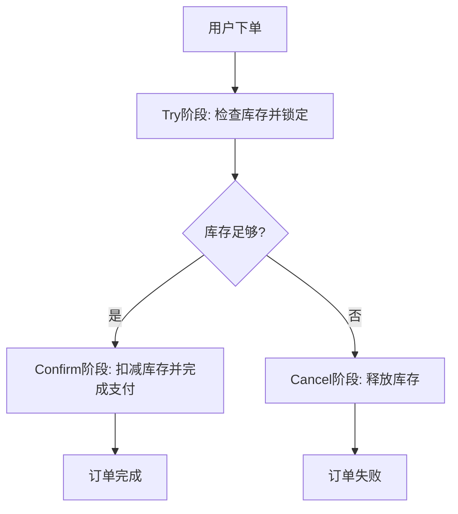

# Seata TCC模式概述

## 介绍

Seata 是一个开源的分布式事务解决方案，旨在简化分布式系统中的事务管理。TCC（Try-Confirm-Cancel）模式是Seata支持的一种分布式事务模式，适用于需要高一致性保证的业务场景。TCC模式通过将事务操作分为三个阶段（Try、Confirm、Cancel）来实现分布式事务的最终一致性。

## TCC模式的工作原理

TCC模式的核心思想是将一个分布式事务分解为三个步骤：

1. **Try阶段**：尝试执行业务操作，预留资源。在这个阶段，系统会检查资源是否可用，并锁定资源以确保后续操作可以顺利进行。
2. **Confirm阶段**：确认执行业务操作，提交资源。如果Try阶段成功，系统会执行Confirm阶段，正式提交事务。
3. **Cancel阶段**：取消执行业务操作，释放资源。如果Try阶段失败，系统会执行Cancel阶段，回滚事务并释放资源。

### 代码示例

以下是一个简单的TCC模式代码示例，展示了如何在Java中实现TCC模式：

```java
public interface TccService {
    @TwoPhaseBusinessAction(name = "tccAction", commitMethod = "confirm", rollbackMethod = "cancel")
    boolean try(BusinessActionContext actionContext);

    boolean confirm(BusinessActionContext actionContext);

    boolean cancel(BusinessActionContext actionContext);
}
```

在这个示例中，`try`方法用于尝试执行业务操作，`confirm`方法用于确认操作，`cancel`方法用于取消操作。

## 实际应用场景

TCC模式适用于需要高一致性保证的业务场景，例如电商系统中的订单支付、库存扣减等操作。在这些场景中，TCC模式可以确保事务的最终一致性，避免数据不一致的问题。

### 示例场景：订单支付

假设我们有一个电商系统，用户下单后需要支付订单并扣减库存。我们可以使用TCC模式来实现这个流程：

1. **Try阶段**：检查库存是否足够，并锁定库存。
2. **Confirm阶段**：扣减库存并完成支付。
3. **Cancel阶段**：如果支付失败，释放库存。



## 总结

Seata TCC模式通过将事务操作分为Try、Confirm、Cancel三个阶段，实现了分布式事务的最终一致性。它适用于需要高一致性保证的业务场景，如订单支付、库存扣减等。通过合理使用TCC模式，可以有效避免分布式系统中的数据不一致问题。

## 附加资源

- [Seata官方文档](https://seata.io/zh-cn/docs/overview/what-is-seata.html)
- [分布式事务解决方案比较](https://www.infoq.cn/article/distributed-transaction-solution-comparison)

## 练习

1. 尝试在本地环境中搭建一个简单的Seata TCC模式示例。
2. 思考并设计一个适合使用TCC模式的业务场景，并编写相应的代码实现。

:::tip
在实现TCC模式时，务必确保每个阶段的幂等性，以避免重复操作导致的数据不一致问题。
:::