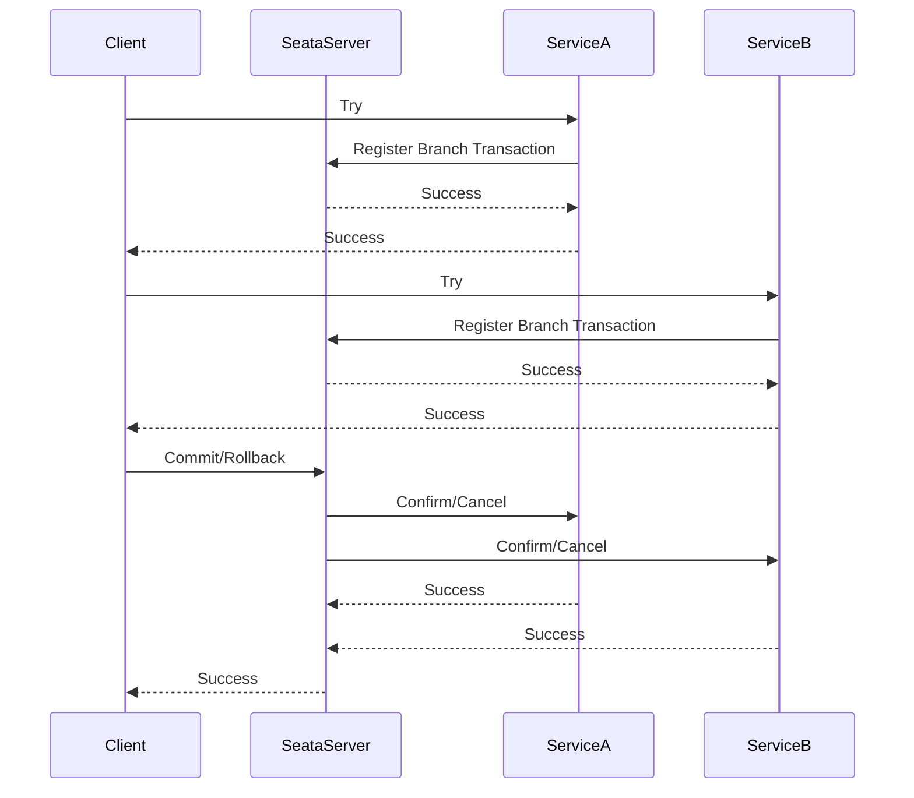

# Seata TCC设计原理

## 介绍

Seata 是一款开源的分布式事务解决方案，支持多种事务模式，其中 TCC（Try-Confirm-Cancel）模式是一种基于补偿机制的分布式事务实现方式。TCC 模式通过将事务操作分为三个阶段（Try、Confirm、Cancel）来保证分布式事务的一致性。本文将详细介绍 Seata TCC 模式的设计原理，并通过代码示例和实际案例帮助你更好地理解其工作机制。

## TCC 模式的核心概念

TCC 模式的核心思想是将一个分布式事务拆分为三个步骤：

1. **Try**：尝试执行业务操作，预留资源。例如，冻结账户中的部分金额。
2. **Confirm**：确认执行业务操作，正式提交资源。例如，扣除冻结的金额。
3. **Cancel**：取消业务操作，释放预留的资源。例如，解冻账户中的金额。

通过这三个步骤，TCC 模式能够在分布式环境下保证事务的最终一致性。

## TCC 模式的设计原理

### 1. Try 阶段

在 Try 阶段，业务系统会尝试执行业务操作，并预留必要的资源。这个阶段的操作需要保证幂等性，即多次执行不会产生副作用。

```java
public interface TccActionOne {
    @TwoPhaseBusinessAction(name = "TccActionOne", commitMethod = "commit", rollbackMethod = "rollback")
    boolean prepare(BusinessActionContext actionContext, int amount);

    boolean commit(BusinessActionContext actionContext);

    boolean rollback(BusinessActionContext actionContext);
}
```

在 Try 阶段，`prepare` 方法会被调用，用于冻结账户中的金额。

### 2. Confirm 阶段

如果 Try 阶段成功，Seata 会调用 Confirm 阶段的方法来提交事务。Confirm 阶段的操作也需要保证幂等性。

```java
public class TccActionOneImpl implements TccActionOne {
    @Override
    public boolean prepare(BusinessActionContext actionContext, int amount) {
        // 冻结账户金额
        return true;
    }

    @Override
    public boolean commit(BusinessActionContext actionContext) {
        // 扣除冻结的金额
        return true;
    }

    @Override
    public boolean rollback(BusinessActionContext actionContext) {
        // 解冻账户金额
        return true;
    }
}
```

### 3. Cancel 阶段

如果 Try 阶段失败，Seata 会调用 Cancel 阶段的方法来回滚事务。Cancel 阶段的操作同样需要保证幂等性。

```java
public class TccActionOneImpl implements TccActionOne {
    @Override
    public boolean prepare(BusinessActionContext actionContext, int amount) {
        // 冻结账户金额
        return true;
    }

    @Override
    public boolean commit(BusinessActionContext actionContext) {
        // 扣除冻结的金额
        return true;
    }

    @Override
    public boolean rollback(BusinessActionContext actionContext) {
        // 解冻账户金额
        return true;
    }
}
```

## TCC 模式的工作流程



## 实际案例

假设我们有一个电商系统，用户下单时需要同时扣减库存和账户余额。我们可以使用 TCC 模式来实现这个分布式事务。

1. **Try 阶段**：
   - 冻结用户账户中的订单金额。
   - 冻结库存中的商品数量。

2. **Confirm 阶段**：
   - 扣除用户账户中的订单金额。
   - 扣除库存中的商品数量。

3. **Cancel 阶段**：
   - 解冻用户账户中的订单金额。
   - 解冻库存中的商品数量。

通过 TCC 模式，我们能够保证在分布式环境下，订单、库存和账户余额的一致性。

## 总结

Seata 的 TCC 模式通过将事务操作分为 Try、Confirm、Cancel 三个阶段，实现了分布式事务的最终一致性。TCC 模式适用于需要强一致性的业务场景，但需要开发者手动实现补偿逻辑。通过本文的介绍和示例代码，你应该对 Seata TCC 模式的设计原理有了初步的了解。

## 附加资源

- [Seata 官方文档](https://seata.io/zh-cn/docs/overview/what-is-seata.html)
- [分布式事务解决方案](https://dubbo.apache.org/zh/docs/advanced/distributed-transaction/)

## 练习

1. 尝试实现一个简单的 TCC 事务，模拟用户下单时扣减库存和账户余额的场景。
2. 思考在 TCC 模式中，如何保证每个阶段的幂等性。