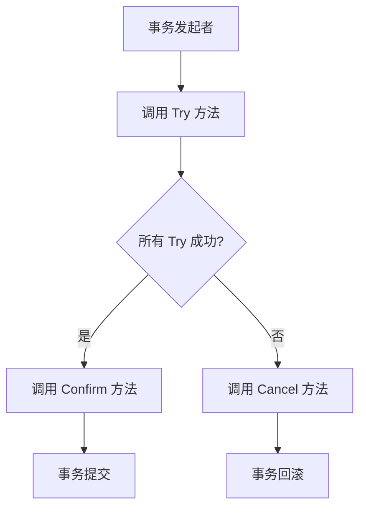

# Seata TCC业务模型

## 介绍

Seata 是一款开源的分布式事务解决方案，支持多种事务模式，其中 **TCC（Try-Confirm-Cancel）模式** 是一种基于补偿机制的事务模型。TCC 模式通过将事务操作分为三个阶段（Try、Confirm、Cancel）来实现分布式事务的一致性。相比于传统的两阶段提交（2PC），TCC 模式更加灵活，适用于高并发、高性能的场景。

TCC 模式的核心思想是：**业务逻辑需要显式地定义 Try、Confirm 和 Cancel 三个操作**，分别对应事务的尝试、确认和取消阶段。通过这种方式，TCC 模式能够在分布式环境下保证事务的最终一致性。

---

## TCC 模式的三个阶段

### 1. Try 阶段
Try 阶段是事务的尝试阶段，主要目的是**预留资源**。在这个阶段，业务逻辑会执行一些检查操作，并预留必要的资源。如果 Try 阶段成功，事务进入 Confirm 阶段；如果失败，事务进入 Cancel 阶段。

例如，在电商系统中，Try 阶段可能会冻结用户的账户余额或锁定库存。

### 2. Confirm 阶段
Confirm 阶段是事务的确认阶段，主要目的是**提交事务**。在这个阶段，业务逻辑会执行真正的提交操作，例如扣减账户余额或减少库存。Confirm 阶段的操作必须是幂等的，以确保在重试时不会产生副作用。

### 3. Cancel 阶段
Cancel 阶段是事务的取消阶段，主要目的是**释放资源**。如果 Try 阶段失败，或者事务需要回滚，业务逻辑会执行 Cancel 操作，释放之前预留的资源。Cancel 阶段的操作也必须是幂等的。

---

## TCC 模式的工作原理

TCC 模式通过协调器（Coordinator）来管理分布式事务的各个参与者。以下是 TCC 模式的工作流程：

1. **事务发起者** 调用各个参与者的 Try 方法，尝试预留资源。
2. 如果所有参与者的 Try 方法都成功，事务发起者调用各个参与者的 Confirm 方法，提交事务。
3. 如果任何一个参与者的 Try 方法失败，事务发起者调用各个参与者的 Cancel 方法，回滚事务。

以下是一个简单的流程图，展示了 TCC 模式的工作流程：



---

## 代码示例

以下是一个简单的 TCC 模式实现示例，模拟电商系统中的订单创建和库存扣减操作。

### Try 阶段
```java
public interface InventoryService {
    @TwoPhaseBusinessAction(name = "deductInventory", commitMethod = "confirmDeduct", rollbackMethod = "cancelDeduct")
    boolean deductInventory(BusinessActionContext context, String productId, int quantity);
}
```

### Confirm 阶段
```java
public boolean confirmDeduct(BusinessActionContext context) {
    // 实际扣减库存
    String productId = (String) context.getActionContext("productId");
    int quantity = (int) context.getActionContext("quantity");
    // 执行扣减操作
    return true;
}
```

### Cancel 阶段
```java
public boolean cancelDeduct(BusinessActionContext context) {
    // 释放库存
    String productId = (String) context.getActionContext("productId");
    int quantity = (int) context.getActionContext("quantity");
    // 执行释放操作
    return true;
}
```

---

## 实际应用场景

TCC 模式适用于以下场景：
1. **电商系统**：在订单创建时，需要同时扣减库存、冻结用户余额等操作。
2. **金融系统**：在转账操作中，需要同时扣减转出账户余额和增加转入账户余额。
3. **库存管理系统**：在库存调拨时，需要同时减少调出仓库库存和增加调入仓库库存。

---

## 总结

Seata TCC 模式通过将事务操作分为 Try、Confirm 和 Cancel 三个阶段，提供了一种灵活的分布式事务解决方案。它适用于高并发、高性能的场景，并且能够保证事务的最终一致性。通过显式定义 Try、Confirm 和 Cancel 操作，开发者可以更好地控制分布式事务的行为。

---

## 附加资源与练习

1. **官方文档**：阅读 [Seata 官方文档](https://seata.io/) 以了解更多关于 TCC 模式的实现细节。
2. **练习**：尝试在本地环境中实现一个简单的 TCC 模式示例，模拟电商系统中的订单创建和库存扣减操作。
3. **深入阅读**：学习其他分布式事务模式，如 AT 模式和 Saga 模式，并比较它们的优缺点。

:::tip
如果你对 TCC 模式有任何疑问，欢迎在评论区留言，我们会尽快为你解答！
:::