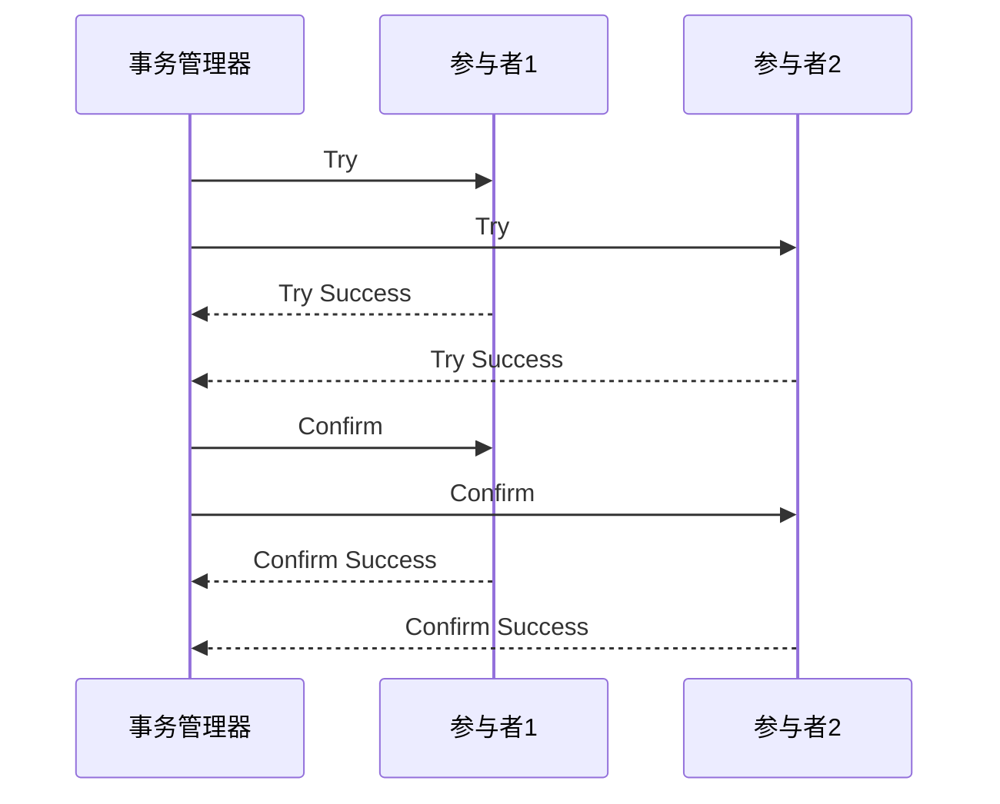

# Seata TCC最佳实践

## 介绍

Seata 是一个开源的分布式事务解决方案，支持多种事务模式，其中 TCC（Try-Confirm-Cancel）模式是一种基于补偿机制的事务模式。TCC 模式通过将事务操作分为三个阶段（Try、Confirm、Cancel）来实现分布式事务的一致性。

在 TCC 模式中，每个事务参与者需要实现三个方法：
- **Try**：尝试执行业务操作，预留资源。
- **Confirm**：确认执行业务操作，提交资源。
- **Cancel**：取消执行业务操作，释放资源。

TCC 模式适用于需要高一致性保证的场景，尤其是在分布式系统中，能够有效解决分布式事务的一致性问题。

## TCC 模式的工作原理

TCC 模式的核心思想是将一个分布式事务分解为多个本地事务，每个本地事务都包含 Try、Confirm 和 Cancel 三个操作。以下是 TCC 模式的工作流程：

1. **Try 阶段**：事务管理器向所有参与者发送 Try 请求，参与者执行 Try 操作，预留资源并记录日志。
2. **Confirm 阶段**：如果所有参与者的 Try 操作都成功，事务管理器向所有参与者发送 Confirm 请求，参与者执行 Confirm 操作，提交资源。
3. **Cancel 阶段**：如果任何一个参与者的 Try 操作失败，事务管理器向所有参与者发送 Cancel 请求，参与者执行 Cancel 操作，释放资源。



## 代码示例

以下是一个简单的 TCC 模式代码示例，假设我们有一个订单服务和库存服务，订单服务需要调用库存服务来扣减库存。

### Try 阶段

```java
public class OrderService {
    @Transactional
    public void tryOrder(Order order) {
        // 创建订单
        orderDao.create(order);
        // 调用库存服务，预留库存
        inventoryService.tryReserve(order.getProductId(), order.getQuantity());
    }
}

public class InventoryService {
    @Transactional
    public void tryReserve(String productId, int quantity) {
        // 检查库存是否足够
        if (inventoryDao.getStock(productId) < quantity) {
            throw new RuntimeException("库存不足");
        }
        // 预留库存
        inventoryDao.reserve(productId, quantity);
    }
}
```

### Confirm 阶段

```java
public class OrderService {
    @Transactional
    public void confirmOrder(Order order) {
        // 确认订单
        orderDao.confirm(order);
        // 调用库存服务，扣减库存
        inventoryService.confirmReserve(order.getProductId(), order.getQuantity());
    }
}

public class InventoryService {
    @Transactional
    public void confirmReserve(String productId, int quantity) {
        // 扣减库存
        inventoryDao.reduceStock(productId, quantity);
    }
}
```

### Cancel 阶段

```java
public class OrderService {
    @Transactional
    public void cancelOrder(Order order) {
        // 取消订单
        orderDao.cancel(order);
        // 调用库存服务，释放库存
        inventoryService.cancelReserve(order.getProductId(), order.getQuantity());
    }
}

public class InventoryService {
    @Transactional
    public void cancelReserve(String productId, int quantity) {
        // 释放库存
        inventoryDao.releaseStock(productId, quantity);
    }
}
```

## 实际案例

假设我们有一个电商系统，用户下单时需要同时扣减库存和创建订单。使用 TCC 模式可以确保这两个操作要么同时成功，要么同时失败。

1. **Try 阶段**：订单服务创建订单并调用库存服务预留库存。
2. **Confirm 阶段**：如果库存预留成功，订单服务确认订单并调用库存服务扣减库存。
3. **Cancel 阶段**：如果库存预留失败，订单服务取消订单并调用库存服务释放库存。

通过 TCC 模式，我们可以确保订单和库存的一致性，避免出现订单创建成功但库存扣减失败的情况。

## 总结

Seata 的 TCC 模式通过将事务操作分为 Try、Confirm 和 Cancel 三个阶段，实现了分布式事务的一致性。TCC 模式适用于需要高一致性保证的场景，尤其是在分布式系统中。通过本文的介绍和代码示例，你应该对 TCC 模式有了初步的了解，并能够在实际项目中应用 TCC 模式。

## 附加资源

- [Seata 官方文档](https://seata.io/zh-cn/docs/overview/what-is-seata.html)
- [分布式事务解决方案](https://dubbo.apache.org/zh/docs/advanced/distributed-transaction/)
- [TCC 模式详解](https://www.cnblogs.com/skyblog/p/11308471.html)

## 练习

1. 尝试在一个简单的分布式系统中实现 TCC 模式，确保事务的一致性。
2. 思考在什么场景下 TCC 模式比其他事务模式更适用，并解释原因。
