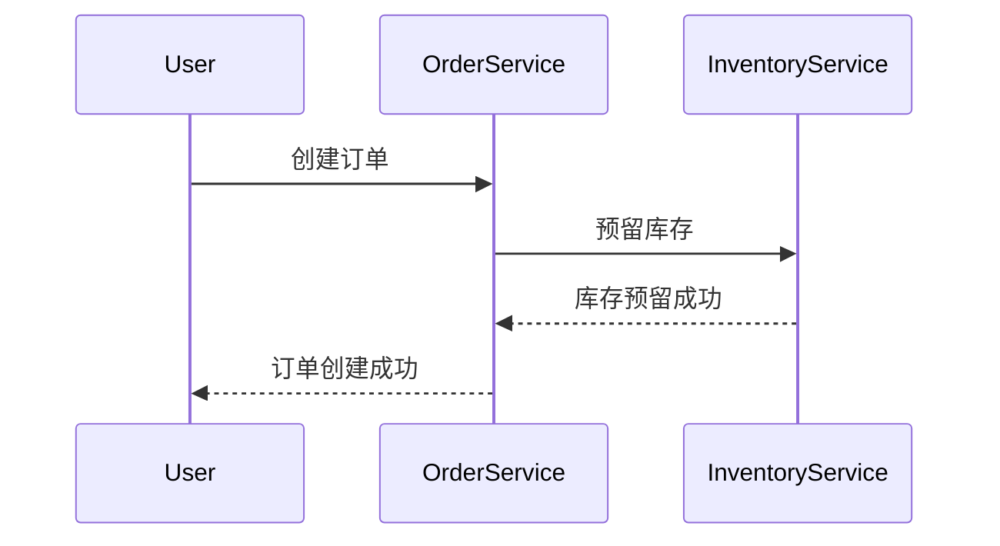

# Seata TCC Try阶段

## 介绍

Seata 是一个开源的分布式事务解决方案，支持多种事务模式，其中 TCC（Try-Confirm-Cancel）模式是一种基于补偿机制的事务模式。TCC 模式将事务分为三个阶段：Try、Confirm 和 Cancel。本文将重点介绍 **Try 阶段**，这是 TCC 模式中的第一个阶段，负责资源的预留和业务逻辑的初步执行。

在 Try 阶段，系统会尝试执行业务逻辑，并预留必要的资源。如果 Try 阶段成功，系统会继续执行 Confirm 阶段以确认事务；如果 Try 阶段失败，系统会执行 Cancel 阶段以回滚事务。

## Try 阶段的工作原理

Try 阶段的核心思想是“预留资源”，即在事务提交之前，先对资源进行预占。这样可以确保在事务提交时，资源是可用的。Try 阶段的具体步骤如下：

1. **业务逻辑执行**：执行业务逻辑，但不会真正提交事务。
2. **资源预留**：在 Try 阶段，系统会预留必要的资源（如数据库记录、缓存等），以确保在 Confirm 阶段可以顺利提交事务。
3. **状态记录**：记录 Try 阶段的执行状态，以便在 Confirm 或 Cancel 阶段进行相应的操作。

## 代码示例

以下是一个简单的 TCC Try 阶段的代码示例。假设我们有一个订单服务，需要在 Try 阶段预留库存。

```java
public interface InventoryService {
    @TwoPhaseBusinessAction(name = "prepareInventory", commitMethod = "confirm", rollbackMethod = "cancel")
    boolean prepareInventory(BusinessActionContext context, String productId, int quantity);
    
    boolean confirm(BusinessActionContext context);
    
    boolean cancel(BusinessActionContext context);
}

@Service
public class InventoryServiceImpl implements InventoryService {

    @Override
    public boolean prepareInventory(BusinessActionContext context, String productId, int quantity) {
        // 检查库存是否足够
        if (checkInventory(productId, quantity)) {
            // 预留库存
            reserveInventory(productId, quantity);
            return true;
        }
        return false;
    }

    @Override
    public boolean confirm(BusinessActionContext context) {
        // 确认预留的库存
        String productId = (String) context.getActionContext("productId");
        int quantity = (int) context.getActionContext("quantity");
        deductInventory(productId, quantity);
        return true;
    }

    @Override
    public boolean cancel(BusinessActionContext context) {
        // 取消预留的库存
        String productId = (String) context.getActionContext("productId");
        int quantity = (int) context.getActionContext("quantity");
        releaseInventory(productId, quantity);
        return true;
    }

    private boolean checkInventory(String productId, int quantity) {
        // 检查库存逻辑
        return true;
    }

    private void reserveInventory(String productId, int quantity) {
        // 预留库存逻辑
    }

    private void deductInventory(String productId, int quantity) {
        // 扣除库存逻辑
    }

    private void releaseInventory(String productId, int quantity) {
        // 释放库存逻辑
    }
}
```

### 输入与输出

- **输入**：`productId`（商品ID）和 `quantity`（数量）。
- **输出**：`boolean` 类型，表示 Try 阶段是否成功。

:::note
在 Try 阶段，`prepareInventory` 方法会检查库存并预留资源。如果库存不足或预留失败，Try 阶段将返回 `false`，事务将进入 Cancel 阶段。
:::

## 实际应用场景

假设我们有一个电商系统，用户下单时需要同时扣减库存和生成订单。在 TCC 模式下，Try 阶段会执行以下操作：

1. **库存服务**：检查库存并预留库存。
2. **订单服务**：生成订单但暂不提交。

如果库存检查和订单生成都成功，事务将进入 Confirm 阶段，正式扣减库存并提交订单。如果任一服务失败，事务将进入 Cancel 阶段，释放预留的库存并取消订单。



## 总结

Seata TCC 模式的 Try 阶段是分布式事务中的关键步骤，负责资源的预留和业务逻辑的初步执行。通过 Try 阶段，系统可以确保在事务提交时资源是可用的，从而避免资源冲突和数据不一致的问题。

在实际应用中，Try 阶段的实现需要仔细设计，确保资源的预留和释放逻辑正确无误。通过合理的 Try 阶段设计，可以有效提高系统的可靠性和一致性。

## 附加资源与练习

- **练习**：尝试在一个简单的电商系统中实现 TCC 模式的 Try 阶段，包括库存服务和订单服务。
- **资源**：阅读 Seata 官方文档，了解更多关于 TCC 模式的实现细节和最佳实践。

:::tip
在实际开发中，建议使用 Seata 提供的注解和工具来简化 TCC 模式的实现，减少手动编写代码的工作量。
:::