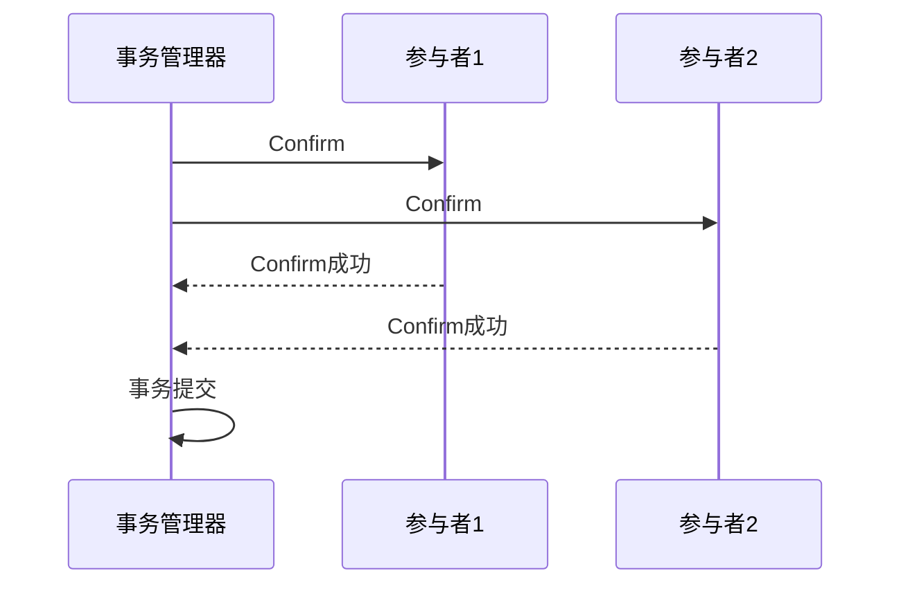

# Seata TCC Confirm阶段

## 介绍

在分布式事务中，Seata 的 TCC（Try-Confirm-Cancel）模式是一种常用的解决方案。TCC 模式通过将事务分为三个阶段（Try、Confirm、Cancel）来确保事务的最终一致性。本文将重点介绍 **Confirm 阶段**，这是 TCC 模式中确保事务提交的关键步骤。

### 什么是 Confirm 阶段？

Confirm 阶段是 TCC 模式的第二个阶段，用于确认 Try 阶段的操作。在 Try 阶段，所有参与者会预留资源或执行初步操作。如果所有参与者的 Try 阶段都成功，事务管理器会调用 Confirm 阶段，正式提交事务。

:::note
Confirm 阶段是幂等的，这意味着无论调用多少次，结果都是一样的。这是为了防止网络抖动或其他异常情况导致 Confirm 被重复调用。
:::

## Confirm 阶段的工作原理

1. **事务管理器调用 Confirm**：当所有参与者的 Try 阶段都成功时，事务管理器会向所有参与者发送 Confirm 请求。
2. **参与者执行 Confirm 操作**：每个参与者根据 Try 阶段的结果，执行实际的提交操作。
3. **事务完成**：如果所有参与者的 Confirm 操作都成功，事务正式提交。



## 代码示例

以下是一个简单的 TCC 模式 Confirm 阶段的代码示例。假设我们有一个订单服务和一个库存服务，订单服务在 Try 阶段预留库存，Confirm 阶段正式扣减库存。

```java
public class InventoryService {

    @Transactional
    public boolean confirm(String productId, int quantity) {
        // 确认扣减库存
        int rows = inventoryMapper.decreaseStock(productId, quantity);
        return rows > 0;
    }
}
```

### 输入与输出

- **输入**：`productId`（商品ID）和 `quantity`（数量）。
- **输出**：`boolean` 类型，表示 Confirm 操作是否成功。

## 实际应用场景

假设我们有一个电商系统，用户下单后需要扣减库存。在 Try 阶段，库存服务会预留库存；在 Confirm 阶段，库存服务会正式扣减库存。如果 Confirm 阶段失败，事务管理器会调用 Cancel 阶段回滚操作。

:::tip
在实际应用中，Confirm 阶段的实现需要确保幂等性，以防止重复调用导致数据不一致。
:::

## 总结

Confirm 阶段是 Seata TCC 模式中确保事务提交的关键步骤。它通过调用所有参与者的 Confirm 操作来正式提交事务。Confirm 阶段的设计需要保证幂等性，以应对网络抖动或其他异常情况。

## 附加资源

- [Seata 官方文档](https://seata.io/zh-cn/docs/)
- [分布式事务与 TCC 模式详解](https://example.com/distributed-transactions-tcc)

## 练习

1. 实现一个简单的 TCC 模式 Confirm 阶段，确保其幂等性。
2. 思考在 Confirm 阶段失败时，如何设计 Cancel 阶段的回滚逻辑。