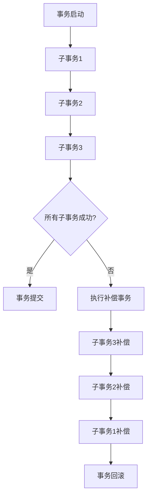

# Seata SAGA模式概述

Seata SAGA模式是一种分布式事务解决方案，特别适用于长事务场景。它通过将事务分解为多个本地事务，并在每个本地事务中记录补偿操作，从而实现最终一致性。本文将详细介绍SAGA模式的概念、工作原理、实际应用场景以及如何通过代码实现。

## 什么是SAGA模式？

SAGA模式最初由Hector Garcia-Molina和Kenneth Salem在1987年提出，用于解决分布式系统中的长事务问题。在SAGA模式中，一个长事务被分解为多个短事务（称为子事务），每个子事务都有一个对应的补偿事务。如果某个子事务失败，系统会通过执行补偿事务来回滚之前已经完成的子事务，从而保证数据的一致性。

Seata SAGA模式是Seata框架中的一种实现，它通过状态机来管理子事务的执行顺序和补偿逻辑，从而简化了分布式事务的管理。

## SAGA模式的工作原理

SAGA模式的核心思想是将一个长事务分解为多个子事务，并为每个子事务定义一个补偿事务。当所有子事务成功执行时，整个事务完成；如果某个子事务失败，系统会依次执行之前子事务的补偿事务，从而回滚整个事务。

### SAGA模式的两种实现方式

1. **Choreography（编排式）**：每个服务都知道自己需要执行的操作以及后续的操作。服务之间通过事件进行通信，协调事务的执行。
2. **Orchestration（编配式）**：由一个中央协调器（Orchestrator）负责协调各个服务的执行顺序和补偿逻辑。Seata SAGA模式采用了这种实现方式。

### Seata SAGA模式的工作流程

1. **事务启动**：客户端发起一个分布式事务请求，Seata的SAGA状态机开始工作。
2. **子事务执行**：状态机按照预定义的顺序依次执行各个子事务。
3. **事务提交或回滚**：
   - 如果所有子事务成功执行，事务提交。
   - 如果某个子事务失败，状态机会依次执行之前子事务的补偿事务，回滚整个事务。



## 实际应用场景

SAGA模式特别适用于以下场景：

1. **长事务**：例如电商系统中的订单处理流程，涉及库存扣减、支付、物流等多个步骤，每个步骤都是一个子事务。
2. **跨服务调用**：例如微服务架构中，多个服务需要协同完成一个业务逻辑。
3. **最终一致性**：例如在分布式系统中，允许短暂的数据不一致，但最终会达到一致状态。

### 示例：电商订单处理

假设我们有一个电商系统，订单处理流程包括以下步骤：

1. **库存扣减**：扣减商品库存。
2. **支付**：用户支付订单。
3. **物流**：生成物流单。

如果支付失败，我们需要回滚库存扣减和物流单生成的操作。使用SAGA模式，我们可以为每个步骤定义补偿操作：

- **库存扣减**的补偿操作是**库存回滚**。
- **支付**的补偿操作是**退款**。
- **物流**的补偿操作是**取消物流单**。

## 代码示例

以下是一个简单的Seata SAGA模式实现示例，使用Java编写：

```java
// 定义状态机
StateMachineEngine stateMachineEngine = StateMachineEngineHolder.getStateMachineEngine();

// 启动事务
StateMachineInstance inst = stateMachineEngine.start("orderProcess", null, null);

// 定义子事务和补偿事务
StateMachineBuilder builder = StateMachineBuilderFactory.create("orderProcess");
builder.transition()
    .from("Start").to("InventoryDeduction").on("DeductInventory")
    .compensate("RollbackInventory");
builder.transition()
    .from("InventoryDeduction").to("Payment").on("MakePayment")
    .compensate("Refund");
builder.transition()
    .from("Payment").to("Logistics").on("GenerateLogistics")
    .compensate("CancelLogistics");

// 注册状态机
stateMachineEngine.registerStateMachine(builder.build());
```

在这个示例中，我们定义了一个名为`orderProcess`的状态机，它包含了三个子事务：`InventoryDeduction`、`Payment`和`Logistics`，并为每个子事务定义了对应的补偿事务。

## 总结

Seata SAGA模式是一种强大的分布式事务解决方案，特别适用于长事务和跨服务调用的场景。通过将事务分解为多个子事务，并为每个子事务定义补偿操作，SAGA模式能够在保证最终一致性的同时，简化分布式事务的管理。

## 附加资源

- [Seata官方文档](https://seata.io/zh-cn/docs/overview/what-is-seata.html)
- [SAGA模式论文](https://www.cs.cornell.edu/andru/cs711/2002fa/reading/sagas.pdf)
- [分布式事务解决方案比较](https://dzone.com/articles/distributed-transaction-solutions-comparison)

## 练习

1. 尝试在本地环境中搭建一个Seata SAGA模式的示例项目。
2. 修改示例代码，添加一个新的子事务（例如`发送通知`），并为其定义补偿事务。
3. 思考并讨论SAGA模式与两阶段提交（2PC）的优缺点。

:::tip
在学习和实践过程中，如果遇到问题，可以参考Seata的官方文档或社区论坛，获取更多帮助。
:::