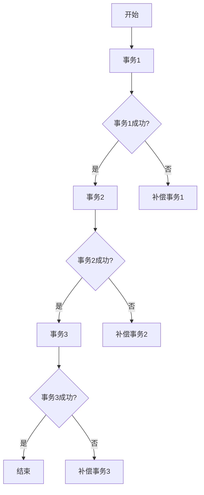

# Seata SAGA设计原理

## 介绍

Seata SAGA模式是一种分布式事务解决方案，适用于长事务场景。与传统的两阶段提交（2PC）或补偿事务（TCC）不同，SAGA模式通过将事务拆分为多个本地事务，并通过事件驱动的方式协调这些事务的执行。每个本地事务完成后，会触发下一个事务的执行，如果某个事务失败，则会触发补偿事务来回滚之前的事务。

SAGA模式的核心思想是“最终一致性”，即通过一系列的事务和补偿操作，最终达到数据一致的状态。这种模式特别适合处理跨多个服务的复杂业务流程。

## SAGA模式的核心概念

### 1. 事务拆分
SAGA模式将一个长事务拆分为多个本地事务。每个本地事务都是一个独立的操作，可以独立提交或回滚。

### 2. 事件驱动
每个本地事务完成后，会触发一个事件，通知下一个事务开始执行。这种事件驱动的方式使得事务之间的依赖关系更加清晰。

### 3. 补偿事务
如果某个本地事务失败，SAGA模式会触发补偿事务来回滚之前的事务。补偿事务是预先定义好的反向操作，用于撤销之前的事务。

### 4. 最终一致性
SAGA模式通过一系列的事务和补偿操作，最终达到数据一致的状态。虽然中间过程可能会出现不一致的情况，但最终会保持一致。

## SAGA模式的工作流程



1. **事务1**：执行第一个本地事务。
2. **事务1成功？**：如果事务1成功，继续执行事务2；如果失败，执行补偿事务1。
3. **事务2**：执行第二个本地事务。
4. **事务2成功？**：如果事务2成功，继续执行事务3；如果失败，执行补偿事务2。
5. **事务3**：执行第三个本地事务。
6. **事务3成功？**：如果事务3成功，流程结束；如果失败，执行补偿事务3。

## 实际案例

假设我们有一个电商系统，用户下单后需要执行以下操作：
1. 扣减库存。
2. 创建订单。
3. 扣减用户余额。

如果其中任何一个步骤失败，都需要回滚之前的操作。

### 代码示例

```java
// 扣减库存
public void deductInventory() {
    // 扣减库存逻辑
}

// 创建订单
public void createOrder() {
    // 创建订单逻辑
}

// 扣减用户余额
public void deductBalance() {
    // 扣减余额逻辑
}

// 补偿事务：恢复库存
public void compensateInventory() {
    // 恢复库存逻辑
}

// 补偿事务：删除订单
public void compensateOrder() {
    // 删除订单逻辑
}

// 补偿事务：恢复余额
public void compensateBalance() {
    // 恢复余额逻辑
}
```

### 执行流程

1. 首先执行 `deductInventory()`，如果成功，继续执行 `createOrder()`；如果失败，执行 `compensateInventory()`。
2. 如果 `createOrder()` 成功，继续执行 `deductBalance()`；如果失败，执行 `compensateOrder()`。
3. 如果 `deductBalance()` 成功，流程结束；如果失败，执行 `compensateBalance()`。

## 总结

Seata SAGA模式通过将长事务拆分为多个本地事务，并通过事件驱动的方式协调这些事务的执行，实现了分布式事务的最终一致性。SAGA模式特别适合处理跨多个服务的复杂业务流程，能够有效降低分布式事务的复杂性。

## 附加资源

- [Seata 官方文档](https://seata.io/zh-cn/docs/overview/what-is-seata.html)
- [分布式事务解决方案](https://en.wikipedia.org/wiki/Distributed_transaction)

## 练习

1. 尝试在本地环境中实现一个简单的SAGA模式示例。
2. 思考在什么场景下SAGA模式比TCC模式更适合。
3. 阅读Seata官方文档，了解更多关于SAGA模式的实现细节。
