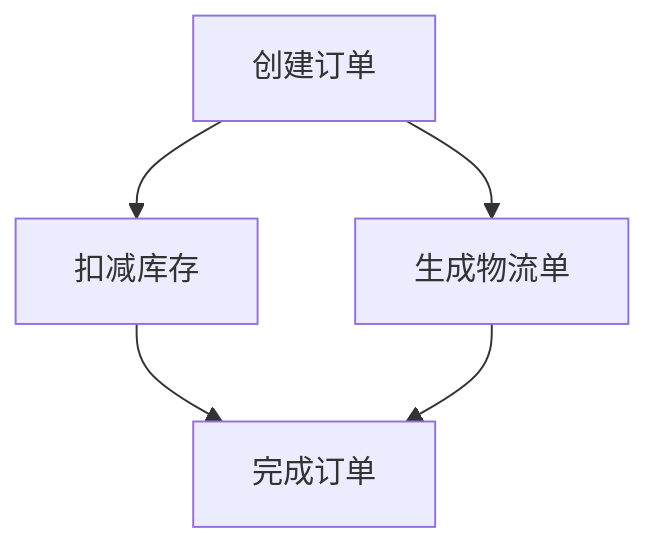
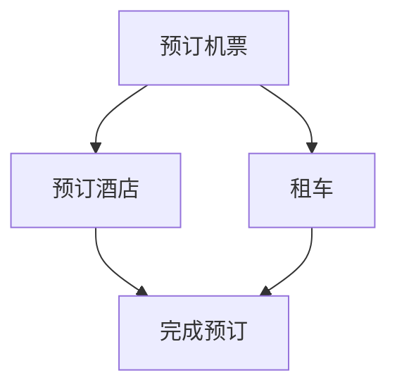

# Seata SAGA并行处理

## 介绍

Seata 是一个开源的分布式事务解决方案，支持多种事务模式，其中 SAGA 模式是一种基于长事务的补偿机制。在 SAGA 模式中，事务被拆分为多个子事务，每个子事务都有对应的补偿操作。通常情况下，这些子事务是按顺序执行的，但在某些场景下，顺序执行可能会导致性能瓶颈。为了解决这个问题，Seata 提供了 **SAGA 并行处理** 机制，允许某些子事务并行执行，从而提升整体事务的执行效率。

本文将详细介绍 Seata SAGA 并行处理的概念、实现方式以及实际应用场景。

---

## SAGA 并行处理的基本概念

在 SAGA 模式中，事务被拆分为多个子事务（也称为事务分支）。每个子事务都有一个正向操作和一个补偿操作。通常情况下，子事务是按顺序执行的，即一个子事务完成后，才会执行下一个子事务。

然而，在某些场景下，子事务之间并没有严格的依赖关系，可以并行执行。例如，在一个电商订单系统中，创建订单、扣减库存和生成物流单这三个子事务可以并行执行，因为它们之间没有直接的依赖关系。

Seata 的 SAGA 并行处理机制允许开发者定义哪些子事务可以并行执行，从而提升事务的执行效率。

---

## 如何实现 SAGA 并行处理

### 1. 定义子事务的依赖关系

在 Seata 中，子事务的依赖关系通过 `@SagaBranch` 注解来定义。默认情况下，子事务是按顺序执行的。如果希望某些子事务并行执行，可以通过设置 `dependsOn` 属性来明确它们的依赖关系。

例如：

```java
@SagaBranch(compensate = "cancelOrder", dependsOn = {})
public void createOrder() {
    // 创建订单逻辑
}

@SagaBranch(compensate = "restoreStock", dependsOn = {})
public void deductStock() {
    // 扣减库存逻辑
}

@SagaBranch(compensate = "cancelLogistics", dependsOn = {})
public void generateLogistics() {
    // 生成物流单逻辑
}
```

在上面的代码中，`createOrder`、`deductStock` 和 `generateLogistics` 三个子事务都没有依赖关系，因此它们可以并行执行。

### 2. 配置并行执行策略

Seata 提供了多种并行执行策略，开发者可以根据实际需求选择合适的策略。常见的策略包括：

- **FIFO（先进先出）**：按照子事务的提交顺序执行。
- **并行度控制**：限制同时执行的子事务数量，避免资源耗尽。

可以通过配置文件或代码来设置并行执行策略。例如：

```yaml
seata:
  saga:
    parallel:
      enabled: true
      max-concurrent: 10
```

### 3. 处理并行执行中的异常

在并行执行过程中，可能会遇到某些子事务失败的情况。Seata 提供了完善的异常处理机制，可以自动触发补偿操作，确保事务的一致性。

例如，如果 `deductStock` 子事务失败，Seata 会自动调用 `restoreStock` 补偿操作，同时终止其他并行执行的子事务。

---

## 实际应用场景

### 电商订单系统

在一个电商订单系统中，创建订单、扣减库存和生成物流单是三个独立的子事务。它们之间没有严格的依赖关系，因此可以并行执行。通过 Seata 的 SAGA 并行处理机制，可以显著提升订单处理的效率。



### 旅行预订系统

在旅行预订系统中，预订机票、预订酒店和租车是三个独立的子事务。它们可以并行执行，从而缩短用户的等待时间。



---

## 总结

Seata 的 SAGA 并行处理机制为分布式事务提供了更高的灵活性和性能。通过合理定义子事务的依赖关系，开发者可以充分利用系统资源，提升事务的执行效率。同时，Seata 提供了完善的异常处理机制，确保事务的一致性和可靠性。

---

## 附加资源与练习

### 资源
- [Seata 官方文档](https://seata.io/zh-cn/docs/overview/what-is-seata.html)
- [SAGA 模式详解](https://microservices.io/patterns/data/saga.html)

### 练习
1. 尝试在一个简单的电商系统中实现 SAGA 并行处理。
2. 模拟子事务失败场景，观察 Seata 的补偿机制如何工作。
3. 调整并行度配置，测试系统在不同负载下的性能表现。