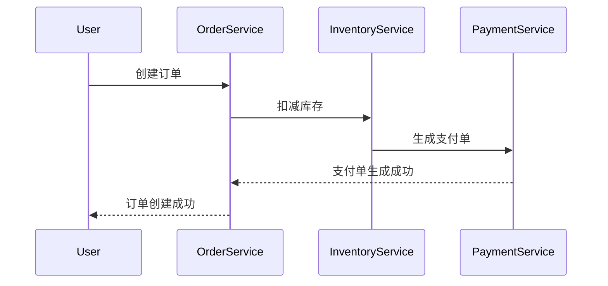

## 介绍

在分布式系统中，事务的长时间运行可能会导致资源占用和系统性能下降。Seata 的 SAGA 模式提供了一种超时控制机制，用于管理事务的执行时间，确保事务在合理的时间内完成或回滚。本文将详细介绍 Seata SAGA 模式中的超时控制机制，并通过代码示例和实际案例帮助您理解其应用。

## 什么是 SAGA 超时控制？

SAGA 模式是一种分布式事务解决方案，它将一个长事务拆分为多个本地事务，每个本地事务都有一个对应的补偿事务。超时控制是 SAGA 模式中的一个重要特性，用于确保事务在指定的时间内完成。如果事务在超时时间内未能完成，系统将自动触发补偿事务，回滚已执行的操作。

## 超时控制的配置

在 Seata 中，超时控制可以通过配置文件或代码进行设置。以下是一个简单的配置示例：

```yaml
seata:
  saga:
    timeout:
      global: 60000  # 全局超时时间，单位为毫秒
      branch: 30000  # 分支事务超时时间，单位为毫秒
```

在这个配置中，`global` 表示整个 SAGA 事务的超时时间，`branch` 表示每个分支事务的超时时间。如果事务在指定的时间内未能完成，系统将自动触发超时处理。

## 代码示例

以下是一个使用 Seata SAGA 模式的简单示例，展示了如何配置和使用超时控制：

```java
@SagaService(timeout = 60000)
public class OrderService {

    @SagaBranch(timeout = 30000)
    public void createOrder(Order order) {
        // 创建订单逻辑
    }

    @SagaCompensate
    public void cancelOrder(Order order) {
        // 取消订单逻辑
    }
}
```

在这个示例中，`@SagaService` 注解用于标记整个 SAGA 事务的超时时间，`@SagaBranch` 注解用于标记分支事务的超时时间。如果 `createOrder` 方法在 30 秒内未能完成，系统将自动调用 `cancelOrder` 方法进行补偿。

## 实际案例

假设我们有一个电商系统，用户下单后需要依次执行以下操作：创建订单、扣减库存、生成支付单。如果其中任何一个操作超时，系统需要回滚已执行的操作。



在这个案例中，如果 `扣减库存` 操作超时，系统将自动回滚 `创建订单` 操作，并通知用户订单创建失败。

## 总结

Seata SAGA 模式的超时控制机制是确保分布式事务可靠性的重要手段。通过合理配置超时时间，可以有效避免事务长时间占用资源，提高系统的稳定性和性能。本文通过代码示例和实际案例，帮助您理解并掌握 Seata SAGA 超时控制的使用方法。

## 附加资源

- [Seata 官方文档](https://seata.io/zh-cn/docs/overview/what-is-seata.html)
- [分布式事务解决方案](https://en.wikipedia.org/wiki/Distributed_transaction)

## 练习

1. 尝试在您的项目中配置 Seata SAGA 模式的超时控制，并测试其效果。
2. 设计一个包含多个分支事务的 SAGA 事务，并模拟超时情况，观察系统的处理流程。
