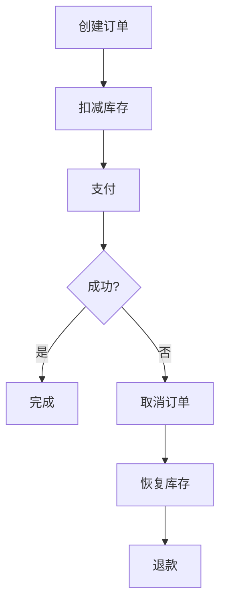

# Seata SAGA最佳实践

## 介绍

Seata SAGA模式是一种用于处理分布式事务的解决方案，特别适用于长事务和复杂业务流程。SAGA模式通过将一个大事务拆分为多个本地事务，并通过补偿机制来保证最终一致性。与传统的两阶段提交（2PC）相比，SAGA模式更适合高并发、高延迟的场景。

在本指南中，我们将深入探讨Seata SAGA模式的最佳实践，帮助你在实际项目中更好地应用这一模式。

## SAGA模式的基本概念

SAGA模式的核心思想是将一个分布式事务拆分为多个本地事务，每个本地事务都有一个对应的补偿事务。如果某个本地事务失败，系统会依次执行之前成功事务的补偿事务，从而回滚整个事务。

### SAGA模式的两种实现方式

1. **编排式（Orchestration）**：通过一个中心化的协调器来管理各个子事务的执行顺序和补偿逻辑。
2. **协同式（Choreography）**：各个子事务通过事件驱动的方式相互协作，没有中心化的协调器。

Seata SAGA模式采用的是编排式实现，通过Seata的协调器来管理事务的执行和补偿。

## Seata SAGA模式的最佳实践

### 1. 事务拆分与设计

在设计SAGA事务时，首先需要将业务流程拆分为多个独立的本地事务。每个本地事务都应该具有幂等性，以确保在重试时不会产生副作用。

:::tip
幂等性是指无论操作执行多少次，结果都是一致的。在设计补偿事务时，幂等性尤为重要。
:::

### 2. 补偿事务的设计

每个本地事务都需要有一个对应的补偿事务。补偿事务的作用是撤销本地事务的操作，确保系统能够回滚到事务开始之前的状态。

```java
// 示例：订单服务的本地事务和补偿事务
public class OrderService {

    @Transactional
    public void createOrder(Order order) {
        // 创建订单
        orderRepository.save(order);
    }

    @Compensable
    public void cancelOrder(Order order) {
        // 取消订单
        orderRepository.delete(order);
    }
}
```

### 3. 事务状态管理

Seata SAGA模式通过全局事务ID（XID）来管理事务的状态。每个本地事务都会记录自己的执行状态，协调器会根据这些状态来决定是否需要执行补偿事务。

```java
// 示例：全局事务的启动
GlobalTransaction tx = GlobalTransactionContext.getCurrentOrCreate();
tx.begin();
try {
    // 执行本地事务
    orderService.createOrder(order);
    inventoryService.reduceStock(order);
    paymentService.pay(order);
    tx.commit();
} catch (Exception e) {
    tx.rollback();
}
```

### 4. 异常处理与重试机制

在分布式系统中，网络波动、服务不可用等问题是不可避免的。因此，SAGA模式需要具备良好的异常处理和重试机制。Seata提供了自动重试的功能，可以在配置文件中设置重试次数和间隔时间。

```yaml
seata:
  saga:
    retry:
      max-retry-count: 3
      retry-interval: 1000
```

### 5. 事务日志与监控

为了确保事务的可追溯性，建议将每个本地事务的执行日志记录下来。Seata提供了事务日志的存储和查询功能，可以通过日志来排查问题。

```java
// 示例：记录事务日志
SagaLogger.log("OrderService.createOrder", order);
```

## 实际案例：电商订单系统

假设我们有一个电商订单系统，用户下单后需要依次执行以下操作：

1. 创建订单
2. 扣减库存
3. 支付

如果其中任何一个步骤失败，系统需要回滚之前的操作。



在这个案例中，如果支付失败，系统会依次执行取消订单、恢复库存和退款操作，确保最终一致性。

## 总结

Seata SAGA模式是处理分布式事务的强大工具，特别适用于长事务和复杂业务流程。通过合理的事务拆分、补偿事务设计、异常处理和日志记录，可以确保系统的高可用性和数据一致性。

## 附加资源与练习

- **官方文档**：[Seata SAGA模式文档](https://seata.io/zh-cn/docs/user/saga.html)
- **练习**：尝试在一个简单的电商系统中实现SAGA模式，模拟订单创建、库存扣减和支付流程，并测试异常情况下的回滚机制。

通过本指南，你应该已经掌握了Seata SAGA模式的基本概念和最佳实践。希望这些内容能帮助你在实际项目中更好地应用SAGA模式。