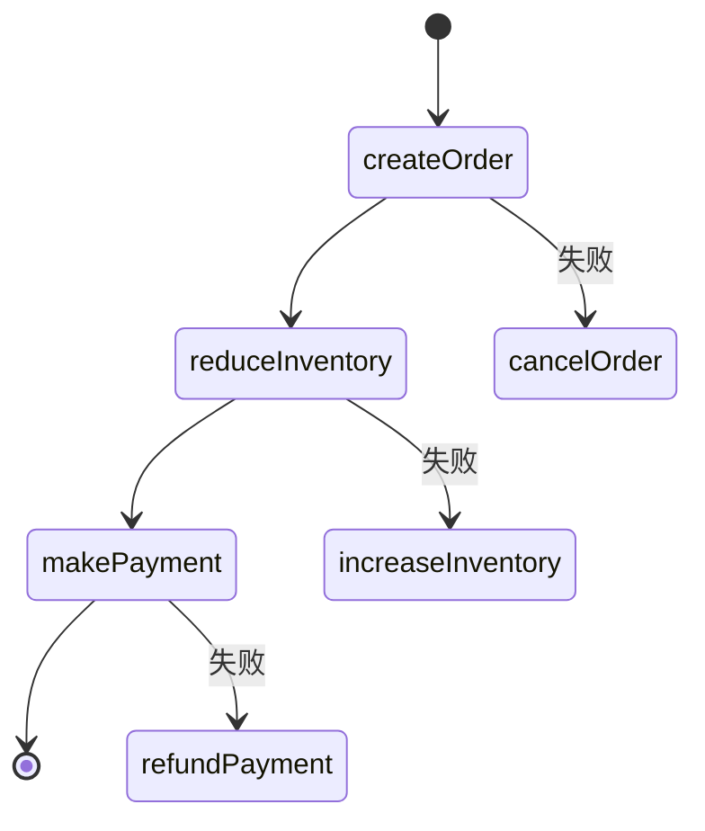

# Seata SAGA状态机定义

Seata SAGA模式是一种用于管理分布式事务的解决方案，特别适用于长事务场景。SAGA模式通过将事务拆分为多个本地事务，并通过状态机来管理这些事务的执行顺序和补偿逻辑。本文将详细介绍Seata SAGA状态机的定义及其工作原理。

## 什么是SAGA状态机？

SAGA状态机是Seata SAGA模式的核心组件，它定义了事务的执行流程和补偿逻辑。状态机由多个状态（State）和状态之间的转换（Transition）组成。每个状态代表一个本地事务的执行步骤，而转换则定义了事务的执行顺序和条件。

### 状态机的基本结构

一个SAGA状态机通常包含以下几个部分：

1. **状态（State）**：表示事务的一个执行步骤，可以是服务调用或补偿操作。
2. **转换（Transition）**：定义了从一个状态到另一个状态的转换条件。
3. **补偿（Compensation）**：在事务失败时，用于回滚已执行的操作。

## 状态机定义示例

以下是一个简单的SAGA状态机定义示例，假设我们有一个订单处理流程，包含创建订单、扣减库存和支付三个步骤。

```json
{
  "name": "orderProcess",
  "states": [
    {
      "name": "createOrder",
      "service": "orderService",
      "method": "create",
      "compensate": {
        "service": "orderService",
        "method": "cancel"
      }
    },
    {
      "name": "reduceInventory",
      "service": "inventoryService",
      "method": "reduce",
      "compensate": {
        "service": "inventoryService",
        "method": "increase"
      }
    },
    {
      "name": "makePayment",
      "service": "paymentService",
      "method": "pay",
      "compensate": {
        "service": "paymentService",
        "method": "refund"
      }
    }
  ],
  "transitions": [
    {
      "from": "createOrder",
      "to": "reduceInventory"
    },
    {
      "from": "reduceInventory",
      "to": "makePayment"
    }
  ]
}
```

在这个示例中，`createOrder`、`reduceInventory`和`makePayment`是三个状态，分别对应创建订单、扣减库存和支付操作。每个状态都定义了对应的补偿操作，用于在事务失败时回滚。

## 状态机的工作原理

当SAGA事务启动时，状态机会按照定义的顺序依次执行每个状态。如果某个状态执行失败，状态机会自动触发补偿操作，回滚之前已执行的状态。

### 状态机的执行流程

1. **启动事务**：状态机从初始状态开始执行。
2. **执行状态**：依次执行每个状态对应的服务调用。
3. **检查结果**：如果某个状态执行失败，状态机会触发补偿操作。
4. **补偿操作**：按照相反的顺序执行补偿操作，回滚已执行的状态。



## 实际应用场景

假设我们有一个电商系统，用户下单后需要依次执行创建订单、扣减库存和支付操作。如果支付失败，系统需要自动取消订单并恢复库存。

### 场景描述

1. **创建订单**：系统创建订单并保存到数据库。
2. **扣减库存**：系统扣减商品库存。
3. **支付**：用户完成支付操作。

如果支付失败，系统需要执行以下补偿操作：

1. **取消订单**：删除已创建的订单。
2. **恢复库存**：将扣减的库存恢复到原值。

### 代码实现

```java
public class OrderService {
    public void create(Order order) {
        // 创建订单逻辑
    }

    public void cancel(Order order) {
        // 取消订单逻辑
    }
}

public class InventoryService {
    public void reduce(Product product) {
        // 扣减库存逻辑
    }

    public void increase(Product product) {
        // 恢复库存逻辑
    }
}

public class PaymentService {
    public void pay(Order order) {
        // 支付逻辑
    }

    public void refund(Order order) {
        // 退款逻辑
    }
}
```

## 总结

Seata SAGA状态机是管理分布式事务的强大工具，特别适用于长事务场景。通过定义状态和转换，开发者可以清晰地描述事务的执行流程和补偿逻辑。在实际应用中，SAGA状态机可以帮助开发者简化事务管理，提高系统的可靠性和可维护性。

## 附加资源

- [Seata官方文档](https://seata.io/zh-cn/docs/)
- [分布式事务模式详解](https://microservices.io/patterns/data/saga.html)
- [SAGA模式实战案例](https://github.com/seata/seata-samples)

:::tip
建议初学者通过实际项目练习SAGA状态机的定义和使用，以加深理解。
:::