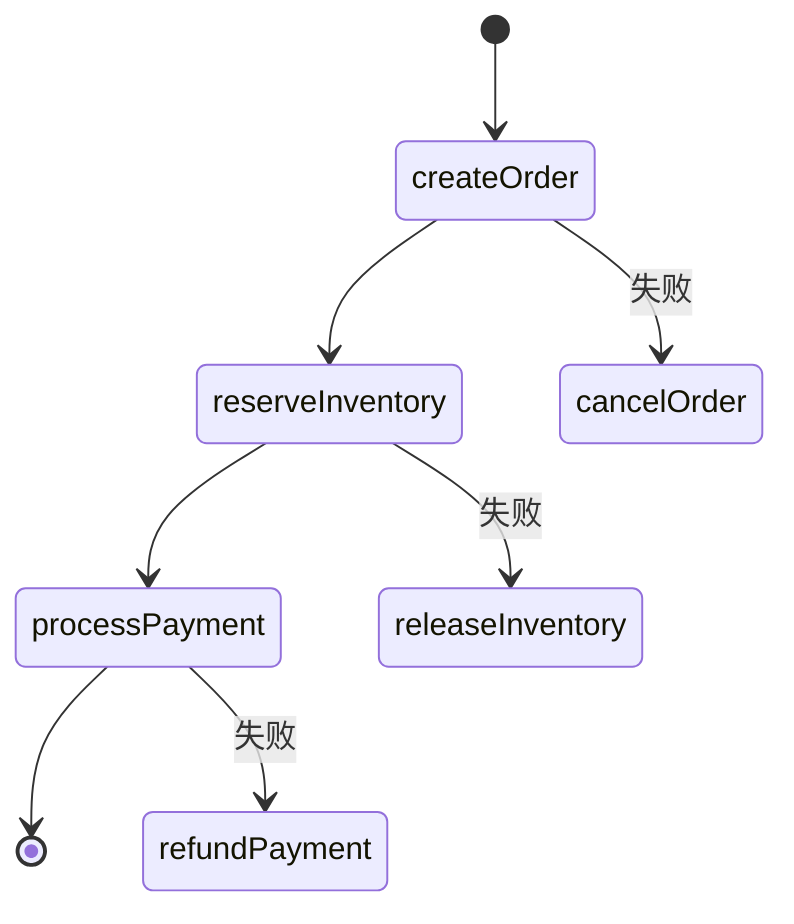

## 介绍

Seata 是一个开源的分布式事务解决方案，而 SAGA 模式是 Seata 提供的一种长事务解决方案。SAGA 模式通过将一个大事务拆分为多个本地事务，并通过补偿机制保证最终一致性。在 SAGA 模式中，**状态语言**用于定义事务的执行流程，包括事务的执行顺序、补偿逻辑以及状态转换。

状态语言是 SAGA 模式的核心，它允许开发者以声明式的方式描述事务的执行流程，而无需编写复杂的代码。通过状态语言，开发者可以清晰地定义每个步骤的执行逻辑以及失败时的补偿操作。

## 状态语言的基本概念

在 Seata SAGA 模式中，状态语言由以下几个核心概念组成：

1. **状态（State）**：表示事务执行过程中的一个步骤或阶段。每个状态可以是一个本地事务或一个补偿操作。
2. **条件（Condition）**：用于决定状态之间的转换条件。条件可以是基于前一个状态的结果或其他业务逻辑。
3. **补偿（Compensation）**：当某个状态执行失败时，需要执行的补偿操作。补偿操作用于回滚之前的状态，以保证事务的最终一致性。
4. **流程（Flow）**：由多个状态和条件组成的执行流程。流程定义了事务的完整执行路径。

## 状态语言的语法

状态语言使用 JSON 格式来描述事务的执行流程。以下是一个简单的状态语言示例：

```json
{
  "name": "orderSaga",
  "steps": [
    {
      "name": "createOrder",
      "service": "orderService",
      "method": "create",
      "compensate": {
        "service": "orderService",
        "method": "cancel"
      }
    },
    {
      "name": "reserveInventory",
      "service": "inventoryService",
      "method": "reserve",
      "compensate": {
        "service": "inventoryService",
        "method": "release"
      }
    },
    {
      "name": "processPayment",
      "service": "paymentService",
      "method": "pay",
      "compensate": {
        "service": "paymentService",
        "method": "refund"
      }
    }
  ]
}
```

在这个示例中，`orderSaga` 是一个 SAGA 事务流程，包含三个步骤：`createOrder`、`reserveInventory` 和 `processPayment`。每个步骤都定义了一个本地事务的执行方法（`method`）以及对应的补偿方法（`compensate`）。

## 状态语言的执行流程

状态语言的执行流程可以通过以下步骤来描述：

1. **初始化**：SAGA 事务开始时，系统会根据状态语言的定义初始化事务的执行流程。
2. **执行步骤**：系统按照状态语言中定义的顺序依次执行每个步骤。每个步骤对应一个本地事务。
3. **条件判断**：在执行每个步骤后，系统会根据条件判断是否继续执行下一个步骤。如果条件不满足，事务将进入补偿流程。
4. **补偿操作**：如果某个步骤执行失败，系统会按照状态语言中定义的补偿操作依次执行补偿逻辑，回滚之前的状态。

以下是一个状态语言执行流程的 Mermaid 图表：



在这个流程图中，`createOrder`、`reserveInventory` 和 `processPayment` 是正常执行的步骤，而 `cancelOrder`、`releaseInventory` 和 `refundPayment` 是失败时的补偿操作。

## 实际案例

假设我们有一个电商系统，用户下单时需要执行以下操作：

1. 创建订单（`createOrder`）
2. 扣减库存（`reserveInventory`）
3. 扣款（`processPayment`）

如果其中任何一个步骤失败，系统需要执行相应的补偿操作：

- 如果 `createOrder` 失败，无需补偿。
- 如果 `reserveInventory` 失败，需要取消订单（`cancelOrder`）。
- 如果 `processPayment` 失败，需要释放库存（`releaseInventory`）并取消订单。

以下是一个完整的 SAGA 状态语言定义：

```json
{
  "name": "orderSaga",
  "steps": [
    {
      "name": "createOrder",
      "service": "orderService",
      "method": "create",
      "compensate": {
        "service": "orderService",
        "method": "cancel"
      }
    },
    {
      "name": "reserveInventory",
      "service": "inventoryService",
      "method": "reserve",
      "compensate": {
        "service": "inventoryService",
        "method": "release"
      }
    },
    {
      "name": "processPayment",
      "service": "paymentService",
      "method": "pay",
      "compensate": {
        "service": "paymentService",
        "method": "refund"
      }
    }
  ]
}
```

在这个案例中，如果 `processPayment` 失败，系统会依次执行 `refundPayment` 和 `releaseInventory`，最后执行 `cancelOrder`，以保证事务的最终一致性。

## 总结

Seata SAGA 状态语言是定义分布式事务执行流程的强大工具。通过状态语言，开发者可以清晰地描述事务的执行步骤和补偿逻辑，而无需编写复杂的代码。状态语言的核心概念包括状态、条件、补偿和流程，它们共同构成了 SAGA 事务的执行框架。

在实际应用中，状态语言可以帮助开发者轻松处理复杂的分布式事务场景，确保系统的最终一致性。

## 附加资源

- [Seata 官方文档](https://seata.io/zh-cn/docs/overview/what-is-seata.html)
- [SAGA 模式详解](https://microservices.io/patterns/data/saga.html)
- [分布式事务实践指南](https://dzone.com/articles/distributed-transactions-the-ultimate-guide)

:::tip 练习
尝试为以下场景设计一个 SAGA 状态语言：
1. 用户注册（`registerUser`）
2. 发送欢迎邮件（`sendWelcomeEmail`）
3. 分配用户角色（`assignRole`）

如果其中任何一个步骤失败，设计相应的补偿操作。
:::