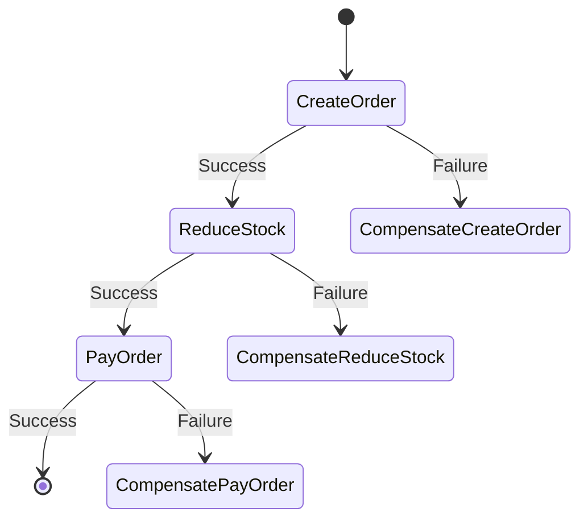

# Seata SAGA 编排设计

## 介绍

Seata 是一个开源的分布式事务解决方案，支持多种事务模式，其中 SAGA 模式是一种基于长事务的最终一致性解决方案。SAGA 模式通过将一个大事务拆分为多个本地事务，并通过编排的方式确保这些本地事务最终能够达到一致状态。

在 SAGA 模式中，编排设计是关键。编排设计定义了事务的执行顺序、补偿逻辑以及异常处理机制。通过合理的编排设计，可以确保在分布式系统中，即使某些服务出现故障，事务仍然能够最终一致。

## SAGA 编排的基本概念

### 1. 事务步骤（Transaction Step）

SAGA 事务由多个步骤组成，每个步骤对应一个本地事务。每个步骤包含两个部分：
- **正向操作（Try）**：执行事务的主要逻辑。
- **补偿操作（Compensate）**：在事务失败时，用于回滚正向操作。

### 2. 编排（Orchestration）

编排是指定义事务步骤的执行顺序和依赖关系。通过编排，可以确保事务按照预定的顺序执行，并在出现异常时执行相应的补偿操作。

### 3. 状态机（State Machine）

SAGA 编排通常使用状态机来描述事务的执行流程。状态机定义了事务的各个状态以及状态之间的转换规则。

## SAGA 编排设计示例

### 1. 定义事务步骤

假设我们有一个订单服务，包含以下步骤：
1. **创建订单（Create Order）**
2. **扣减库存（Reduce Stock）**
3. **支付订单（Pay Order）**

每个步骤都有对应的正向操作和补偿操作。

### 2. 编排设计

我们可以使用状态机来描述这个事务的编排设计。以下是一个简单的状态机示例：



### 3. 代码示例

以下是一个简单的 Java 代码示例，展示了如何使用 Seata 的 SAGA 模式来实现上述编排设计。

```java
public class OrderService {

    @SagaStart
    public void createOrder(Order order) {
        // 正向操作：创建订单
        orderRepository.save(order);
    }

    @Compensate
    public void compensateCreateOrder(Order order) {
        // 补偿操作：删除订单
        orderRepository.delete(order);
    }

    @SagaStart
    public void reduceStock(Order order) {
        // 正向操作：扣减库存
        stockService.reduce(order.getProductId(), order.getQuantity());
    }

    @Compensate
    public void compensateReduceStock(Order order) {
        // 补偿操作：恢复库存
        stockService.increase(order.getProductId(), order.getQuantity());
    }

    @SagaStart
    public void payOrder(Order order) {
        // 正向操作：支付订单
        paymentService.pay(order.getOrderId(), order.getAmount());
    }

    @Compensate
    public void compensatePayOrder(Order order) {
        // 补偿操作：退款
        paymentService.refund(order.getOrderId(), order.getAmount());
    }
}
```

### 4. 输入与输出

假设我们有一个订单对象 `order`，其内容如下：

```json
{
    "orderId": "12345",
    "productId": "67890",
    "quantity": 2,
    "amount": 100.0
}
```

当执行 `createOrder(order)` 时，订单会被创建并保存到数据库中。如果后续步骤失败，系统会自动调用相应的补偿操作来回滚事务。

## 实际应用场景

### 电商订单系统

在电商系统中，订单的创建、库存的扣减和支付是三个关键步骤。通过 SAGA 编排设计，可以确保在支付失败时，库存能够自动恢复，订单能够被删除，从而保证系统的一致性。

### 旅行预订系统

在旅行预订系统中，预订酒店、预订机票和支付费用是三个关键步骤。通过 SAGA 编排设计，可以确保在支付失败时，酒店和机票的预订能够被取消，从而避免资源浪费。

## 总结

Seata 的 SAGA 模式通过编排设计实现了分布式事务的最终一致性。通过定义事务步骤、编排顺序和补偿逻辑，可以确保在分布式系统中，即使某些服务出现故障，事务仍然能够最终一致。

## 附加资源与练习

- **练习**：尝试在一个简单的电商系统中实现 SAGA 编排设计，确保订单、库存和支付三个步骤的最终一致性。
- **资源**：阅读 Seata 官方文档，了解更多关于 SAGA 模式的详细信息和最佳实践。

:::tip
提示：在实际应用中，编排设计需要根据业务需求进行调整，确保事务的可靠性和性能。
:::