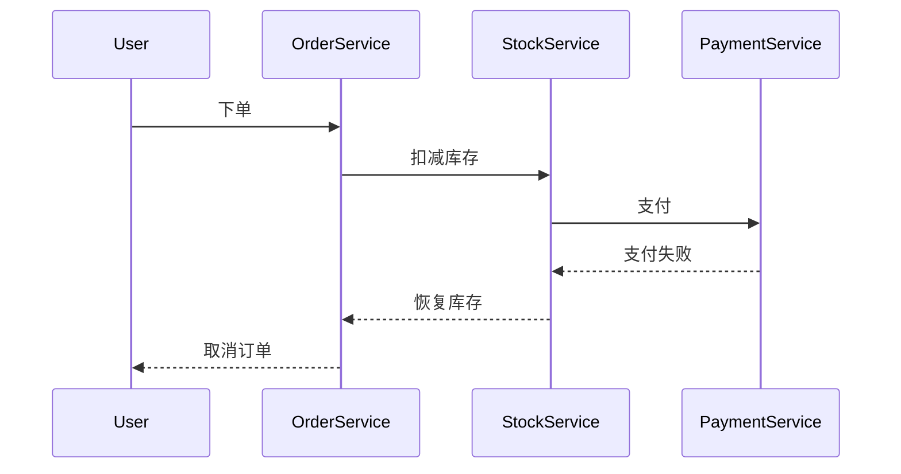

# Seata SAGA补偿机制

## 介绍

在分布式系统中，事务管理是一个复杂的问题。Seata SAGA模式是一种用于处理长事务的解决方案，它通过将事务分解为多个步骤，并在每个步骤中执行补偿操作来实现事务的最终一致性。SAGA模式的核心思想是：如果某个步骤失败，系统会执行一系列补偿操作来回滚之前已经完成的步骤，从而保证数据的一致性。

补偿机制是SAGA模式的关键部分。它允许系统在事务失败时，通过执行反向操作来撤销已经完成的操作。这种机制特别适用于那些无法通过简单的回滚操作来恢复状态的场景。

## SAGA模式的基本概念

在SAGA模式中，一个事务被分解为多个步骤，每个步骤都有一个对应的补偿操作。当某个步骤失败时，系统会按照相反的顺序执行之前步骤的补偿操作，从而回滚整个事务。

### SAGA模式的两种实现方式

1. **编排式（Choreography）**：每个服务都知道自己需要执行的操作以及如何补偿这些操作。服务之间通过事件进行通信。
2. **编排式（Orchestration）**：由一个中央协调器（Orchestrator）来管理事务的执行顺序和补偿操作。

Seata SAGA模式采用的是**编排式（Orchestration）**的实现方式。

## Seata SAGA补偿机制的工作原理

在Seata SAGA模式中，补偿机制的工作原理如下：

1. **事务开始**：事务开始时，系统会记录事务的初始状态。
2. **执行步骤**：系统按照预定义的顺序执行事务的各个步骤。
3. **步骤失败**：如果某个步骤失败，系统会触发补偿机制。
4. **执行补偿**：系统按照相反的顺序执行之前步骤的补偿操作。
5. **事务结束**：所有补偿操作执行完毕后，事务结束。

### 代码示例

以下是一个简单的Seata SAGA模式的代码示例，展示了如何定义事务步骤和补偿操作。

```java
@SagaStart
public void placeOrder(Order order) {
    // 步骤1：创建订单
    createOrder(order);
    
    // 步骤2：扣减库存
    reduceStock(order);
    
    // 步骤3：支付
    pay(order);
}

@Compensable
public void createOrder(Order order) {
    // 创建订单逻辑
    orderService.create(order);
}

@Compensable
public void reduceStock(Order order) {
    // 扣减库存逻辑
    stockService.reduce(order);
}

@Compensable
public void pay(Order order) {
    // 支付逻辑
    paymentService.pay(order);
}

@Compensable
public void compensateCreateOrder(Order order) {
    // 补偿逻辑：撤销订单
    orderService.cancel(order);
}

@Compensable
public void compensateReduceStock(Order order) {
    // 补偿逻辑：恢复库存
    stockService.restore(order);
}

@Compensable
public void compensatePay(Order order) {
    // 补偿逻辑：退款
    paymentService.refund(order);
}
```

在这个示例中，`placeOrder`方法定义了事务的各个步骤，每个步骤都有一个对应的补偿方法。如果某个步骤失败，系统会自动调用相应的补偿方法来撤销之前的操作。

## 实际应用场景

假设我们有一个电商系统，用户下单后需要执行以下操作：

1. 创建订单
2. 扣减库存
3. 支付

如果支付失败，系统需要撤销之前的操作，即取消订单并恢复库存。这时，Seata SAGA模式的补偿机制就派上了用场。

### 场景示例



在这个场景中，支付失败后，系统会自动执行补偿操作，恢复库存并取消订单。

## 总结

Seata SAGA模式的补偿机制是处理分布式事务中长事务的有效方式。通过将事务分解为多个步骤，并在每个步骤中定义补偿操作，系统可以在事务失败时自动回滚，保证数据的一致性。对于初学者来说，理解SAGA模式的基本概念和补偿机制的工作原理是非常重要的。

## 附加资源

- [Seata官方文档](https://seata.io/zh-cn/docs/overview/what-is-seata.html)
- [分布式事务与SAGA模式](https://microservices.io/patterns/data/saga.html)
- [Seata SAGA模式示例代码](https://github.com/seata/seata-samples)

## 练习

1. 尝试在本地环境中运行Seata SAGA模式的示例代码，观察事务的执行和补偿过程。
2. 修改示例代码，添加一个新的步骤（例如发送通知），并定义其补偿操作。
3. 思考在实际项目中，哪些场景适合使用SAGA模式，并尝试设计一个简单的SAGA事务流程。
