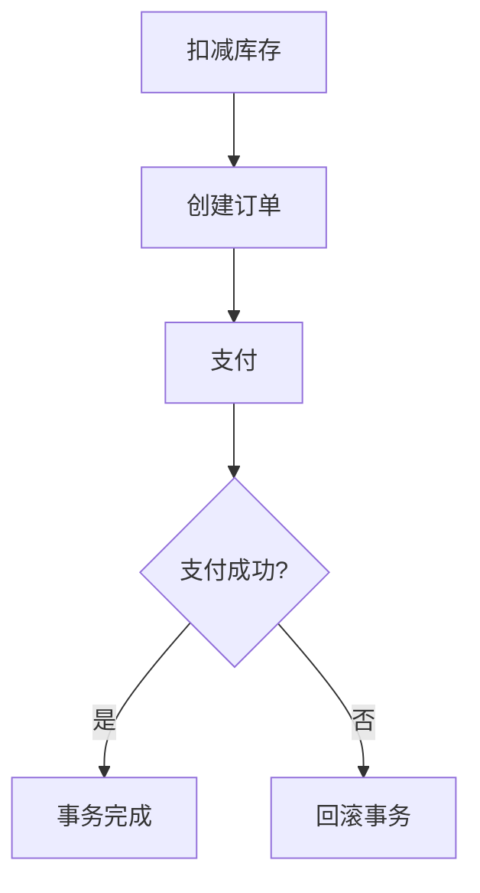

# Seata SAGA状态持久化

在分布式系统中，事务管理是一个复杂且关键的问题。Seata 是一个开源的分布式事务解决方案，其中的 SAGA 模式通过将长事务拆分为多个本地事务来实现最终一致性。为了确保在系统故障或重启后事务状态能够恢复，Seata 提供了状态持久化机制。本文将详细介绍 Seata SAGA 模式中的状态持久化机制，并通过实际案例帮助你理解其工作原理。

## 什么是 SAGA 状态持久化？

SAGA 状态持久化是指在 SAGA 事务执行过程中，将事务的状态（如事务的当前步骤、执行结果等）保存到持久化存储中（如数据库）。这样，即使系统发生故障或重启，事务的状态仍然可以被恢复，从而确保事务能够继续执行或回滚。

:::note
状态持久化是分布式事务中确保数据一致性和可靠性的重要机制。
:::

## 为什么需要状态持久化？

在分布式系统中，事务可能涉及多个服务，每个服务都有自己的本地事务。如果某个服务在执行过程中发生故障，事务的状态可能会丢失，导致事务无法继续执行或回滚。通过状态持久化，我们可以确保事务的状态在故障恢复后仍然可用，从而避免数据不一致的问题。

## Seata SAGA 状态持久化机制

Seata SAGA 模式通过以下方式实现状态持久化：

1. **事务日志存储**：Seata 将事务的执行步骤和状态记录在事务日志中，并将其存储到持久化存储中（如数据库）。
2. **状态恢复**：在系统重启或故障恢复后，Seata 会从持久化存储中读取事务日志，恢复事务的状态，并根据日志中的信息决定事务的下一步操作（继续执行或回滚）。

### 事务日志结构

Seata SAGA 的事务日志通常包含以下字段：

- `xid`：全局事务 ID，用于唯一标识一个全局事务。
- `branch_id`：分支事务 ID，用于标识一个分支事务。
- `status`：事务状态，如 `BEGIN`、`COMMITTED`、`ROLLBACKED` 等。
- `content`：事务内容，通常是一个 JSON 字符串，包含事务的执行步骤和参数。

### 代码示例

以下是一个简单的代码示例，展示如何在 Seata SAGA 模式中使用状态持久化：

```java
// 定义 SAGA 事务
@SagaTransactional
public void executeSagaTransaction() {
    // 步骤1：执行本地事务
    step1();
    
    // 步骤2：执行另一个本地事务
    step2();
    
    // 步骤3：执行最后一个本地事务
    step3();
}

private void step1() {
    // 模拟本地事务执行
    System.out.println("Step 1 executed");
}

private void step2() {
    // 模拟本地事务执行
    System.out.println("Step 2 executed");
}

private void step3() {
    // 模拟本地事务执行
    System.out.println("Step 3 executed");
}
```

在执行上述代码时，Seata 会自动将每个步骤的状态记录到事务日志中，并将其存储到持久化存储中。

### 状态恢复示例

假设在 `step2` 执行过程中系统发生故障，事务的状态会被记录到持久化存储中。在系统恢复后，Seata 会从持久化存储中读取事务日志，并根据日志中的信息决定事务的下一步操作（继续执行 `step2` 或回滚）。

## 实际应用场景

### 电商订单系统

假设我们有一个电商订单系统，用户下单后需要依次执行以下操作：

1. 扣减库存
2. 创建订单
3. 支付

如果支付操作失败，系统需要回滚之前的操作（如恢复库存、删除订单）。通过 Seata SAGA 模式，我们可以将每个操作拆分为一个本地事务，并通过状态持久化确保在系统故障后能够恢复事务状态，从而保证数据的一致性。



## 总结

Seata SAGA 状态持久化是确保分布式事务可靠性的重要机制。通过将事务的状态保存到持久化存储中，我们可以在系统故障或重启后恢复事务的状态，从而确保事务能够继续执行或回滚。本文通过代码示例和实际应用场景，帮助你理解了 Seata SAGA 状态持久化的基本原理和应用方法。

## 附加资源

- [Seata 官方文档](https://seata.io/zh-cn/docs/overview/what-is-seata.html)
- [分布式事务与 SAGA 模式](https://microservices.io/patterns/data/saga.html)

## 练习

1. 尝试在本地环境中配置 Seata 并运行一个简单的 SAGA 事务，观察事务日志的生成和状态恢复过程。
2. 修改上述电商订单系统的示例代码，增加一个“发货”操作，并测试在发货操作失败时事务的回滚过程。
