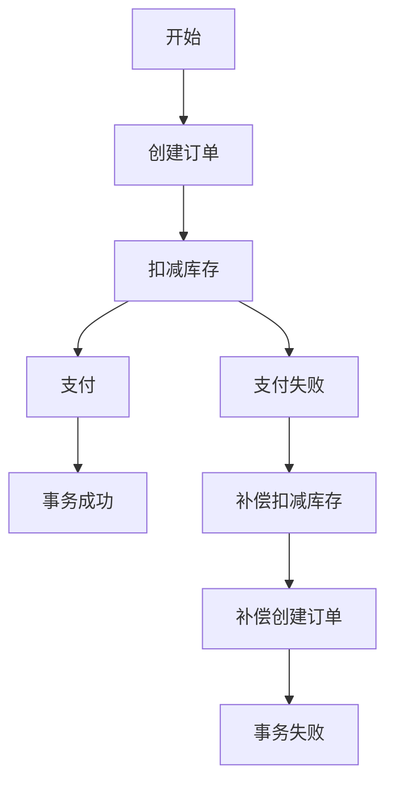

# Seata SAGA可视化设计

## 介绍

Seata SAGA模式是一种用于处理分布式事务的解决方案，特别适用于长事务场景。SAGA模式通过将一个大事务拆分为多个本地事务，并通过补偿机制来保证最终一致性。本文将介绍如何使用Seata SAGA模式进行可视化设计，帮助初学者理解其工作原理和实际应用。

## SAGA模式的核心概念

在SAGA模式中，一个分布式事务被拆分为多个本地事务，每个本地事务都有一个对应的补偿事务。如果某个本地事务失败，系统会依次执行之前成功的本地事务的补偿事务，从而回滚整个事务。

### SAGA事务的生命周期

1. **事务开始**：启动一个SAGA事务。
2. **执行本地事务**：依次执行每个本地事务。
3. **事务成功**：所有本地事务执行成功，事务完成。
4. **事务失败**：某个本地事务失败，执行补偿事务回滚。

## Seata SAGA可视化设计

Seata提供了SAGA模式的可视化设计工具，帮助开发者更直观地设计和调试SAGA事务。通过可视化工具，开发者可以清晰地看到事务的执行流程、状态以及补偿机制。

### 可视化工具的使用

1. **安装Seata**：首先需要安装并配置Seata服务器。
2. **定义SAGA事务**：使用Seata提供的API定义SAGA事务的各个步骤。
3. **启动可视化工具**：启动Seata的可视化工具，查看事务的执行情况。

### 示例代码

以下是一个简单的SAGA事务定义示例：

```java
@SagaStart
public void placeOrder() {
    // 步骤1：创建订单
    createOrder();
    
    // 步骤2：扣减库存
    reduceStock();
    
    // 步骤3：支付
    makePayment();
}

@Compensable
public void createOrder() {
    // 创建订单逻辑
}

@Compensable
public void reduceStock() {
    // 扣减库存逻辑
}

@Compensable
public void makePayment() {
    // 支付逻辑
}
```

### 可视化工具中的事务流程

在Seata的可视化工具中，你可以看到以下事务流程：



## 实际案例

假设我们有一个电商系统，用户下单时需要依次执行创建订单、扣减库存和支付三个步骤。如果支付失败，系统需要回滚之前的操作。

### 案例流程

1. **创建订单**：在数据库中创建订单记录。
2. **扣减库存**：减少库存数量。
3. **支付**：调用支付接口进行支付。

如果支付失败，系统需要执行以下补偿操作：

1. **补偿扣减库存**：恢复库存数量。
2. **补偿创建订单**：删除订单记录。

## 总结

Seata SAGA模式通过将分布式事务拆分为多个本地事务，并通过补偿机制保证最终一致性，非常适合处理长事务场景。通过Seata的可视化工具，开发者可以更直观地设计和调试SAGA事务，提高开发效率。

## 附加资源

- [Seata官方文档](https://seata.io/zh-cn/docs/overview/what-is-seata.html)
- [SAGA模式详解](https://microservices.io/patterns/data/saga.html)
- [分布式事务实践](https://dzone.com/articles/distributed-transactions-in-microservices-with-saga)

## 练习

1. 尝试在本地环境中配置Seata，并运行一个简单的SAGA事务。
2. 使用Seata的可视化工具，观察事务的执行流程和状态变化。
3. 修改示例代码，添加一个新的本地事务步骤，并定义其补偿事务。

通过以上学习和实践，你将能够掌握Seata SAGA模式的核心概念和可视化设计方法。