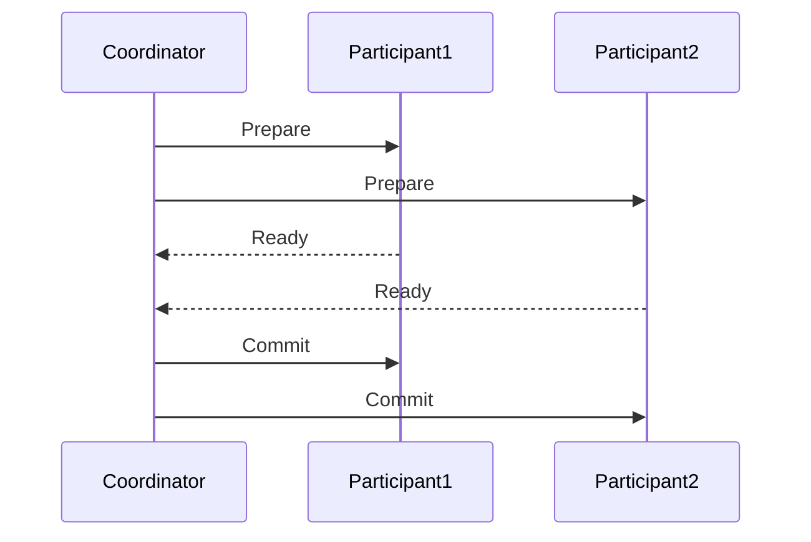

# Seata XA模式概述

## 介绍

在分布式系统中，事务管理是一个复杂且关键的问题。Seata 是一个开源的分布式事务解决方案，提供了多种事务模式来满足不同的业务需求。其中，XA模式是Seata支持的一种基于两阶段提交（2PC）的分布式事务模式。

XA模式的核心思想是通过协调多个资源管理器（如数据库）来确保事务的原子性。它适用于需要强一致性的场景，尤其是在跨多个数据库或服务的分布式事务中。

## XA模式的工作原理

XA模式基于XA协议，XA协议是由X/Open组织定义的一种分布式事务处理标准。它通过两阶段提交（2PC）来确保事务的原子性。

### 两阶段提交（2PC）

两阶段提交分为两个阶段：

1. **准备阶段（Prepare Phase）**：事务协调者（Transaction Coordinator）向所有参与者（Participants）发送准备请求，询问它们是否可以提交事务。参与者执行事务操作，并将结果（成功或失败）返回给协调者。

2. **提交阶段（Commit Phase）**：如果所有参与者都返回成功，协调者向所有参与者发送提交请求，参与者正式提交事务。如果有任何一个参与者返回失败，协调者则发送回滚请求，所有参与者回滚事务。



### Seata XA模式的实现

在Seata中，XA模式的实现依赖于数据库的XA协议支持。Seata的XA模式通过以下步骤来管理分布式事务：

1. **事务开始**：应用程序启动一个全局事务，Seata的事务协调者生成一个全局事务ID（XID）。

2. **分支事务注册**：每个参与事务的数据库操作都会注册为一个分支事务，并与全局事务ID关联。

3. **两阶段提交**：
   - **准备阶段**：Seata协调者向所有分支事务发送准备请求，分支事务执行本地事务并锁定资源。
   - **提交阶段**：如果所有分支事务都准备成功，Seata协调者发送提交请求，分支事务提交本地事务并释放资源。

## 代码示例

以下是一个简单的Seata XA模式的使用示例。假设我们有两个数据库操作，分别在不同的数据库中执行。

```java
// 全局事务开始
GlobalTransaction tx = GlobalTransactionContext.getCurrentOrCreate();
tx.begin();

try {
    // 分支事务1：操作数据库A
    DataSourceProxy dataSourceA = new DataSourceProxy(databaseA);
    Connection connA = dataSourceA.getConnection();
    PreparedStatement pstmtA = connA.prepareStatement("INSERT INTO tableA (column) VALUES (?)");
    pstmtA.setString(1, "valueA");
    pstmtA.executeUpdate();

    // 分支事务2：操作数据库B
    DataSourceProxy dataSourceB = new DataSourceProxy(databaseB);
    Connection connB = dataSourceB.getConnection();
    PreparedStatement pstmtB = connB.prepareStatement("INSERT INTO tableB (column) VALUES (?)");
    pstmtB.setString(1, "valueB");
    pstmtB.executeUpdate();

    // 全局事务提交
    tx.commit();
} catch (Exception e) {
    // 全局事务回滚
    tx.rollback();
}
```

在这个示例中，`GlobalTransaction` 表示一个全局事务，`DataSourceProxy` 是Seata提供的代理数据源，用于拦截数据库操作并注册分支事务。如果所有操作成功，全局事务提交；如果任何一个操作失败，全局事务回滚。

## 实际应用场景

Seata XA模式适用于需要强一致性的分布式事务场景，例如：

- **跨数据库事务**：当业务需要同时操作多个数据库时，XA模式可以确保所有数据库操作要么全部成功，要么全部回滚。
- **跨服务事务**：在微服务架构中，多个服务可能分别操作不同的数据库，XA模式可以确保这些操作的一致性。

:::tip
XA模式虽然提供了强一致性，但由于其两阶段提交的特性，性能开销较大。因此，在不需要强一致性的场景下，可以考虑使用Seata的其他事务模式，如AT模式或TCC模式。
:::

## 总结

Seata XA模式是一种基于XA协议的分布式事务解决方案，适用于需要强一致性的场景。它通过两阶段提交机制确保事务的原子性，适用于跨数据库或跨服务的分布式事务管理。

虽然XA模式提供了强一致性保障，但其性能开销较大，因此在选择事务模式时，需要根据业务需求进行权衡。

## 附加资源

- [Seata官方文档](https://seata.io/zh-cn/docs/overview/what-is-seata.html)
- [XA协议详解](https://en.wikipedia.org/wiki/X/Open_XA)
- [分布式事务模式比较](https://dzone.com/articles/distributed-transaction-patterns)

## 练习

1. 尝试在本地环境中配置Seata XA模式，并编写一个简单的跨数据库事务示例。
2. 比较Seata XA模式与AT模式的性能差异，并分析其适用场景。