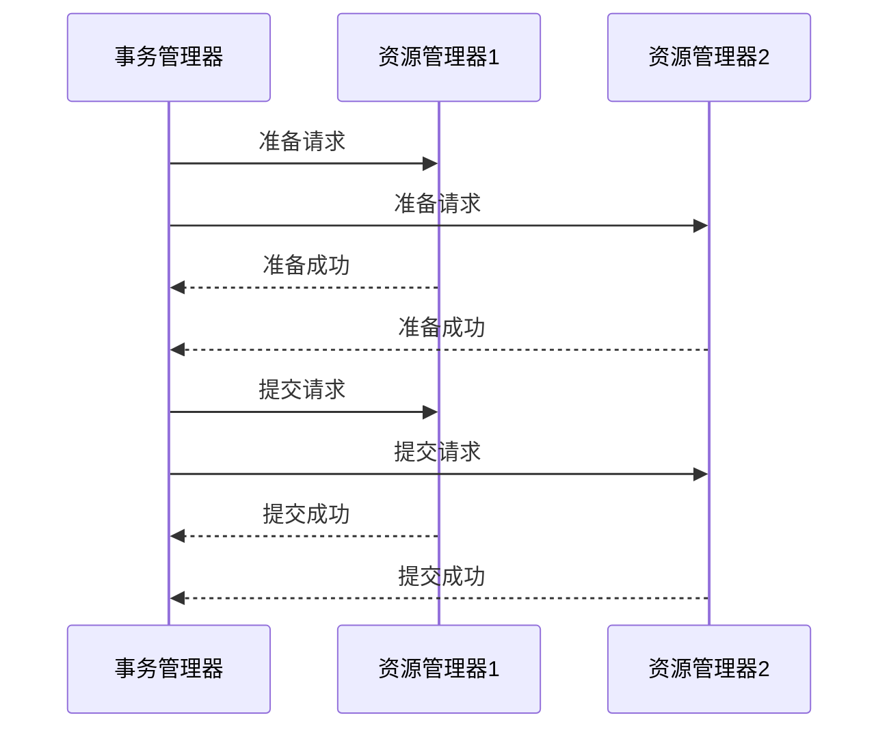

## 介绍

Seata 是一个开源的分布式事务解决方案，支持多种事务模式，其中 XA 模式是 Seata 提供的一种基于 X/Open XA 协议的分布式事务模式。XA 模式适用于需要强一致性的场景，特别是在跨多个数据库或资源管理器的分布式系统中。

在 XA 模式中，事务管理器（Transaction Manager, TM）负责协调多个资源管理器（Resource Manager, RM）的事务操作。XA 模式通过两阶段提交（2PC）协议来确保所有参与事务的资源管理器要么全部提交，要么全部回滚，从而保证事务的原子性和一致性。

## XA 模式的工作原理

XA 模式的核心是两阶段提交协议（2PC），它分为两个阶段：

1. **准备阶段（Prepare Phase）**：事务管理器向所有参与事务的资源管理器发送准备请求，资源管理器执行事务操作并返回准备结果。
2. **提交阶段（Commit Phase）**：如果所有资源管理器都准备成功，事务管理器发送提交请求，资源管理器提交事务；如果有任何一个资源管理器准备失败，事务管理器发送回滚请求，资源管理器回滚事务。



## Seata XA 模式的使用场景

### 1. 跨数据库事务

在微服务架构中，不同的服务可能使用不同的数据库。例如，订单服务使用 MySQL，库存服务使用 PostgreSQL。在这种情况下，如果需要保证订单和库存操作的原子性，可以使用 Seata 的 XA 模式。

```java
// 示例代码：跨数据库事务
@GlobalTransactional
public void placeOrder(Order order) {
    // 在订单数据库中插入订单
    orderDao.insert(order);
    
    // 在库存数据库中减少库存
    inventoryDao.decreaseStock(order.getProductId(), order.getQuantity());
}
```

### 2. 跨资源管理器事务

在某些场景中，事务可能涉及多个资源管理器，例如数据库和消息队列。例如，在电商系统中，下单成功后需要发送消息通知用户。这种情况下，可以使用 Seata 的 XA 模式来保证数据库操作和消息发送的原子性。

```java
// 示例代码：跨资源管理器事务
@GlobalTransactional
public void placeOrderAndNotify(Order order) {
    // 在订单数据库中插入订单
    orderDao.insert(order);
    
    // 发送消息到消息队列
    messageQueue.send(new OrderPlacedEvent(order.getId()));
}
```

### 3. 高一致性要求的场景

在一些对数据一致性要求极高的场景中，例如金融系统中的转账操作，必须确保转账的原子性。Seata 的 XA 模式可以确保转账操作的强一致性。

```java
// 示例代码：转账操作
@GlobalTransactional
public void transfer(Account from, Account to, BigDecimal amount) {
    // 从账户扣款
    accountDao.decreaseBalance(from.getId(), amount);
    
    // 向账户加款
    accountDao.increaseBalance(to.getId(), amount);
}
```

## 实际案例

### 电商系统中的订单创建

在电商系统中，创建订单通常涉及多个步骤，例如扣减库存、生成订单、发送通知等。这些操作可能分布在不同的服务中，使用不同的数据库或资源管理器。通过 Seata 的 XA 模式，可以确保这些操作的原子性，避免因部分操作失败而导致的数据不一致问题。

```java
// 示例代码：电商系统中的订单创建
@GlobalTransactional
public void createOrder(Order order) {
    // 扣减库存
    inventoryService.decreaseStock(order.getProductId(), order.getQuantity());
    
    // 生成订单
    orderService.createOrder(order);
    
    // 发送通知
    notificationService.sendOrderCreatedNotification(order);
}
```

## 总结

Seata 的 XA 模式适用于需要强一致性的分布式事务场景，特别是在跨多个数据库或资源管理器的系统中。通过两阶段提交协议，XA 模式能够确保所有参与事务的资源管理器要么全部提交，要么全部回滚，从而保证事务的原子性和一致性。

在实际应用中，XA 模式可以用于跨数据库事务、跨资源管理器事务以及高一致性要求的场景。通过合理使用 Seata 的 XA 模式，可以有效解决分布式系统中的事务一致性问题。

## 附加资源

- [Seata 官方文档](https://seata.io/zh-cn/docs/overview/what-is-seata.html)
- [XA 协议详解](https://en.wikipedia.org/wiki/X/Open_XA)
- [分布式事务解决方案比较](https://dzone.com/articles/distributed-transaction-solutions-comparison)

## 练习

1. 尝试在一个简单的微服务项目中实现 Seata 的 XA 模式，确保跨数据库的事务一致性。
2. 思考在你的项目中，哪些场景适合使用 XA 模式，并尝试实现这些场景。
