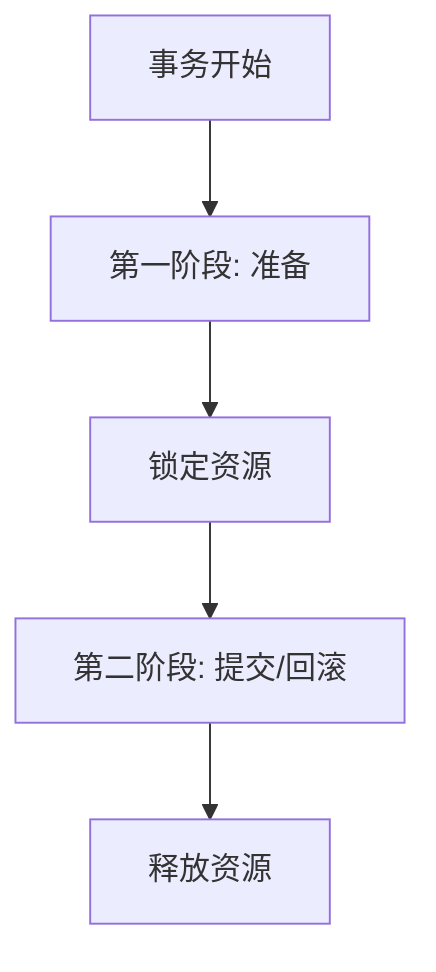

# Seata XA限制条件

Seata XA模式是一种基于XA协议的分布式事务解决方案，适用于需要强一致性的场景。然而，尽管XA模式提供了强大的事务管理能力，但它也有一些限制条件。本文将详细介绍这些限制条件，并通过实际案例帮助初学者更好地理解。

## 什么是Seata XA模式？

Seata XA模式是Seata框架中的一种分布式事务模式，它基于XA协议实现。XA协议是一种两阶段提交（2PC）协议，用于协调多个资源管理器（如数据库）的事务。Seata XA模式通过全局事务管理器（TM）和资源管理器（RM）的协作，确保分布式事务的原子性和一致性。

## Seata XA模式的限制条件

尽管Seata XA模式提供了强大的事务管理能力，但它也有一些限制条件，主要包括以下几点：

### 1. 性能开销

XA模式的两阶段提交协议需要多次网络通信和资源锁定，这会导致较高的性能开销。在高并发场景下，这种开销可能会成为系统的瓶颈。

:::caution
**注意**：在高并发场景下，XA模式的性能开销可能会显著增加，建议在性能要求较高的场景下谨慎使用。
:::

### 2. 资源锁定

在XA模式中，事务管理器需要在第一阶段锁定所有参与事务的资源，直到第二阶段提交或回滚。这种锁定机制可能会导致资源争用，影响系统的并发性能。



### 3. 单点故障

XA模式依赖于全局事务管理器（TM）来协调事务。如果TM发生故障，整个事务系统将无法正常工作，导致单点故障问题。

:::warning
**警告**：在分布式系统中，单点故障是一个严重的问题，建议在设计系统时考虑高可用性和容错机制。
:::

### 4. 数据库支持

XA模式要求所有参与事务的数据库必须支持XA协议。如果某些数据库不支持XA协议，将无法使用Seata XA模式。

:::note
**提示**：在使用Seata XA模式之前，请确保所有参与事务的数据库都支持XA协议。
:::

### 5. 事务超时

XA模式的事务超时设置需要谨慎处理。如果事务超时时间设置过短，可能会导致事务在未完成时被强制回滚；如果设置过长，可能会导致资源长时间锁定，影响系统性能。

## 实际案例

假设我们有一个电商系统，用户在下单时需要同时更新库存和订单表。我们可以使用Seata XA模式来确保这两个操作的原子性。

```java
// 伪代码示例
@GlobalTransactional
public void placeOrder(Order order) {
    // 更新库存
    inventoryService.updateStock(order.getProductId(), order.getQuantity());
    
    // 创建订单
    orderService.createOrder(order);
}
```

在这个例子中，`placeOrder`方法被标记为全局事务。如果库存更新或订单创建中的任何一个操作失败，整个事务将回滚，确保数据的一致性。

## 总结

Seata XA模式提供了一种强大的分布式事务解决方案，但它也有一些限制条件，包括性能开销、资源锁定、单点故障、数据库支持和事务超时等。在实际应用中，开发者需要根据具体场景权衡利弊，选择合适的分布式事务模式。

## 附加资源

- [Seata官方文档](https://seata.io/zh-cn/docs/overview/what-is-seata.html)
- [XA协议详解](https://en.wikipedia.org/wiki/X/Open_XA)
- [分布式事务实践指南](https://dzone.com/articles/distributed-transactions-in-microservices)

## 练习

1. 尝试在一个简单的Spring Boot项目中集成Seata XA模式，并模拟一个分布式事务场景。
2. 分析在高并发场景下，Seata XA模式的性能表现，并提出优化建议。
3. 研究其他分布式事务模式（如TCC、Saga），并与Seata XA模式进行对比。

通过以上内容，希望你能更好地理解Seata XA模式的限制条件，并在实际项目中做出明智的选择。