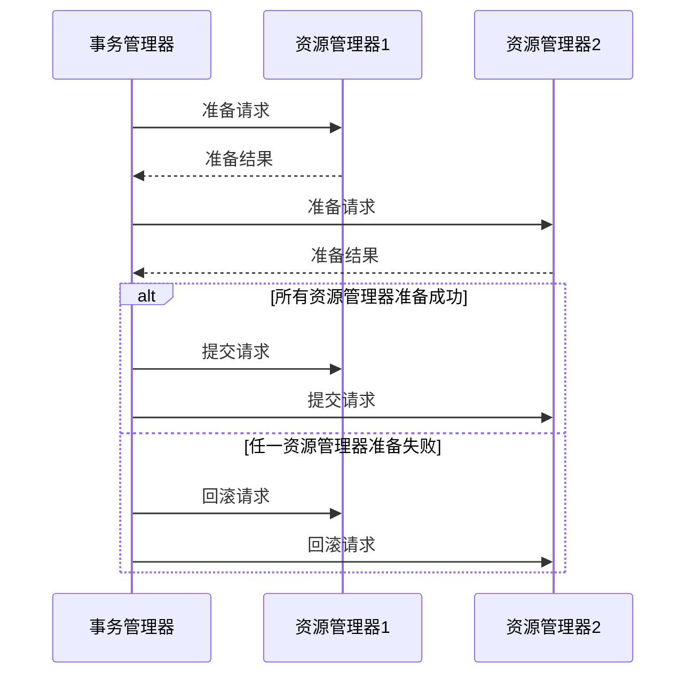

# Seata XA资源管理

## 介绍

在分布式系统中，事务管理是一个复杂且关键的问题。Seata 是一个开源的分布式事务解决方案，支持多种事务模式，其中 XA 模式是基于 X/Open 组织提出的 XA 协议实现的。XA 协议是一种两阶段提交（2PC）协议，用于协调多个资源管理器（如数据库）的事务。

在 Seata 的 XA 模式中，**资源管理**是指如何管理和协调多个资源管理器（如数据库）的事务操作。本文将详细介绍 Seata XA 模式中的资源管理机制，并通过代码示例和实际案例帮助你理解其工作原理。

## XA 协议简介

XA 协议是一种分布式事务协议，定义了事务管理器（TM）和资源管理器（RM）之间的接口。XA 协议的核心思想是通过两阶段提交（2PC）来确保分布式事务的原子性。

- **第一阶段（Prepare）**：事务管理器向所有资源管理器发送准备请求，资源管理器执行事务操作并返回准备结果。
- **第二阶段（Commit/Rollback）**：事务管理器根据资源管理器的准备结果决定提交或回滚事务。

## Seata XA 模式中的资源管理

在 Seata 的 XA 模式中，资源管理器通常是数据库。Seata 通过 XA 协议与数据库进行交互，确保事务的原子性和一致性。

### 1. 资源管理器的注册

在 Seata 中，资源管理器需要在事务开始时注册到事务管理器中。注册过程通常由 Seata 的客户端自动完成。

```java
// 示例：资源管理器注册
DataSourceProxy dataSourceProxy = new DataSourceProxy(dataSource);
```

### 2. XA 事务的执行

在 XA 模式中，事务的执行分为两个阶段：

- **第一阶段（Prepare）**：Seata 客户端向数据库发送 XA 准备请求，数据库执行事务操作并返回准备结果。
- **第二阶段（Commit/Rollback）**：Seata 客户端根据数据库的准备结果决定提交或回滚事务。

```java
// 示例：XA 事务的执行
try {
    // 开启 XA 事务
    XAResource xaResource = dataSourceProxy.getXAResource();
    xaResource.start(xid, XAResource.TMNOFLAGS);

    // 执行 SQL 操作
    connection = dataSourceProxy.getConnection();
    statement = connection.createStatement();
    statement.executeUpdate("UPDATE account SET balance = balance - 100 WHERE id = 1");

    // 结束 XA 事务
    xaResource.end(xid, XAResource.TMSUCCESS);

    // 准备提交
    int prepareResult = xaResource.prepare(xid);
    if (prepareResult == XAResource.XA_OK) {
        // 提交事务
        xaResource.commit(xid, false);
    } else {
        // 回滚事务
        xaResource.rollback(xid);
    }
} catch (Exception e) {
    // 处理异常
    xaResource.rollback(xid);
}
```

### 3. 事务的提交与回滚

在 XA 模式中，事务的提交和回滚由事务管理器统一协调。如果所有资源管理器都成功准备，事务管理器将发送提交请求；否则，发送回滚请求。



## 实际案例

假设我们有一个分布式系统，包含两个数据库：`account_db` 和 `order_db`。我们需要在两个数据库中同时更新数据，确保事务的原子性。

```java
// 示例：分布式事务的实际应用
try {
    // 开启 XA 事务
    XAResource xaResource1 = dataSourceProxy1.getXAResource();
    XAResource xaResource2 = dataSourceProxy2.getXAResource();
    xaResource1.start(xid, XAResource.TMNOFLAGS);
    xaResource2.start(xid, XAResource.TMNOFLAGS);

    // 执行 SQL 操作
    connection1 = dataSourceProxy1.getConnection();
    statement1 = connection1.createStatement();
    statement1.executeUpdate("UPDATE account SET balance = balance - 100 WHERE id = 1");

    connection2 = dataSourceProxy2.getConnection();
    statement2 = connection2.createStatement();
    statement2.executeUpdate("INSERT INTO order (user_id, amount) VALUES (1, 100)");

    // 结束 XA 事务
    xaResource1.end(xid, XAResource.TMSUCCESS);
    xaResource2.end(xid, XAResource.TMSUCCESS);

    // 准备提交
    int prepareResult1 = xaResource1.prepare(xid);
    int prepareResult2 = xaResource2.prepare(xid);
    if (prepareResult1 == XAResource.XA_OK && prepareResult2 == XAResource.XA_OK) {
        // 提交事务
        xaResource1.commit(xid, false);
        xaResource2.commit(xid, false);
    } else {
        // 回滚事务
        xaResource1.rollback(xid);
        xaResource2.rollback(xid);
    }
} catch (Exception e) {
    // 处理异常
    xaResource1.rollback(xid);
    xaResource2.rollback(xid);
}
```

:::note
在实际应用中，Seata 会自动处理 XA 事务的注册、准备、提交和回滚，开发者只需关注业务逻辑的实现。
:::

## 总结

Seata 的 XA 模式通过 XA 协议实现了分布式事务的强一致性。资源管理器在事务开始时注册到事务管理器中，事务的执行分为准备和提交/回滚两个阶段。通过 Seata 的 XA 模式，开发者可以轻松实现跨多个数据库的分布式事务。

## 附加资源

- [Seata 官方文档](https://seata.io/zh-cn/docs/overview/what-is-seata.html)
- [XA 协议详解](https://en.wikipedia.org/wiki/X/Open_XA)

## 练习

1. 尝试在本地环境中配置 Seata 的 XA 模式，并实现一个简单的分布式事务。
2. 修改上述代码示例，使其支持更多的资源管理器（如三个数据库），并测试事务的提交和回滚。