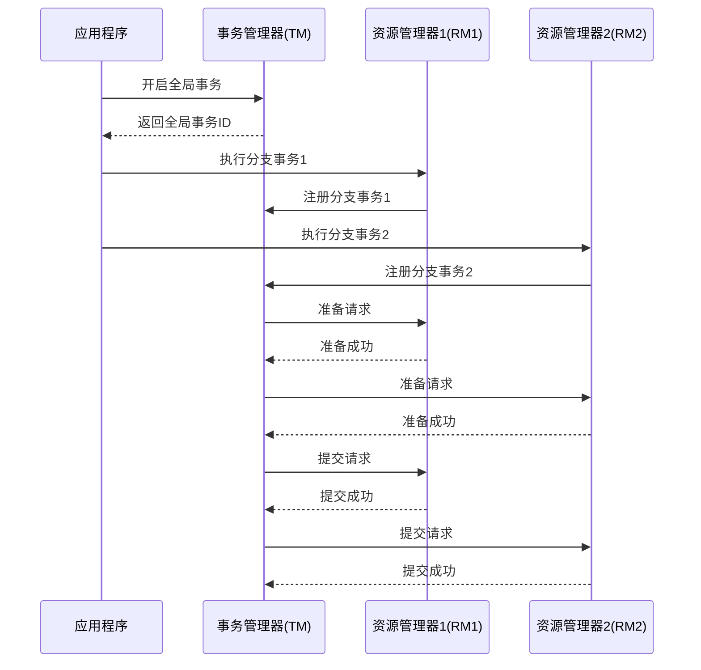

# Seata XA两阶段提交

在分布式系统中，事务管理是一个复杂且关键的问题。Seata 是一个开源的分布式事务解决方案，支持多种事务模式，其中 **XA 模式** 是一种基于两阶段提交（2PC）的分布式事务协议。本文将详细介绍 Seata XA 模式的工作原理、实现方式以及实际应用场景。

## 什么是 XA 模式？

XA 模式是一种基于 X/Open 组织定义的分布式事务协议。它通过两阶段提交（2PC）机制来确保分布式事务的原子性。XA 模式的核心思想是将事务的提交分为两个阶段：

1. **准备阶段（Prepare Phase）**：事务管理器（TM）向所有参与者（资源管理器，RM）发送准备请求，参与者执行事务操作但不提交，并将结果反馈给 TM。
2. **提交阶段（Commit Phase）**：如果所有参与者都成功准备，TM 发送提交请求，参与者提交事务；否则，TM 发送回滚请求，参与者回滚事务。

Seata 的 XA 模式实现了这一协议，并提供了简单易用的 API，帮助开发者在分布式系统中管理事务。

---

## Seata XA 模式的工作原理

Seata XA 模式的工作流程可以分为以下几个步骤：

1. **事务开始**：应用程序通过 Seata 的 API 开启一个全局事务。
2. **分支事务注册**：每个参与事务的服务（RM）向 Seata 注册一个分支事务。
3. **准备阶段**：Seata 的事务管理器（TM）向所有分支事务发送准备请求，分支事务执行本地事务但不提交。
4. **提交或回滚**：如果所有分支事务都成功准备，TM 发送提交请求；否则，发送回滚请求。

以下是一个简单的流程图，展示了 Seata XA 模式的工作流程：



---

## 代码示例

以下是一个使用 Seata XA 模式的简单代码示例。假设我们有两个服务：`OrderService` 和 `InventoryService`，它们分别管理订单和库存。

```java
// OrderService.java
@GlobalTransactional
public void createOrder(Order order) {
    // 创建订单
    orderRepository.save(order);
    // 调用库存服务
    inventoryService.deductStock(order.getProductId(), order.getQuantity());
}

// InventoryService.java
public void deductStock(String productId, int quantity) {
    // 扣减库存
    inventoryRepository.deductStock(productId, quantity);
}
```

在这个示例中，`createOrder` 方法被标记为 `@GlobalTransactional`，表示它是一个全局事务。Seata 会自动管理事务的提交和回滚。

---

## 实际应用场景

Seata XA 模式适用于以下场景：

1. **跨数据库事务**：当应用程序需要操作多个数据库时，XA 模式可以确保所有数据库操作的一致性。
2. **跨服务事务**：在微服务架构中，多个服务可能涉及同一个业务逻辑，XA 模式可以确保这些服务的操作要么全部成功，要么全部回滚。
3. **高一致性要求的系统**：例如金融系统、订单系统等，这些系统对数据一致性要求极高，XA 模式可以满足需求。

---

## 总结

Seata XA 模式通过两阶段提交机制，为分布式事务提供了强大的支持。它适用于跨数据库、跨服务的高一致性场景，能够有效解决分布式系统中的事务管理问题。

:::tip
如果你对 Seata 的其他事务模式（如 AT 模式、TCC 模式）感兴趣，可以参考 Seata 的官方文档。
:::

---

## 附加资源与练习

1. **官方文档**：[Seata 官方文档](https://seata.io/zh-cn/docs/overview/what-is-seata.html)
2. **练习**：尝试在一个简单的微服务项目中集成 Seata XA 模式，并模拟事务失败的情况，观察事务的回滚行为。
3. **深入学习**：了解 XA 协议的底层实现，探索其在高并发场景下的性能优化方法。