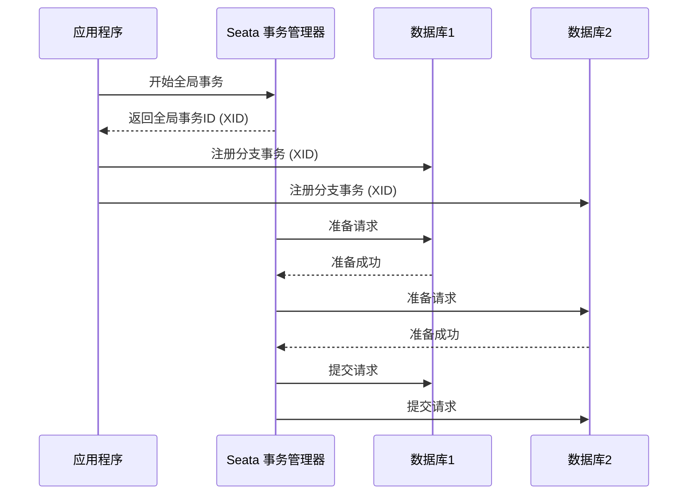

# Seata XA数据库支持

## 介绍

Seata 是一个开源的分布式事务解决方案，旨在简化微服务架构中的事务管理。Seata 提供了多种事务模式，其中 XA 模式是基于 X/Open XA 协议的分布式事务实现。XA 模式通过两阶段提交（2PC）协议来保证事务的原子性和一致性。

在 XA 模式中，Seata 充当事务管理器（Transaction Manager），而数据库则充当资源管理器（Resource Manager）。Seata 通过 XA 协议与数据库进行通信，协调多个资源管理器的事务提交或回滚。

## XA 协议简介

XA 协议是由 X/Open 组织定义的一种分布式事务处理协议。它定义了一个全局事务管理器（TM）和多个资源管理器（RM）之间的接口。XA 协议的核心是两阶段提交（2PC），分为以下两个阶段：

1. **准备阶段（Prepare Phase）**：事务管理器向所有资源管理器发送准备请求，资源管理器执行事务操作并返回准备结果。
2. **提交/回滚阶段（Commit/Rollback Phase）**：事务管理器根据资源管理器的准备结果决定提交或回滚事务。

## Seata XA 模式的工作原理

在 Seata XA 模式中，Seata 作为事务管理器，负责协调多个数据库资源管理器的事务。以下是 Seata XA 模式的工作流程：

1. **事务开始**：应用程序启动一个全局事务，Seata 生成一个全局事务 ID（XID）。
2. **分支事务注册**：应用程序在每个参与的数据库中注册一个分支事务，Seata 将分支事务与全局事务关联。
3. **准备阶段**：Seata 向所有分支事务发送准备请求，数据库执行事务操作并锁定相关资源。
4. **提交/回滚阶段**：如果所有分支事务都准备成功，Seata 发送提交请求；否则，发送回滚请求。



## 代码示例

以下是一个使用 Seata XA 模式的简单示例。假设我们有两个数据库 `db1` 和 `db2`，我们需要在这两个数据库中执行事务操作。

```java
// 引入 Seata 的 XA 数据源
@Configuration
public class DataSourceConfig {

    @Bean
    public DataSource dataSource1() {
        return new XADataSourceWrapper().wrap(DataSourceBuilder.create().build());
    }

    @Bean
    public DataSource dataSource2() {
        return new XADataSourceWrapper().wrap(DataSourceBuilder.create().build());
    }
}

// 使用 Seata 的全局事务注解
@Service
public class OrderService {

    @Autowired
    private JdbcTemplate jdbcTemplate1;

    @Autowired
    private JdbcTemplate jdbcTemplate2;

    @GlobalTransactional
    public void placeOrder() {
        // 在 db1 中插入订单
        jdbcTemplate1.update("INSERT INTO orders (id, product) VALUES (1, 'Product A')");

        // 在 db2 中更新库存
        jdbcTemplate2.update("UPDATE inventory SET stock = stock - 1 WHERE product = 'Product A'");
    }
}
```

在这个示例中，`placeOrder` 方法被 `@GlobalTransactional` 注解标记，表示这是一个全局事务。Seata 会确保在 `db1` 和 `db2` 中的操作要么全部成功，要么全部回滚。

## 实际应用场景

Seata XA 模式适用于需要强一致性的分布式事务场景。例如：

- **电商系统中的订单和库存管理**：在用户下单时，需要同时更新订单表和库存表。如果订单创建成功但库存更新失败，事务需要回滚，以确保数据一致性。
- **银行系统中的转账操作**：在转账过程中，需要同时更新两个账户的余额。如果其中一个账户更新失败，整个转账操作需要回滚。

## 总结

Seata XA 模式通过 XA 协议实现了分布式事务的强一致性。它适用于需要跨多个数据库进行事务操作的场景，能够确保事务的原子性和一致性。通过 Seata 的 XA 模式，开发者可以轻松地在微服务架构中管理分布式事务。

## 附加资源

- [Seata 官方文档](https://seata.io/zh-cn/docs/overview/what-is-seata.html)
- [XA 协议详解](https://en.wikipedia.org/wiki/X/Open_XA)
- [分布式事务处理指南](https://dzone.com/articles/distributed-transactions-in-microservices)

## 练习

1. 尝试在本地环境中配置 Seata XA 模式，并使用两个数据库进行事务操作。
2. 修改上述代码示例，使其在事务失败时能够正确回滚。
3. 研究 Seata 的其他事务模式（如 AT 模式和 TCC 模式），并比较它们与 XA 模式的异同。
