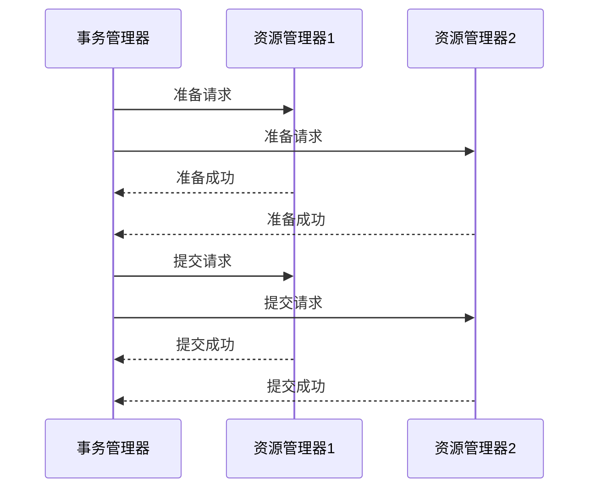

# Seata XA性能影响

## 介绍

Seata 是一个开源的分布式事务解决方案，支持多种事务模式，其中 XA 模式是一种基于两阶段提交（2PC）的分布式事务协议。XA 模式通过协调多个资源管理器（如数据库）来确保事务的原子性。然而，XA 模式在性能上可能会带来一些挑战，尤其是在高并发或大规模分布式系统中。

本文将深入探讨 Seata XA 模式的性能影响，帮助初学者理解其工作原理、性能瓶颈以及优化建议。

## Seata XA模式的工作原理

在 Seata XA 模式中，事务管理器（TM）负责协调多个资源管理器（RM）的事务操作。XA 模式的核心是两阶段提交（2PC），分为以下两个阶段：

1. **准备阶段（Prepare Phase）**：事务管理器向所有参与的资源管理器发送准备请求，资源管理器执行事务操作并锁定相关资源，但不提交事务。
2. **提交阶段（Commit Phase）**：如果所有资源管理器都成功准备，事务管理器发送提交请求，资源管理器提交事务并释放锁。如果有任何一个资源管理器准备失败，事务管理器发送回滚请求，资源管理器回滚事务。



## XA模式的性能影响

尽管 XA 模式提供了强一致性保证，但其性能可能会受到以下因素的影响：

### 1. 两阶段提交的开销

XA 模式的两阶段提交机制需要多次网络通信和资源锁定，这会增加事务的延迟。在高并发场景下，这种开销可能会显著影响系统的吞吐量。

### 2. 资源锁定时间

在准备阶段，资源管理器需要锁定相关资源，直到提交或回滚阶段才能释放。如果事务执行时间较长，锁定的资源可能会阻塞其他事务，导致性能下降。

### 3. 单点故障

事务管理器在 XA 模式中扮演着关键角色。如果事务管理器出现故障，可能会导致整个事务无法完成，进而影响系统的可用性和性能。

### 4. 网络延迟

XA 模式依赖于事务管理器与资源管理器之间的网络通信。如果网络延迟较高，事务的响应时间会增加，进而影响系统的整体性能。

## 实际案例

假设我们有一个电商系统，用户在下单时需要同时更新库存和订单数据库。使用 Seata XA 模式，事务管理器需要协调库存和订单两个资源管理器。

```java
// 伪代码示例
@GlobalTransactional
public void placeOrder(Order order) {
    // 更新库存
    inventoryService.reduceStock(order.getProductId(), order.getQuantity());
    // 创建订单
    orderService.createOrder(order);
}
```

在这个例子中，如果库存或订单数据库的响应时间较长，整个事务的延迟会增加，进而影响用户体验。

## 优化建议

为了减少 XA 模式的性能影响，可以考虑以下优化措施：

1. **减少事务范围**：尽量将事务范围缩小到必要的操作，减少资源锁定时间。
2. **使用本地事务**：对于不需要跨资源的事务，优先使用本地事务，避免 XA 模式的开销。
3. **优化网络通信**：确保事务管理器与资源管理器之间的网络通信高效可靠，减少网络延迟。
4. **分布式缓存**：使用分布式缓存减少对数据库的频繁访问，降低资源锁定的概率。

## 总结

Seata XA 模式提供了强一致性保证，但其性能可能会受到两阶段提交、资源锁定、单点故障和网络延迟的影响。通过优化事务范围、使用本地事务、优化网络通信和使用分布式缓存，可以有效减少 XA 模式的性能影响。

## 附加资源

- [Seata 官方文档](https://seata.io/zh-cn/docs/overview/what-is-seata.html)
- [分布式事务与两阶段提交](https://en.wikipedia.org/wiki/Two-phase_commit_protocol)
- [高性能分布式系统设计](https://www.oreilly.com/library/view/designing-data-intensive-applications/9781491903063/)

:::tip
**练习**：尝试在一个简单的分布式系统中实现 Seata XA 模式，并观察其性能表现。通过调整事务范围和资源锁定策略，看看能否优化系统的吞吐量和响应时间。
:::