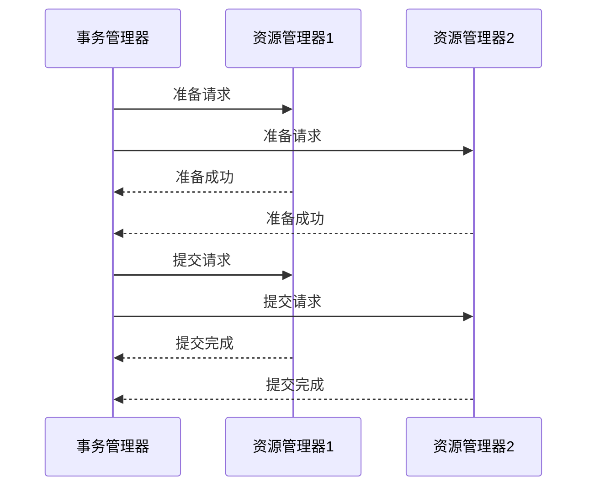
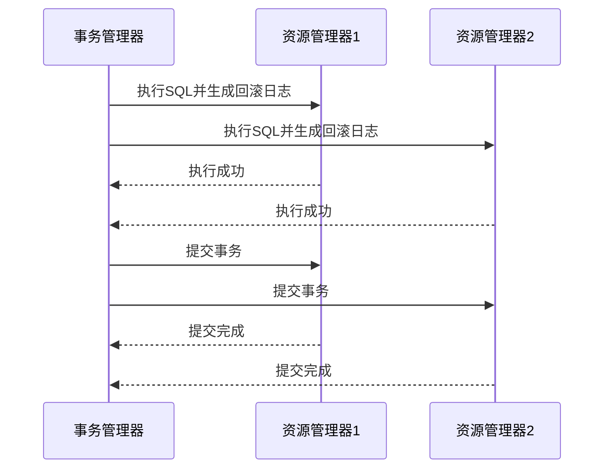

## 介绍

Seata 是一款开源的分布式事务解决方案，支持多种事务模式，其中 **XA模式** 和 **AT模式** 是最常用的两种。这两种模式在实现分布式事务时采用了不同的机制，适用于不同的场景。本文将详细介绍它们的区别、优缺点以及实际应用场景，帮助你更好地理解并选择适合的模式。

---

## 什么是XA模式？

XA模式是基于 **XA协议** 的分布式事务解决方案。XA协议是由X/Open组织提出的分布式事务处理标准，它通过 **两阶段提交（2PC）** 来保证事务的原子性。

在XA模式中，事务管理器（Transaction Manager, TM）负责协调多个资源管理器（Resource Manager, RM），确保所有参与事务的资源要么全部提交，要么全部回滚。

### XA模式的工作流程

1. **准备阶段（Prepare Phase）**：事务管理器向所有资源管理器发送准备请求，资源管理器执行事务操作并锁定资源，但不提交。
2. **提交阶段（Commit Phase）**：如果所有资源管理器都准备成功，事务管理器发送提交请求，资源管理器提交事务并释放锁。

---

## 什么是AT模式？

AT模式（Automatic Transaction Mode）是Seata提供的一种 **无侵入式** 的分布式事务解决方案。它通过 **全局锁** 和 **本地事务** 的结合来实现分布式事务的一致性。

AT模式的核心思想是：
- 在业务方法执行时，Seata会自动拦截SQL语句，生成 **回滚日志**。
- 如果事务失败，Seata会根据回滚日志自动回滚。

### AT模式的工作流程

1. **执行阶段**：业务方法执行时，Seata拦截SQL并生成回滚日志。
2. **提交阶段**：如果所有分支事务都执行成功，Seata提交事务并删除回滚日志。
3. **回滚阶段**：如果某个分支事务失败，Seata根据回滚日志自动回滚。

---

## XA模式与AT模式的对比

| 特性                | XA模式                          | AT模式                          |
|---------------------|--------------------------------|--------------------------------|
| **实现机制**         | 基于XA协议，使用两阶段提交（2PC） | 基于全局锁和本地事务，自动生成回滚日志 |
| **侵入性**           | 需要数据库支持XA协议             | 无侵入，适用于大多数数据库         |
| **性能**             | 较低，因为需要两阶段提交          | 较高，因为只需要本地事务           |
| **锁粒度**           | 行级锁                          | 行级锁                          |
| **适用场景**         | 强一致性要求的场景               | 高并发、高性能要求的场景           |
| **回滚机制**         | 依赖数据库的回滚能力             | 自动生成回滚日志，支持自动回滚     |

---

## 实际应用场景

### 场景1：金融交易系统（XA模式）
在金融交易系统中，事务的强一致性至关重要。例如，转账操作需要确保资金从一个账户扣除并成功转入另一个账户。XA模式通过两阶段提交保证了事务的原子性，适合这种场景。

### 场景2：电商订单系统（AT模式）
在电商系统中，订单创建、库存扣减和支付操作需要高并发处理。AT模式通过无侵入的方式实现分布式事务，性能更高，适合这种高并发场景。

---

## 总结

- **XA模式** 适合对事务一致性要求极高的场景，但性能较低。
- **AT模式** 适合高并发、高性能的场景，且对业务代码无侵入。

选择哪种模式取决于你的业务需求。如果你的系统需要强一致性，可以选择XA模式；如果更注重性能和开发效率，AT模式是更好的选择。

---

## 附加资源

- [Seata官方文档](https://seata.io/zh-cn/docs/overview/what-is-seata.html)
- [XA协议详解](https://en.wikipedia.org/wiki/X/Open_XA)
- [分布式事务实践指南](https://dbaplus.cn/news-11-3630-1.html)

:::tip 练习
1. 尝试在本地搭建Seata环境，分别使用XA模式和AT模式实现一个简单的分布式事务。
2. 对比两种模式的性能差异，并记录测试结果。
:::