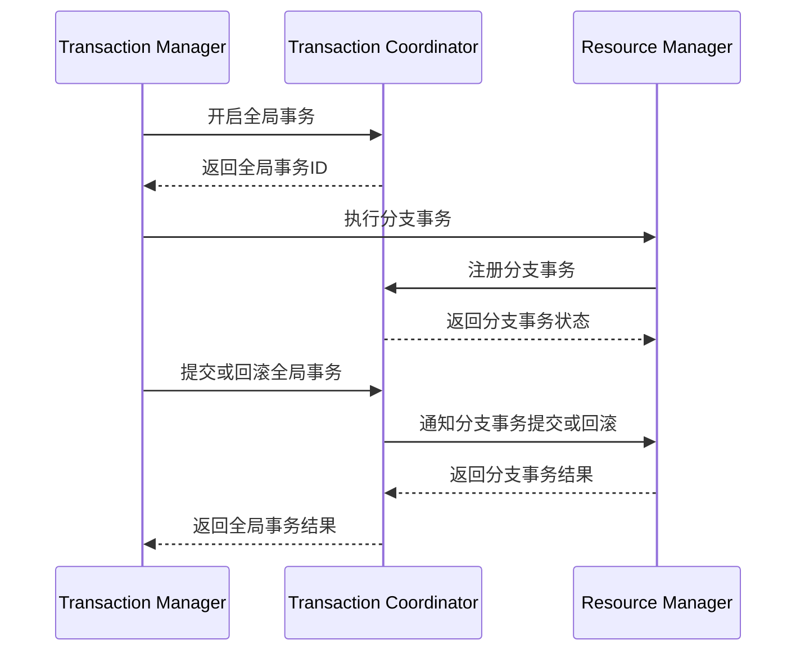

# Seata TC架构设计

Seata（Simple Extensible Autonomous Transaction Architecture）是一款开源的分布式事务解决方案，旨在简化微服务架构中的事务管理。Seata的事务协调器（Transaction Coordinator，简称TC）是其核心组件之一，负责协调全局事务的提交和回滚。本文将详细介绍Seata TC的架构设计，帮助初学者理解其工作原理和实际应用。

## 什么是Seata TC？

Seata TC是Seata框架中的事务协调器，负责管理全局事务的生命周期。它通过与事务管理器（TM）和资源管理器（RM）的交互，确保分布式事务的一致性。TC的主要职责包括：

- 全局事务的创建和管理
- 分支事务的注册和状态管理
- 全局事务的提交和回滚

## Seata TC的架构设计

Seata TC的架构设计可以分为以下几个核心组件：

1. **Transaction Coordinator (TC)**：事务协调器，负责全局事务的管理。
2. **Transaction Manager (TM)**：事务管理器，负责全局事务的开启、提交和回滚。
3. **Resource Manager (RM)**：资源管理器，负责分支事务的注册和状态管理。

### 核心组件交互



### 详细步骤

1. **全局事务的创建**：
   - TM向TC发送请求，开启一个新的全局事务。
   - TC生成一个全局唯一的全局事务ID（XID），并返回给TM。

   ```java
   // TM开启全局事务
   String xid = tm.beginGlobalTransaction();
   ```

2. **分支事务的注册**：
   - TM在执行分支事务时，会向TC注册该分支事务。
   - TC记录分支事务的状态，并返回注册结果。

   ```java
   // RM注册分支事务
   boolean success = rm.registerBranchTransaction(xid, branchId);
   ```

3. **全局事务的提交或回滚**：
   - TM根据业务逻辑决定提交或回滚全局事务。
   - TC通知所有相关的RM执行提交或回滚操作。

   ```java
   // TM提交全局事务
   tm.commitGlobalTransaction(xid);

   // TM回滚全局事务
   tm.rollbackGlobalTransaction(xid);
   ```

4. **分支事务的提交或回滚**：
   - RM接收到TC的通知后，执行分支事务的提交或回滚操作。
   - RM将执行结果返回给TC。

   ```java
   // RM提交分支事务
   rm.commitBranchTransaction(xid, branchId);

   // RM回滚分支事务
   rm.rollbackBranchTransaction(xid, branchId);
   ```

## 实际案例

假设我们有一个电商系统，用户下单时需要同时扣减库存和创建订单。这两个操作分别由库存服务和订单服务处理，属于分布式事务。

1. **开启全局事务**：
   - 订单服务作为TM，向TC发起全局事务请求，获取XID。

2. **执行分支事务**：
   - 订单服务调用库存服务扣减库存，库存服务作为RM，向TC注册分支事务。
   - 订单服务创建订单，订单服务作为RM，向TC注册分支事务。

3. **提交或回滚全局事务**：
   - 如果库存扣减和订单创建都成功，TM向TC发起提交请求，TC通知库存服务和订单服务提交分支事务。
   - 如果任一操作失败，TM向TC发起回滚请求，TC通知库存服务和订单服务回滚分支事务。

## 总结

Seata TC作为分布式事务的核心协调器，通过全局事务ID（XID）和分支事务的管理，确保了分布式事务的一致性。本文详细介绍了Seata TC的架构设计、核心组件交互以及实际应用案例，帮助初学者理解其工作原理。

## 附加资源

- [Seata官方文档](https://seata.io/zh-cn/docs/overview/what-is-seata.html)
- [分布式事务理论与实践](https://www.oreilly.com/library/view/distributed-systems-principles/9781492043015/)

## 练习

1. 尝试在本地搭建一个简单的Seata环境，模拟一个分布式事务场景。
2. 阅读Seata源码，深入理解TC的实现细节。
3. 设计一个包含多个微服务的分布式事务场景，并使用Seata进行事务管理。