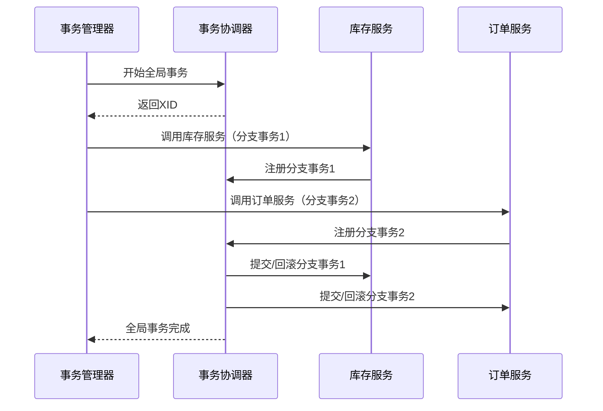

# Seata TC启动流程

## 介绍

Seata（Simple Extensible Autonomous Transaction Architecture）是一款开源的分布式事务解决方案。在Seata的架构中，事务协调器（Transaction Coordinator，简称TC）是核心组件之一，负责协调全局事务的提交或回滚。理解TC的启动流程对于掌握Seata的整体工作原理至关重要。

本文将逐步讲解Seata TC的启动流程，并通过实际案例展示其应用场景。

## Seata TC的核心作用

在分布式事务中，TC的主要职责是：

1. **全局事务管理**：负责全局事务的创建、提交和回滚。
2. **分支事务协调**：协调各个分支事务的执行状态。
3. **日志存储**：记录事务日志，确保事务的持久化。

## TC启动流程详解

Seata TC的启动流程可以分为以下几个步骤：

### 1. 配置文件加载

TC启动时，首先会加载配置文件（如`file.conf`或`registry.conf`），这些配置文件定义了TC的运行参数、注册中心信息以及存储模式等。

```plaintext
# file.conf 示例
transport {
  type = "TCP"
  server = "NIO"
}
service {
  vgroupMapping.my_test_tx_group = "default"
  default.grouplist = "127.0.0.1:8091"
}
```

### 2. 初始化Netty服务器

TC使用Netty作为通信框架，启动时会初始化Netty服务器，监听指定的端口（默认8091），等待客户端连接。

```java
// 伪代码示例
ServerBootstrap bootstrap = new ServerBootstrap();
bootstrap.group(bossGroup, workerGroup)
         .channel(NioServerSocketChannel.class)
         .childHandler(new ChannelInitializer<SocketChannel>() {
             @Override
             protected void initChannel(SocketChannel ch) {
                 // 添加处理器
             }
         });
ChannelFuture future = bootstrap.bind(port).sync();
```

### 3. 注册到注册中心

TC启动后，会将自己注册到配置文件中指定的注册中心（如Nacos、Zookeeper等），以便客户端能够发现并连接到TC。

```plaintext
# registry.conf 示例
registry {
  type = "nacos"
  nacos {
    serverAddr = "127.0.0.1:8848"
    namespace = ""
    cluster = "default"
  }
}
```

### 4. 初始化事务日志存储

TC需要将事务日志持久化存储，以便在系统崩溃后能够恢复事务状态。Seata支持多种存储模式，如文件存储、数据库存储等。

```plaintext
# file.conf 示例
store {
  mode = "file"
  file {
    dir = "sessionStore"
  }
}
```

### 5. 启动心跳检测

TC会定期向注册中心发送心跳，以保持自身的活跃状态。同时，TC也会检测客户端的连接状态，确保事务的及时处理。

```java
// 伪代码示例
ScheduledExecutorService scheduler = Executors.newScheduledThreadPool(1);
scheduler.scheduleAtFixedRate(() -> {
    // 发送心跳
}, 0, 30, TimeUnit.SECONDS);
```

### 6. 等待客户端连接

完成上述步骤后，TC进入等待状态，等待客户端（TM、RM）的连接，并开始处理全局事务的请求。

## 实际案例

假设我们有一个电商系统，用户下单时需要同时扣减库存和生成订单。这两个操作分别由库存服务和订单服务处理，且需要保证事务的一致性。

1. **TM（事务管理器）**向TC发起全局事务请求。
2. TC创建全局事务，并生成全局事务ID（XID）。
3. TM调用库存服务和订单服务，分别执行分支事务。
4. 库存服务和订单服务向TC注册分支事务。
5. TC协调各个分支事务的执行状态，最终决定提交或回滚全局事务。



## 总结

Seata TC的启动流程包括配置文件加载、Netty服务器初始化、注册到注册中心、事务日志存储初始化、心跳检测以及等待客户端连接。通过理解TC的启动流程，我们可以更好地掌握Seata在分布式事务中的工作原理。

## 附加资源

- [Seata官方文档](https://seata.io/zh-cn/docs/overview/what-is-seata.html)
- [Netty官方文档](https://netty.io/wiki/user-guide.html)
- [Nacos官方文档](https://nacos.io/zh-cn/docs/what-is-nacos.html)

## 练习

1. 尝试在本地启动一个Seata TC实例，并观察其日志输出。
2. 修改`file.conf`和`registry.conf`中的配置，尝试使用不同的注册中心和存储模式。
3. 编写一个简单的分布式事务示例，模拟TC的启动和事务处理流程。

:::tip
在实际生产环境中，建议将TC部署为高可用集群，以确保系统的稳定性和可靠性。
:::