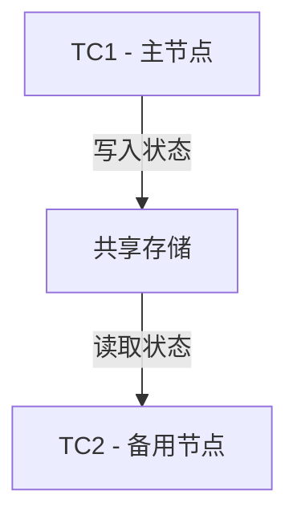
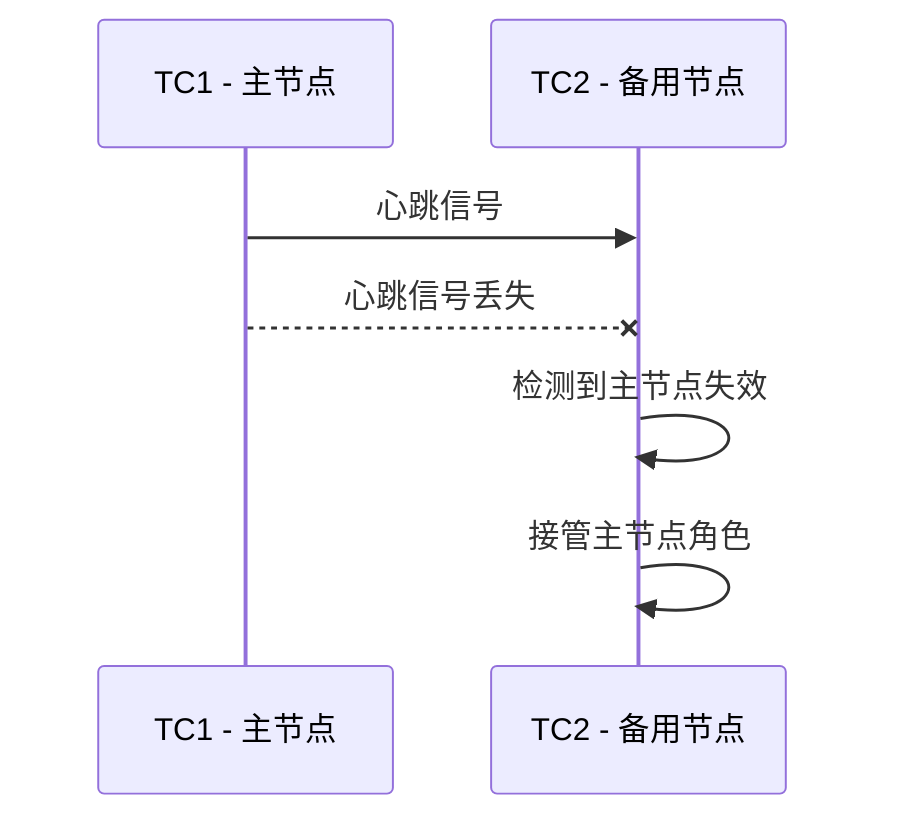

# Seata TC故障转移

## 介绍

在分布式系统中，事务协调器（Transaction Coordinator, TC）是Seata框架的核心组件之一，负责管理全局事务的状态和分支事务的提交或回滚。然而，TC作为一个单点，可能会因为硬件故障、网络问题或其他原因导致服务不可用。为了确保系统的高可用性，Seata提供了TC的故障转移机制。

故障转移（Failover）是指在主节点发生故障时，系统能够自动切换到备用节点，从而保证服务的连续性。Seata TC的故障转移机制通过集群部署和状态同步来实现，确保在主TC节点失效时，备用TC节点能够接管事务管理工作。

## 故障转移的工作原理

Seata TC的故障转移机制依赖于以下几个关键点：

1. **集群部署**：多个TC节点组成一个集群，主节点负责处理事务请求，备用节点处于待命状态。
2. **状态同步**：主节点和备用节点之间通过共享存储（如数据库或分布式缓存）同步事务状态。
3. **心跳检测**：集群中的节点通过心跳机制检测主节点的健康状态。如果主节点失效，备用节点会接管事务管理工作。

### 状态同步示例

假设我们有一个TC集群，包含两个节点：`TC1`（主节点）和`TC2`（备用节点）。当`TC1`处理事务时，它会将事务状态存储在共享存储中。`TC2`会定期从共享存储中读取状态，确保它与`TC1`保持同步。

### 心跳检测示例

集群中的节点会定期发送心跳信号。如果`TC1`在一定时间内没有发送心跳信号，`TC2`会认为`TC1`失效，并接管主节点的角色。

## 实际应用场景

假设我们有一个电商系统，用户下单后需要扣减库存、生成订单和支付。这些操作涉及多个服务，因此需要使用分布式事务来保证一致性。如果TC节点在事务处理过程中失效，故障转移机制可以确保事务不会中断。

### 场景描述

1. 用户下单，TC1开始处理全局事务。
2. TC1将事务状态写入共享存储。
3. TC1在处理过程中突然失效。
4. TC2检测到TC1失效，接管事务管理工作。
5. TC2从共享存储中读取事务状态，继续处理事务。

:::tip
在实际生产环境中，建议至少部署两个TC节点，并确保共享存储的高可用性，以避免单点故障。
:::

## 总结

Seata TC的故障转移机制通过集群部署、状态同步和心跳检测，确保了分布式事务的高可用性。在主节点失效时，备用节点能够快速接管事务管理工作，保证系统的连续性和一致性。

## 附加资源与练习

- **练习**：尝试在本地环境中部署一个Seata TC集群，模拟主节点失效的场景，观察备用节点如何接管事务。
- **资源**：阅读Seata官方文档中关于[TC高可用性](https://seata.io/zh-cn/docs/overview/ha.html)的部分，了解更多细节。

通过本文的学习，你应该对Seata TC的故障转移机制有了初步的了解。接下来，可以尝试在实际项目中应用这一机制，进一步提升系统的可靠性。