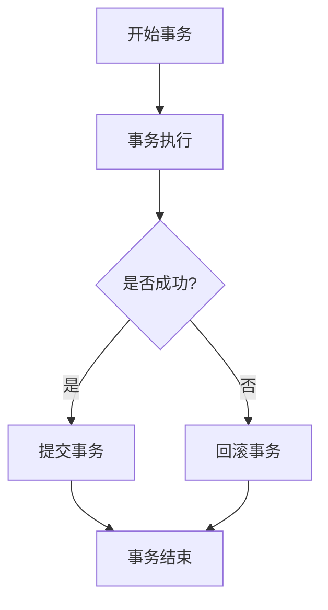
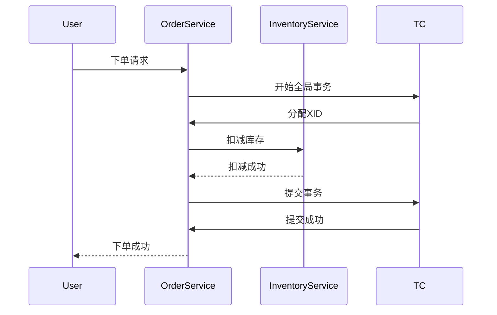

# Seata TC异常处理

在分布式系统中，事务管理是一个复杂且关键的任务。Seata（Simple Extensible Autonomous Transaction Architecture）是一个开源的分布式事务解决方案，它通过事务协调器（Transaction Coordinator, TC）来管理全局事务的状态。然而，在实际应用中，异常情况是不可避免的。本文将详细介绍Seata TC的异常处理机制，帮助你更好地理解和应对分布式事务中的异常。

## 什么是Seata TC异常处理？

Seata TC异常处理是指在分布式事务执行过程中，当事务协调器（TC）遇到异常情况时，如何确保事务的一致性和可靠性。这些异常可能包括网络故障、服务宕机、数据不一致等。Seata通过一系列机制来检测和处理这些异常，以确保事务的最终一致性。

## Seata TC异常处理机制

### 1. 事务状态管理

Seata TC通过维护全局事务的状态来管理事务的生命周期。每个全局事务都有一个唯一的事务ID（XID），TC会根据XID来跟踪事务的状态。当事务执行过程中发生异常时，TC会根据当前事务状态决定如何处理。



### 2. 异常检测与恢复

Seata TC通过心跳机制和超时机制来检测异常。如果某个参与者（RM）在一定时间内没有响应，TC会认为该参与者发生了异常，并启动恢复流程。

:::note
**心跳机制**：TC会定期向参与者发送心跳包，以确认参与者的状态。
**超时机制**：如果参与者在规定时间内没有响应，TC会认为该参与者发生了异常。
:::

### 3. 事务回滚与重试

当检测到异常时，Seata TC会根据事务的当前状态决定是否回滚事务。如果事务已经提交了一部分，TC会尝试回滚未提交的部分，以确保数据的一致性。此外，TC还支持事务的重试机制，以应对临时性的异常。

```java
// 示例：事务回滚代码
public void rollbackTransaction(String xid) {
    try {
        // 回滚事务逻辑
        transactionService.rollback(xid);
    } catch (Exception e) {
        // 处理回滚异常
        log.error("Failed to rollback transaction: {}", xid, e);
    }
}
```

### 4. 日志记录与监控

Seata TC会记录事务的执行日志，包括事务的开始、提交、回滚等操作。这些日志可以用于事务的监控和故障排查。通过分析日志，可以快速定位异常的原因，并采取相应的措施。

:::tip
**日志记录**：建议在生产环境中启用详细的日志记录，以便在发生异常时能够快速定位问题。
:::

## 实际案例

假设我们有一个电商系统，用户下单后需要扣减库存并生成订单。这两个操作分别由库存服务和订单服务处理，且需要保证事务的一致性。



在上述案例中，如果库存服务在扣减库存时发生异常，TC会检测到异常并启动回滚流程，确保库存和订单数据的一致性。

## 总结

Seata TC的异常处理机制是确保分布式事务一致性的关键。通过事务状态管理、异常检测与恢复、事务回滚与重试以及日志记录与监控，Seata能够有效应对分布式系统中的各种异常情况。掌握这些机制，可以帮助你更好地设计和实现可靠的分布式系统。

## 附加资源

- [Seata官方文档](https://seata.io/zh-cn/docs/)
- [分布式事务处理指南](https://example.com/distributed-transactions-guide)
- [Seata TC源码解析](https://example.com/seata-tc-source-code)

## 练习

1. 尝试在本地环境中部署Seata，并模拟一个分布式事务场景，观察TC的异常处理机制。
2. 修改Seata的日志配置，启用详细日志记录，并分析日志中的事务执行过程。
3. 编写一个简单的分布式事务应用，测试在不同异常情况下的TC行为。
