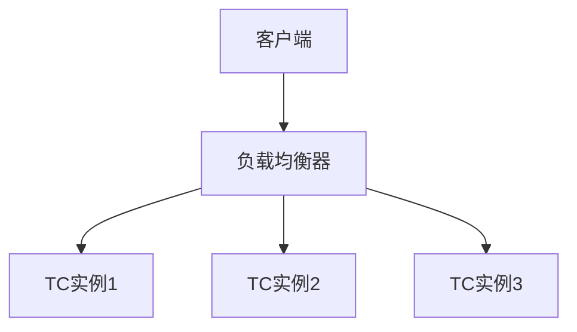

# Seata TC水平扩展

## 介绍

Seata（Simple Extensible Autonomous Transaction Architecture）是一个开源的分布式事务解决方案，旨在解决微服务架构中的分布式事务问题。Seata的核心组件之一是事务协调器（Transaction Coordinator, TC），它负责协调全局事务的提交或回滚。

随着业务规模的扩大，单个TC实例可能无法满足高并发和高可用性的需求。因此，水平扩展TC成为提升系统性能的重要手段。本文将详细介绍如何通过水平扩展来提升Seata TC的性能和可用性。

## 什么是水平扩展？

水平扩展（Horizontal Scaling）是指通过增加更多的服务器或实例来分散负载，从而提高系统的处理能力和可用性。与垂直扩展（增加单个服务器的资源）不同，水平扩展更适用于分布式系统。

在Seata中，水平扩展TC意味着部署多个TC实例，并通过负载均衡器将请求分发到这些实例上。这样可以有效分担单个TC的压力，提高系统的整体性能。

## 如何实现Seata TC的水平扩展？

### 1. 部署多个TC实例

首先，你需要在不同的服务器或容器中部署多个TC实例。每个TC实例都需要配置相同的数据库和注册中心，以确保它们能够协同工作。

```bash
# 启动第一个TC实例
java -jar seata-server.jar -p 8091 -h 192.168.1.1

# 启动第二个TC实例
java -jar seata-server.jar -p 8092 -h 192.168.1.2
```

### 2. 配置负载均衡器

接下来，你需要配置一个负载均衡器（如Nginx或HAProxy）来将请求分发到多个TC实例上。以下是一个简单的Nginx配置示例：

```nginx
http {
    upstream seata_tc {
        server 192.168.1.1:8091;
        server 192.168.1.2:8092;
    }

    server {
        listen 80;

        location / {
            proxy_pass http://seata_tc;
        }
    }
}
```

### 3. 配置客户端

最后，你需要在Seata客户端中配置负载均衡器的地址，而不是直接连接到单个TC实例。以下是一个示例配置：

```properties
seata.tc.server-addr=192.168.1.100:80
```

## 实际案例

假设你有一个电商平台，随着用户量的增加，单个TC实例无法处理大量的订单事务请求。通过水平扩展TC，你可以部署多个TC实例，并通过负载均衡器将请求分发到这些实例上。这样，即使在高并发的情况下，系统也能保持稳定运行。



## 总结

通过水平扩展Seata TC，你可以显著提升系统的性能和可用性。部署多个TC实例并通过负载均衡器分发请求，可以有效分担单个TC的压力，确保系统在高并发情况下的稳定性。

## 附加资源

- [Seata官方文档](https://seata.io/zh-cn/docs/overview/what-is-seata.html)
- [Nginx负载均衡配置指南](https://nginx.org/en/docs/http/load_balancing.html)
- [HAProxy配置指南](https://www.haproxy.org/download/1.8/doc/configuration.txt)

## 练习

1. 尝试在你的本地环境中部署两个Seata TC实例，并配置Nginx进行负载均衡。
2. 使用JMeter或其他压力测试工具，模拟高并发场景，观察水平扩展后的性能提升。

:::tip
在实际生产环境中，建议使用容器化技术（如Docker）来部署和管理多个TC实例，以提高部署效率和可维护性。
:::