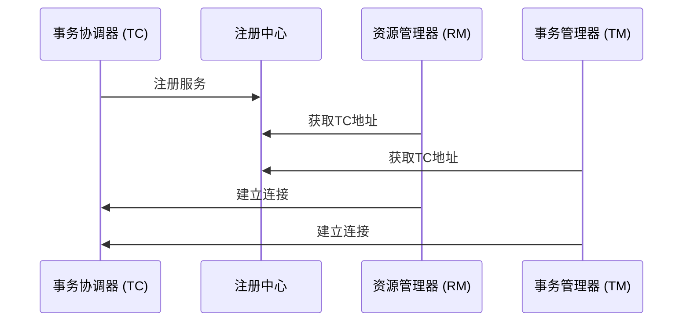
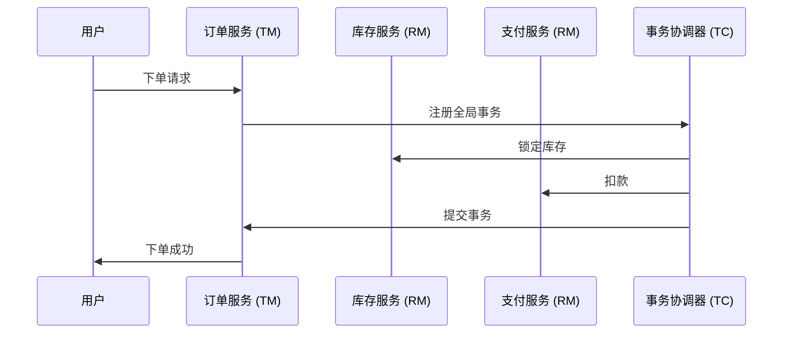

## 介绍

Seata（Simple Extensible Autonomous Transaction Architecture）是一个开源的分布式事务解决方案，旨在解决微服务架构下的分布式事务问题。Seata的核心组件之一是**事务协调器（Transaction Coordinator, TC）**，它负责协调全局事务的提交或回滚。

在Seata的架构中，TC服务注册是一个关键步骤。它允许事务参与者（如RM和TM）发现并连接到TC，从而确保分布式事务的正确执行。本文将详细介绍Seata TC服务注册的概念、配置方法以及实际应用场景。

---

## Seata TC服务注册的工作原理

Seata TC服务注册的核心目的是让事务参与者能够找到并连接到TC服务。TC服务注册通常通过注册中心（如Nacos、Eureka、Zookeeper等）来实现。以下是TC服务注册的基本流程：

1. **TC启动**：TC服务启动时，会向注册中心注册自己的服务信息。
2. **事务参与者发现TC**：事务参与者（如RM和TM）通过注册中心获取TC的地址。
3. **建立连接**：事务参与者与TC建立连接，开始事务的协调工作。



---

## 配置Seata TC服务注册

以下是如何在Seata中配置TC服务注册的步骤。我们以Nacos作为注册中心为例。

### 1. 配置注册中心

在`registry.conf`文件中，配置Nacos作为注册中心：

```conf
registry {
  type = "nacos"
  nacos {
    serverAddr = "127.0.0.1:8848"
    namespace = ""
    cluster = "default"
  }
}
```

### 2. 启动TC服务

启动TC服务时，Seata会自动将TC服务注册到Nacos中。你可以通过Nacos控制台查看已注册的服务。

### 3. 配置事务参与者

在事务参与者（如RM和TM）的配置文件中，指定使用Nacos作为注册中心：

```conf
registry {
  type = "nacos"
  nacos {
    serverAddr = "127.0.0.1:8848"
    namespace = ""
    cluster = "default"
  }
}
```

---

## 实际应用场景

假设我们有一个电商系统，包含订单服务、库存服务和支付服务。每个服务都是一个独立的事务参与者。当用户下单时，订单服务需要调用库存服务和支付服务来完成事务。

1. **订单服务**作为事务的发起者（TM），向TC注册全局事务。
2. **库存服务**和**支付服务**作为资源管理器（RM），通过注册中心发现TC并建立连接。
3. TC协调所有参与者，确保事务的原子性。



---

## 总结

Seata TC服务注册是分布式事务中至关重要的一环。通过注册中心，事务参与者能够动态发现并连接到TC，从而确保事务的正确执行。本文介绍了TC服务注册的工作原理、配置方法以及实际应用场景。

:::tip
**提示**：在实际生产环境中，建议使用高可用的注册中心（如Nacos集群）来确保服务的稳定性。
:::

---

## 附加资源与练习

- **练习**：尝试在本地环境中配置Seata TC服务注册，并使用Nacos作为注册中心。
- **资源**：
  - [Seata官方文档](https://seata.io/zh-cn/docs/)
  - [Nacos官方文档](https://nacos.io/zh-cn/docs/what-is-nacos.html)

通过本文的学习，你应该已经掌握了Seata TC服务注册的基本概念和配置方法。接下来，可以尝试在实际项目中应用这些知识，进一步巩固你的理解。