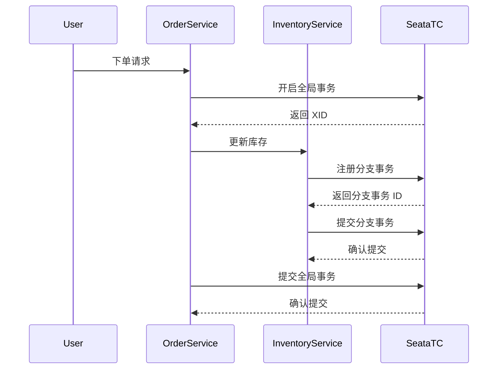

## 介绍

Seata 是一款开源的分布式事务解决方案，其核心组件之一是事务协调器（Transaction Coordinator, TC）。TC 负责管理全局事务的状态，协调分支事务的提交或回滚。为了实现高效的事务管理，TC 需要将事务状态持久化存储。本文将详细介绍 Seata TC 的数据存储机制，帮助初学者理解其工作原理。

## Seata TC 数据存储的核心概念

Seata TC 的数据存储主要包括以下几个方面：

1. **事务日志存储**：记录全局事务和分支事务的状态。
2. **锁存储**：存储事务执行过程中涉及的资源锁信息。
3. **存储介质**：支持多种存储介质，如文件系统、数据库等。

### 事务日志存储

事务日志是 Seata TC 的核心数据，用于记录全局事务和分支事务的状态。事务日志的存储方式直接影响系统的性能和可靠性。

#### 存储格式

事务日志通常以键值对的形式存储，键为全局事务 ID（XID），值为事务状态信息。以下是一个简单的事务日志示例：

```json
{
  "xid": "192.168.1.1:8091:123456",
  "status": "COMMITTED",
  "branchTransactions": [
    {
      "branchId": 1,
      "resourceId": "jdbc:mysql://localhost:3306/db1",
      "status": "COMMITTED"
    },
    {
      "branchId": 2,
      "resourceId": "jdbc:mysql://localhost:3306/db2",
      "status": "COMMITTED"
    }
  ]
}
```

### 锁存储

Seata TC 使用锁机制来保证事务的隔离性。锁存储用于记录事务执行过程中涉及的资源锁信息，防止多个事务同时修改同一资源。

#### 锁存储格式

锁存储通常以资源 ID 为键，锁信息为值。以下是一个简单的锁存储示例：

```json
{
  "resourceId": "jdbc:mysql://localhost:3306/db1",
  "lockKey": "order:1",
  "xid": "192.168.1.1:8091:123456"
}
```

### 存储介质

Seata TC 支持多种存储介质，包括文件系统、数据库等。选择合适的存储介质可以提高系统的性能和可靠性。

#### 文件系统存储

文件系统存储是 Seata TC 的默认存储方式，适用于单机部署场景。事务日志和锁信息存储在本地文件系统中。

#### 数据库存储

数据库存储适用于分布式部署场景，事务日志和锁信息存储在关系型数据库中。Seata 支持 MySQL、Oracle 等主流数据库。

## 实际案例

假设我们有一个电商系统，用户下单时需要同时更新订单表和库存表。为了保证数据一致性，我们使用 Seata 来管理分布式事务。

### 场景描述

1. 用户下单，生成订单记录。
2. 更新库存，减少库存数量。
3. 如果库存不足，回滚订单。

### 事务流程



### 代码示例

以下是一个简单的 Seata 事务管理代码示例：

```java
@GlobalTransactional
public void placeOrder(Order order) {
    // 生成订单
    orderService.createOrder(order);
    // 更新库存
    inventoryService.updateStock(order.getProductId(), order.getQuantity());
}
```

## 总结

Seata TC 的数据存储机制是分布式事务管理的核心。通过事务日志和锁存储，Seata TC 能够有效地管理全局事务和分支事务的状态，保证数据的一致性。选择合适的存储介质可以提高系统的性能和可靠性。

## 附加资源

- [Seata 官方文档](https://seata.io/zh-cn/docs/overview/what-is-seata.html)
- [分布式事务原理与实践](https://book.douban.com/subject/27665177/)

## 练习

1. 尝试在本地部署 Seata TC，并使用文件系统存储事务日志。
2. 修改 Seata TC 的存储配置，将其切换为数据库存储。
3. 编写一个简单的分布式事务应用，模拟电商系统的下单流程。
