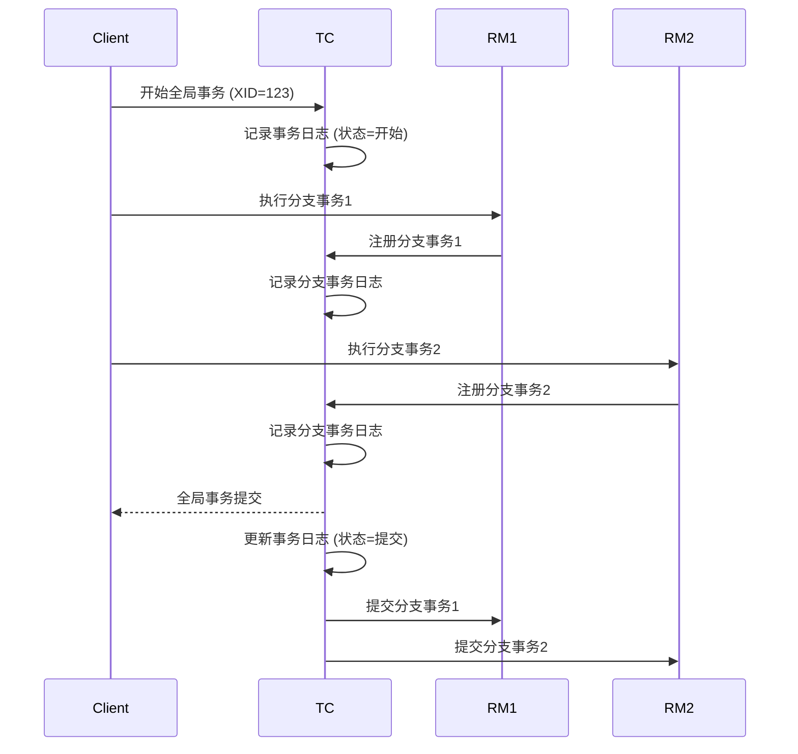

# Seata TC事务日志

Seata（Simple Extensible Autonomous Transaction Architecture）是一个开源的分布式事务解决方案，旨在简化微服务架构中的事务管理。Seata的事务协调器（Transaction Coordinator, TC）是Seata架构中的核心组件之一，负责协调全局事务的提交或回滚。事务日志（Transaction Log）是TC中用于记录事务状态和操作的关键机制，确保事务的原子性和一致性。

本文将详细介绍Seata TC事务日志的工作原理、实际应用场景以及如何通过日志调试事务。

---

## 什么是Seata TC事务日志？

Seata TC事务日志是事务协调器（TC）用于记录全局事务状态和分支事务操作的日志。它主要用于：

1. **事务状态持久化**：记录全局事务的状态（如开始、提交、回滚等），确保在系统崩溃或重启后能够恢复事务状态。
2. **事务操作追踪**：记录每个分支事务的操作，便于调试和排查问题。
3. **事务一致性保障**：通过日志确保事务的原子性和一致性。

事务日志通常存储在数据库中，Seata支持多种数据库作为日志存储介质，如MySQL、PostgreSQL等。

---

## Seata TC事务日志的工作原理

Seata TC事务日志的核心是记录全局事务和分支事务的状态变化。以下是其工作原理的简要说明：

1. **全局事务开始**：当一个全局事务开始时，TC会生成一个全局事务ID（XID），并将其状态记录到事务日志中。
2. **分支事务注册**：每个分支事务在参与全局事务时，会向TC注册，TC会记录分支事务的状态。
3. **事务状态更新**：在全局事务的提交或回滚过程中，TC会更新事务日志中的状态。
4. **事务恢复**：如果TC发生故障或重启，它会从事务日志中恢复未完成的事务状态，并继续处理。

以下是一个简单的事务日志表结构示例：

```sql
CREATE TABLE global_table (
  xid VARCHAR(128) PRIMARY KEY,
  status TINYINT NOT NULL,
  application_id VARCHAR(32),
  transaction_service_group VARCHAR(32),
  transaction_name VARCHAR(128),
  timeout INT,
  begin_time BIGINT,
  application_data VARCHAR(2000),
  gmt_create DATETIME,
  gmt_modified DATETIME
);
```

---

## 事务日志的实际应用场景

### 场景1：事务状态恢复

假设一个全局事务在执行过程中，TC突然崩溃。当TC重启后，它会从事务日志中读取未完成的事务状态，并根据日志中的信息决定是提交还是回滚事务。



### 场景2：事务调试

通过查看事务日志，开发人员可以追踪每个全局事务和分支事务的状态变化，快速定位问题。例如，如果某个分支事务未能成功提交，可以通过日志分析原因。

---

## 代码示例

以下是一个简单的Seata全局事务示例，展示了如何使用Seata API启动和提交事务：

```java
// 启动全局事务
GlobalTransaction tx = GlobalTransactionContext.getCurrentOrCreate();
tx.begin(60000, "myTransactionGroup");

try {
    // 执行业务逻辑
    businessService.doBusiness();

    // 提交全局事务
    tx.commit();
} catch (Exception e) {
    // 回滚全局事务
    tx.rollback();
}
```

在执行过程中，TC会记录事务日志，如下所示：

| XID          | Status | Application ID | Transaction Name | Begin Time  |
|--------------|--------|----------------|------------------|-------------|
| 192.168.1.1:8091:123 | 1      | order-service  | createOrder      | 1698765432100 |

---

## 总结

Seata TC事务日志是确保分布式事务一致性和可靠性的关键机制。通过记录全局事务和分支事务的状态，TC能够在系统崩溃或重启后恢复事务状态，并提供调试和排查问题的依据。

:::tip
在实际开发中，建议定期检查事务日志，确保事务状态的正确性。同时，可以通过配置日志存储介质（如MySQL）来优化日志的读写性能。
:::

---

## 附加资源与练习

1. **练习**：尝试在本地部署Seata，并模拟一个全局事务的提交和回滚过程，观察事务日志的变化。
2. **资源**：
   - [Seata官方文档](https://seata.io/zh-cn/docs/overview/what-is-seata.html)
   - [分布式事务原理与实践](https://book.douban.com/subject/27665177/)

通过本文的学习，你应该对Seata TC事务日志有了初步的了解。接下来，可以尝试在实际项目中应用这些知识，进一步巩固学习成果。