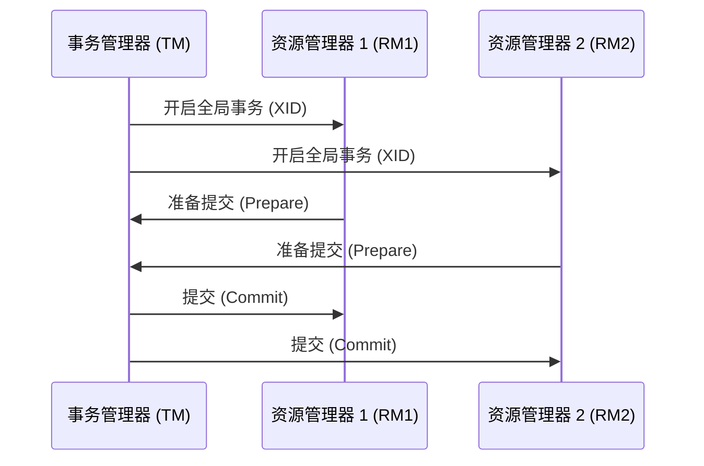

## 介绍

Seata 是一个开源的分布式事务解决方案，旨在简化分布式事务的管理。Seata 的事务管理器（Transaction Manager, TM）是 Seata 架构中的核心组件之一，负责全局事务的创建、提交和回滚。本文将详细介绍 Seata TM 的设计原理，帮助初学者理解其工作机制。

## Seata TM 的核心功能

Seata TM 的主要功能包括：

1. **全局事务的创建与管理**：TM 负责创建全局事务，并为每个全局事务分配一个唯一的 XID（全局事务 ID）。
2. **事务的提交与回滚**：TM 根据业务逻辑的执行结果，决定是提交还是回滚全局事务。
3. **与资源管理器（RM）的交互**：TM 与资源管理器（RM）协作，确保事务的一致性。

## Seata TM 的工作流程

Seata TM 的工作流程可以分为以下几个步骤：

1. **开启全局事务**：TM 通过调用 `GlobalTransaction.begin()` 方法开启一个全局事务，并生成一个唯一的 XID。
2. **执行业务逻辑**：在全局事务的上下文中，执行业务逻辑。业务逻辑可能涉及多个微服务，每个微服务都会通过 XID 与全局事务关联。
3. **提交或回滚事务**：根据业务逻辑的执行结果，TM 决定是提交还是回滚全局事务。如果所有分支事务都执行成功，TM 会提交全局事务；否则，TM 会回滚全局事务。

### 代码示例

以下是一个简单的代码示例，展示了如何使用 Seata TM 开启、提交和回滚全局事务：

```java
// 开启全局事务
GlobalTransaction tx = GlobalTransactionContext.getCurrentOrCreate();
tx.begin(60000, "myTransactionGroup");

try {
    // 执行业务逻辑
    businessService.doSomething();

    // 提交全局事务
    tx.commit();
} catch (Exception e) {
    // 回滚全局事务
    tx.rollback();
    throw e;
}
```

### 输入与输出

- **输入**：业务逻辑的执行结果。
- **输出**：全局事务的提交或回滚。

## Seata TM 的设计原理

Seata TM 的设计基于两阶段提交协议（2PC），但其实现方式与传统 2PC 有所不同。Seata 通过引入全局事务和分支事务的概念，简化了分布式事务的管理。

### 全局事务与分支事务

- **全局事务**：全局事务是由 TM 创建的一个逻辑上的事务，它包含了多个分支事务。
- **分支事务**：分支事务是全局事务中的一个子事务，通常对应一个微服务中的本地事务。

### 两阶段提交协议

Seata TM 的两阶段提交协议分为以下两个阶段：

1. **第一阶段（Prepare 阶段）**：TM 向所有分支事务发送准备请求，分支事务执行本地事务并返回执行结果。
2. **第二阶段（Commit/Rollback 阶段）**：根据第一阶段的结果，TM 决定是提交还是回滚全局事务。如果所有分支事务都准备成功，TM 发送提交请求；否则，TM 发送回滚请求。

### Mermaid 流程图

以下是一个展示 Seata TM 工作流程的 Mermaid 流程图：



## 实际应用场景

Seata TM 在实际应用中有广泛的应用场景，特别是在微服务架构中。以下是一个典型的应用场景：

### 电商系统中的订单处理

在电商系统中，用户下单后，系统需要处理多个微服务，如库存服务、支付服务和订单服务。Seata TM 可以确保这些微服务的事务一致性。例如：

1. **开启全局事务**：用户下单时，TM 开启一个全局事务。
2. **执行业务逻辑**：
   - 库存服务减少库存。
   - 支付服务处理支付。
   - 订单服务创建订单。
3. **提交或回滚事务**：如果所有服务都执行成功，TM 提交全局事务；否则，TM 回滚全局事务，确保数据一致性。

## 总结

Seata TM 是 Seata 分布式事务解决方案中的核心组件，负责全局事务的创建、提交和回滚。通过两阶段提交协议，Seata TM 确保了分布式事务的一致性。本文详细介绍了 Seata TM 的设计原理、工作流程以及实际应用场景，帮助初学者理解其工作机制。

## 附加资源与练习

- **附加资源**：
  - [Seata 官方文档](https://seata.io/zh-cn/docs/overview/what-is-seata.html)
  - [分布式事务与 Seata 实战](https://time.geekbang.org/column/intro/100026801)

- **练习**：
  - 尝试在一个简单的微服务项目中集成 Seata TM，并模拟一个分布式事务场景。
  - 修改代码，观察在不同异常情况下 Seata TM 的行为。

:::tip
建议初学者在理解 Seata TM 的基本原理后，通过实际项目进行实践，以加深对分布式事务管理的理解。
:::