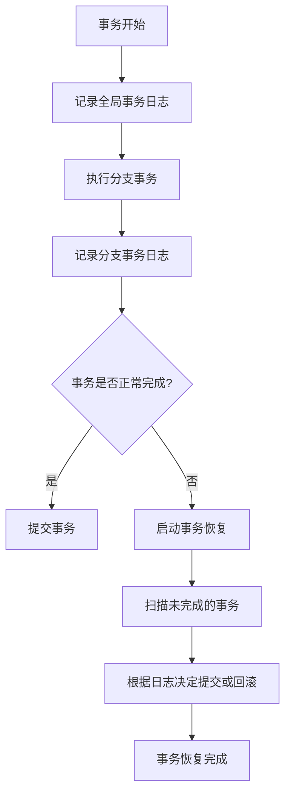

# Seata TM事务恢复

在分布式系统中，事务管理是一个复杂且关键的任务。Seata（Simple Extensible Autonomous Transaction Architecture）是一个开源的分布式事务解决方案，它通过事务管理器（Transaction Manager, TM）来协调全局事务的提交或回滚。然而，在实际应用中，可能会遇到网络故障、服务崩溃等异常情况，导致事务无法正常完成。这时，**事务恢复**机制就显得尤为重要。

本文将详细介绍Seata TM中的事务恢复机制，帮助初学者理解其工作原理，并通过实际案例展示如何应用这一机制。

## 什么是事务恢复？

事务恢复是指在分布式事务执行过程中，由于某些异常情况（如网络中断、服务崩溃等）导致事务未能正常完成时，系统能够自动或手动恢复事务状态，确保数据的一致性。

在Seata中，事务恢复主要由TM负责。TM会定期检查未完成的事务，并根据事务的状态决定是提交还是回滚。这一过程称为**事务恢复**。

## Seata TM事务恢复的工作原理

Seata TM的事务恢复机制主要依赖于以下几个组件：

1. **全局事务日志（Global Transaction Log）**：记录全局事务的状态信息。
2. **分支事务日志（Branch Transaction Log）**：记录每个分支事务的状态信息。
3. **事务恢复服务（Transaction Recovery Service）**：定期扫描未完成的事务，并根据日志信息进行恢复。

### 事务恢复的流程

1. **事务日志记录**：在事务执行过程中，TM会记录全局事务和分支事务的状态信息。
2. **异常检测**：当系统检测到事务未正常完成时，TM会启动事务恢复流程。
3. **事务恢复**：TM根据事务日志中的信息，决定是提交还是回滚未完成的事务。



## 代码示例

以下是一个简单的Seata事务恢复的代码示例。假设我们有一个分布式事务，包含两个分支事务：`serviceA`和`serviceB`。

```java
@GlobalTransactional
public void globalTransaction() {
    // 分支事务A
    serviceA.doSomething();
    
    // 分支事务B
    serviceB.doSomething();
}
```

在这个例子中，`@GlobalTransactional`注解表示这是一个全局事务。如果`serviceA`或`serviceB`在执行过程中发生异常，TM会自动启动事务恢复流程。

### 输入与输出

- **输入**：全局事务开始，执行`serviceA`和`serviceB`。
- **输出**：
  - 如果两个分支事务都成功执行，全局事务提交。
  - 如果任一分支事务失败，全局事务回滚。

## 实际应用场景

假设我们有一个电商系统，用户下单后需要同时扣减库存和生成订单。这两个操作分别由`库存服务`和`订单服务`处理。如果`库存服务`成功扣减库存，但`订单服务`在生成订单时失败，这时就需要事务恢复机制来确保数据的一致性。

```java
@GlobalTransactional
public void placeOrder(Order order) {
    // 扣减库存
    inventoryService.deductStock(order.getProductId(), order.getQuantity());
    
    // 生成订单
    orderService.createOrder(order);
}
```

在这个场景中，如果`createOrder`方法执行失败，TM会自动回滚`deductStock`操作，确保库存数据的一致性。

## 总结

Seata TM的事务恢复机制是确保分布式事务数据一致性的关键。通过全局事务日志和分支事务日志，TM能够在事务执行过程中检测异常，并根据日志信息进行事务恢复。这一机制在实际应用中非常重要，尤其是在面对网络故障、服务崩溃等异常情况时。

## 附加资源与练习

- **练习**：尝试在一个简单的分布式系统中实现Seata事务恢复机制，模拟网络故障和服务崩溃的场景，观察事务恢复的效果。
- **资源**：
  - [Seata官方文档](https://seata.io/zh-cn/docs/overview/what-is-seata.html)
  - [分布式事务原理与实践](https://book.douban.com/subject/30266336/)

通过本文的学习，你应该对Seata TM的事务恢复机制有了初步的了解。希望你能在实际项目中应用这一机制，确保分布式事务的数据一致性。