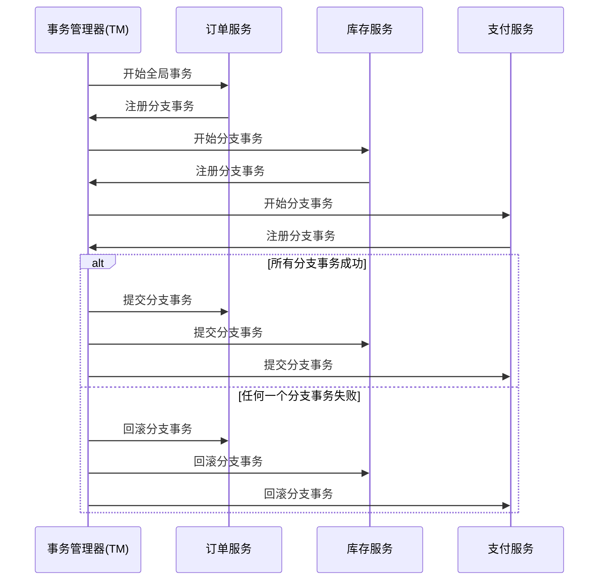

# Seata TM全局事务

## 介绍

在分布式系统中，事务管理是一个复杂且关键的问题。Seata（Simple Extensible Autonomous Transaction Architecture）是一个开源的分布式事务解决方案，旨在简化分布式事务的管理。Seata的事务管理器（Transaction Manager, TM）负责协调全局事务的提交或回滚，确保多个服务之间的数据一致性。

全局事务是指跨越多个服务或数据库的事务操作。Seata TM通过协调各个分支事务（Branch Transaction）来确保全局事务的一致性。本文将详细介绍Seata TM全局事务的工作原理、实现方式以及实际应用场景。

## 全局事务的工作原理

### 1. 事务的发起

全局事务由TM发起，TM负责协调整个事务的生命周期。当一个全局事务开始时，TM会生成一个全局唯一的事务ID（XID），并将其传递给所有参与事务的服务。

```java
// 示例：发起全局事务
GlobalTransaction tx = GlobalTransactionContext.getCurrentOrCreate();
tx.begin();
```

### 2. 分支事务的注册

每个参与事务的服务（称为资源管理器，Resource Manager, RM）在本地执行事务操作时，会向TM注册一个分支事务。分支事务是全局事务的一部分，负责管理本地资源的提交或回滚。

```java
// 示例：注册分支事务
BranchTransaction branchTx = new BranchTransaction();
branchTx.register();
```

### 3. 事务的提交或回滚

当所有分支事务都执行成功后，TM会向所有RM发送提交请求，确保所有分支事务都提交。如果任何一个分支事务失败，TM会向所有RM发送回滚请求，确保所有分支事务都回滚。

```java
// 示例：提交全局事务
tx.commit();

// 示例：回滚全局事务
tx.rollback();
```

### 4. 事务的恢复

在分布式环境中，网络故障或服务宕机可能导致事务状态不一致。Seata TM通过日志记录和定时任务来恢复未完成的事务，确保数据的一致性。

## 实际应用场景

### 场景：电商订单系统

假设我们有一个电商系统，用户下单时需要同时更新订单服务、库存服务和支付服务。这三个服务分别位于不同的数据库中，因此需要使用全局事务来确保数据的一致性。

1. **订单服务**：创建订单记录。
2. **库存服务**：减少库存数量。
3. **支付服务**：扣除用户账户余额。

如果任何一个服务操作失败，整个事务需要回滚，确保数据的一致性。



## 总结

Seata TM全局事务是分布式系统中确保数据一致性的重要机制。通过协调多个分支事务，Seata TM能够有效地管理全局事务的提交或回滚。本文介绍了Seata TM全局事务的工作原理、实现方式以及实际应用场景，希望能够帮助初学者更好地理解和应用这一概念。

## 附加资源

- [Seata官方文档](https://seata.io/zh-cn/docs/overview/what-is-seata.html)
- [分布式事务解决方案比较](https://dzone.com/articles/distributed-transaction-solutions-comparison)

## 练习

1. 尝试在一个简单的分布式系统中实现Seata TM全局事务。
2. 模拟一个事务失败场景，观察Seata TM如何处理事务回滚。
3. 阅读Seata源码，深入了解TM的实现细节。
