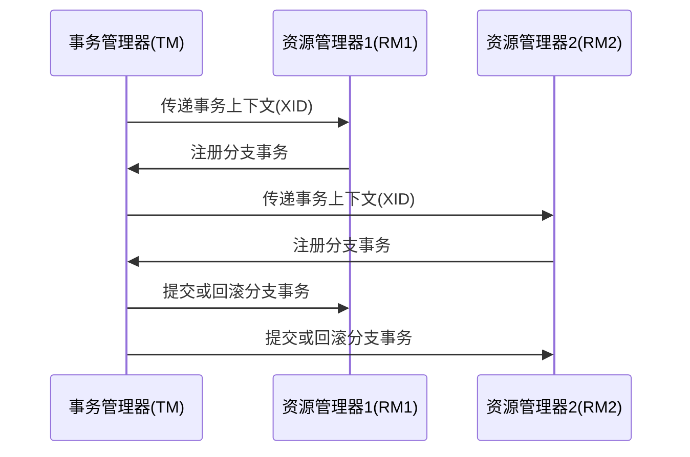

# Seata TM事务上下文

## 介绍

在分布式系统中，事务管理是一个复杂且关键的任务。Seata（Simple Extensible Autonomous Transaction Architecture）是一个开源的分布式事务解决方案，旨在简化分布式事务的管理。Seata的事务管理器（TM）负责协调全局事务的提交或回滚。而**事务上下文**则是Seata TM中用于传递事务信息的关键机制。

事务上下文是一个包含事务ID、分支事务ID等信息的对象，它在分布式事务的各个参与者之间传递，确保事务的一致性和完整性。理解事务上下文的工作原理对于正确使用Seata至关重要。

## 事务上下文的工作原理

在Seata中，事务上下文由TM创建，并通过RPC调用传递给各个资源管理器（RM）。事务上下文的主要作用是确保所有参与者在同一个全局事务中执行操作。以下是事务上下文的传递过程：

1. **事务开始**：TM启动一个全局事务，并生成一个全局事务ID（XID）。
2. **事务上下文传递**：TM将XID传递给各个RM，RM根据XID注册分支事务。
3. **事务提交或回滚**：TM根据全局事务的状态决定提交或回滚所有分支事务。



## 代码示例

以下是一个简单的代码示例，展示如何在Java中使用Seata TM创建和传递事务上下文。

```java
import io.seata.core.context.RootContext;
import io.seata.tm.api.TransactionalTemplate;

public class SeataTmExample {

    public void performTransaction() {
        // 开始全局事务
        String xid = RootContext.getXID();
        if (xid == null) {
            xid = RootContext.bind("your_xid_here");
        }

        // 执行业务逻辑
        try {
            // 业务逻辑代码
            // ...

            // 提交全局事务
            TransactionalTemplate.commit();
        } catch (Exception e) {
            // 回滚全局事务
            TransactionalTemplate.rollback();
        } finally {
            // 清理事务上下文
            RootContext.unbind();
        }
    }
}
```

:::note
在实际应用中，`your_xid_here` 应该是一个唯一的全局事务ID，通常由Seata自动生成。
:::

## 实际应用场景

假设你正在开发一个电商系统，用户下单时需要同时更新库存和订单状态。这两个操作分别由不同的微服务处理，因此需要确保它们在同一事务中执行。

1. **用户下单**：订单服务接收到用户请求，开始一个全局事务。
2. **更新库存**：订单服务调用库存服务，传递事务上下文。
3. **更新订单状态**：订单服务调用订单状态服务，传递事务上下文。
4. **事务提交或回滚**：如果所有操作成功，提交事务；否则回滚事务。

通过使用Seata TM的事务上下文，你可以确保库存和订单状态的更新在同一事务中完成，从而保证数据的一致性。

## 总结

Seata TM的事务上下文是分布式事务管理中的关键机制，它确保了全局事务的一致性和完整性。通过理解事务上下文的工作原理，并掌握其在实际应用中的使用方法，你可以更好地设计和实现分布式系统。

:::tip
为了进一步巩固你的理解，建议你尝试在本地环境中运行Seata，并编写一个简单的分布式事务示例。
:::

## 附加资源

- [Seata官方文档](https://seata.io/zh-cn/docs/overview/what-is-seata.html)
- [分布式事务理论与实践](https://www.oreilly.com/library/view/distributed-systems-principles/9781492043015/)

:::caution
在实际生产环境中使用Seata时，请确保充分测试事务管理逻辑，以避免潜在的数据一致性问题。
:::