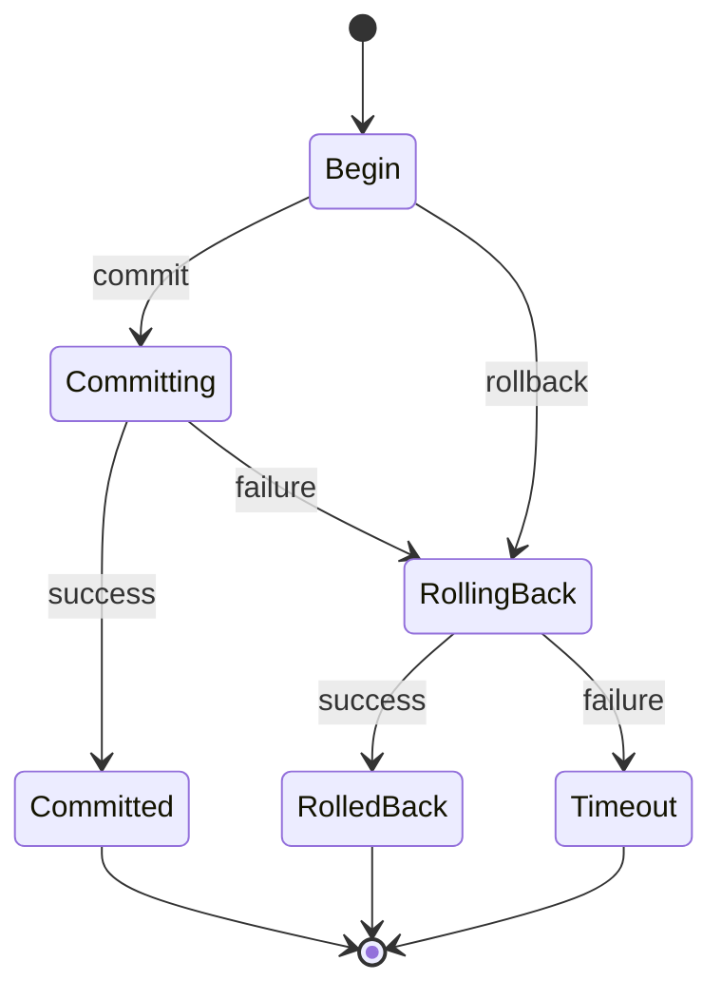

## 介绍

在分布式系统中，事务管理是一个复杂但至关重要的部分。Seata（Simple Extensible Autonomous Transaction Architecture）是一个开源的分布式事务解决方案，它通过事务管理器（Transaction Manager, TM）来协调和管理事务的状态。理解Seata TM的事务状态对于构建可靠的分布式系统至关重要。

本文将详细介绍Seata TM的事务状态，包括其生命周期、状态转换以及如何在实际应用中使用这些状态来确保数据的一致性。

## Seata TM事务状态概述

Seata TM的事务状态主要分为以下几种：

1. **Begin**：事务开始。
2. **Committing**：事务正在提交。
3. **Committed**：事务已成功提交。
4. **Rolling Back**：事务正在回滚。
5. **Rolled Back**：事务已成功回滚。
6. **Timeout**：事务超时。

这些状态描述了事务从开始到结束的整个生命周期。理解这些状态及其转换是掌握Seata TM的关键。

## 事务状态转换

事务状态之间的转换可以通过以下状态图来表示：



### 状态转换说明

- **Begin**：事务开始时，状态为`Begin`。
- **Committing**：当事务提交时，状态从`Begin`转换为`Committing`。
- **Committed**：如果提交成功，状态从`Committing`转换为`Committed`。
- **Rolling Back**：如果提交失败或显式回滚，状态从`Committing`或`Begin`转换为`Rolling Back`。
- **Rolled Back**：如果回滚成功，状态从`Rolling Back`转换为`Rolled Back`。
- **Timeout**：如果事务超时，状态从`Rolling Back`转换为`Timeout`。

## 代码示例

以下是一个简单的Java代码示例，展示了如何使用Seata TM来管理事务状态：

```java
import io.seata.tm.api.TransactionalTemplate;

public class SeataTMExample {

    private TransactionalTemplate transactionalTemplate;

    public void performTransaction() {
        transactionalTemplate.execute(status -> {
            // 业务逻辑
            try {
                // 模拟业务操作
                System.out.println("Performing business logic...");
                // 提交事务
                status.commit();
            } catch (Exception e) {
                // 回滚事务
                status.rollback();
            }
            return null;
        });
    }
}
```

### 输入与输出

- **输入**：调用`performTransaction()`方法。
- **输出**：
  - 如果业务逻辑成功执行，输出为：
    ```
    Performing business logic...
    Transaction committed.
    ```
  - 如果业务逻辑执行失败，输出为：
    ```
    Performing business logic...
    Transaction rolled back.
    ```

## 实际应用场景

假设你正在开发一个电商系统，用户下单后需要扣减库存并生成订单。这两个操作需要在一个事务中完成，以确保数据的一致性。使用Seata TM可以轻松管理这个分布式事务。

```java
public class OrderService {

    private TransactionalTemplate transactionalTemplate;
    private InventoryService inventoryService;
    private OrderRepository orderRepository;

    public void placeOrder(Order order) {
        transactionalTemplate.execute(status -> {
            try {
                // 扣减库存
                inventoryService.decreaseStock(order.getProductId(), order.getQuantity());
                // 生成订单
                orderRepository.save(order);
                // 提交事务
                status.commit();
            } catch (Exception e) {
                // 回滚事务
                status.rollback();
            }
            return null;
        });
    }
}
```

在这个例子中，如果库存扣减或订单生成失败，事务将回滚，确保数据的一致性。

## 总结

Seata TM的事务状态是分布式事务管理中的核心概念。通过理解事务的生命周期及其状态转换，你可以更好地设计和实现可靠的分布式系统。本文介绍了Seata TM的事务状态、状态转换、代码示例以及实际应用场景，希望能帮助你掌握这一重要概念。

## 附加资源与练习

- **练习**：尝试在本地环境中配置Seata，并编写一个简单的分布式事务示例。
- **资源**：
  - [Seata官方文档](https://seata.io/zh-cn/docs/overview/what-is-seata.html)
  - [分布式事务理论与实践](https://www.oreilly.com/library/view/distributed-systems-principles/9781492043015/)

通过不断实践和深入学习，你将能够熟练运用Seata TM来管理复杂的分布式事务。