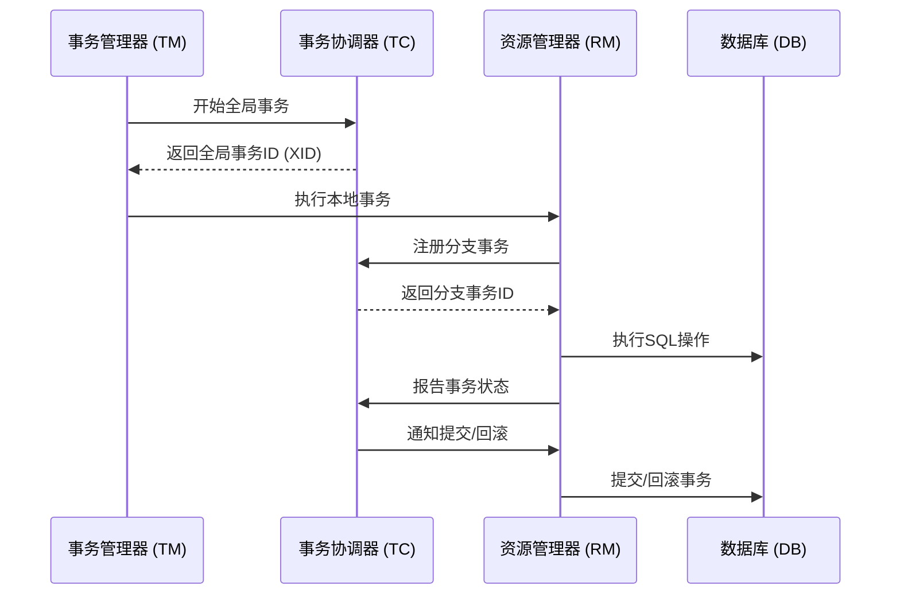

# Seata RM 设计原理

Seata（Simple Extensible Autonomous Transaction Architecture）是一款开源的分布式事务解决方案，旨在解决微服务架构下的数据一致性问题。Seata 的核心组件之一是资源管理器（Resource Manager，简称 RM），它负责与底层数据库交互，管理本地事务的提交和回滚。本文将详细介绍 Seata RM 的设计原理，帮助初学者理解其工作机制。

## 什么是 Seata RM？

Seata RM 是 Seata 框架中的一个重要组件，负责管理本地资源（通常是数据库）的事务操作。它与事务协调器（TC）和事务管理器（TM）协同工作，确保分布式事务的一致性。RM 的主要职责包括：

1. **注册分支事务**：在分布式事务开始时，RM 会向 TC 注册分支事务。
2. **执行本地事务**：RM 负责执行本地事务的提交或回滚。
3. **报告事务状态**：RM 向 TC 报告本地事务的执行结果。

## Seata RM 的核心设计

### 1. 分支事务注册

在分布式事务中，每个参与者（即服务）都会启动一个本地事务，这些本地事务被称为分支事务。RM 需要将这些分支事务注册到 TC 中，以便 TC 能够全局管理这些事务。

```java
// 示例：分支事务注册
BranchRegisterRequest request = new BranchRegisterRequest();
request.setXid("全局事务ID");
request.setResourceId("资源ID");
request.setBranchType(BranchType.AT);
request.setApplicationData("应用数据");

BranchRegisterResponse response = rmClient.branchRegister(request);
```

### 2. 本地事务执行

RM 负责执行本地事务的提交或回滚。在执行过程中，RM 会记录事务的 undo log，以便在需要时进行回滚。

```java
// 示例：本地事务提交
Connection connection = dataSource.getConnection();
connection.setAutoCommit(false);

// 执行 SQL 操作
Statement statement = connection.createStatement();
statement.executeUpdate("UPDATE account SET balance = balance - 100 WHERE id = 1");

// 提交事务
connection.commit();
```

### 3. 事务状态报告

本地事务执行完成后，RM 需要向 TC 报告事务的执行状态（提交或回滚）。TC 根据所有分支事务的状态决定全局事务的最终状态。

```java
// 示例：事务状态报告
BranchReportRequest request = new BranchReportRequest();
request.setXid("全局事务ID");
request.setBranchId("分支事务ID");
request.setStatus(BranchStatus.PhaseOne_Done);

BranchReportResponse response = rmClient.branchReport(request);
```

## Seata RM 的工作流程

为了更好地理解 Seata RM 的工作流程，我们可以通过以下步骤来描述其执行过程：

1. **事务开始**：TM 发起全局事务，生成全局事务 ID（XID）。
2. **分支事务注册**：RM 向 TC 注册分支事务，获取分支事务 ID。
3. **本地事务执行**：RM 执行本地事务，并记录 undo log。
4. **事务状态报告**：RM 向 TC 报告本地事务的执行状态。
5. **全局事务提交/回滚**：TC 根据所有分支事务的状态决定全局事务的最终状态，并通知 RM 执行相应的操作。



## 实际应用场景

假设我们有一个电商系统，用户下单后需要扣减库存和账户余额。这两个操作分别由库存服务和账户服务完成，属于分布式事务。Seata RM 在这两个服务中分别管理本地事务，确保数据一致性。

1. **库存服务**：扣减库存，RM 管理库存数据库的本地事务。
2. **账户服务**：扣减余额，RM 管理账户数据库的本地事务。

如果其中一个服务的事务失败，Seata 会通过 RM 回滚所有相关事务，确保数据一致性。

## 总结

Seata RM 是 Seata 分布式事务框架中的关键组件，负责管理本地事务的执行和状态报告。通过分支事务注册、本地事务执行和事务状态报告，RM 确保了分布式事务的一致性。理解 Seata RM 的设计原理对于掌握 Seata 框架至关重要。

## 附加资源

- [Seata 官方文档](https://seata.io/zh-cn/docs/overview/what-is-seata.html)
- [分布式事务解决方案对比](https://dzone.com/articles/distributed-transaction-solutions-comparison)

## 练习

1. 尝试在一个简单的 Spring Boot 项目中集成 Seata，并使用 RM 管理本地事务。
2. 模拟一个分布式事务场景，观察 RM 在不同事务状态下的行为。

:::tip
在实践过程中，建议使用 Seata 的 AT 模式（自动补偿模式），它是最常用的模式之一，适合初学者快速上手。
:::