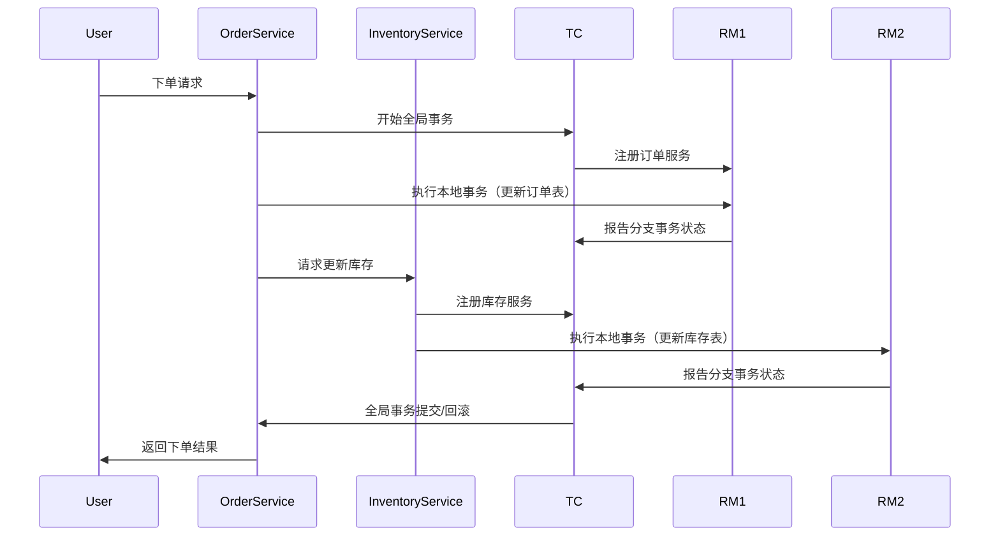

# Seata RM职责范围

## 介绍

在分布式系统中，事务管理是一个复杂且关键的任务。Seata（Simple Extensible Autonomous Transaction Architecture）是一个开源的分布式事务解决方案，旨在简化分布式事务的管理。Seata的核心组件之一是资源管理器（Resource Manager，简称RM），它负责与底层数据库交互，管理本地事务，并与事务协调器（TC）协作，确保全局事务的一致性。

本文将详细介绍Seata RM的职责范围，帮助初学者理解其在分布式事务中的作用。

## Seata RM的职责

Seata RM的主要职责包括以下几个方面：

### 1. 本地事务管理

RM负责管理本地事务的生命周期。它需要确保本地事务的正确提交或回滚，并与全局事务保持一致。RM通过与数据库的交互，执行SQL语句，并记录事务日志。

```java
// 示例：本地事务管理
public void executeLocalTransaction() {
    Connection conn = getConnection();
    try {
        conn.setAutoCommit(false);
        // 执行SQL语句
        executeSQL(conn, "INSERT INTO orders (id, amount) VALUES (1, 100)");
        // 提交本地事务
        conn.commit();
    } catch (SQLException e) {
        // 回滚本地事务
        conn.rollback();
    } finally {
        conn.close();
    }
}
```

### 2. 全局事务注册

在全局事务开始时，RM需要向事务协调器（TC）注册自己，以便TC能够跟踪和管理所有参与全局事务的资源。注册过程中，RM会提供本地事务的相关信息，如事务ID、资源ID等。

```java
// 示例：全局事务注册
public void registerWithTC() {
    String xid = getGlobalTransactionId();
    String resourceId = getResourceId();
    // 向TC注册
    tcClient.registerResource(xid, resourceId);
}
```

### 3. 分支事务管理

在全局事务中，每个本地事务被视为一个分支事务。RM需要管理这些分支事务的状态，包括分支事务的提交和回滚。RM通过与TC的通信，确保分支事务与全局事务的一致性。

```java
// 示例：分支事务管理
public void manageBranchTransaction(String xid) {
    try {
        // 执行分支事务
        executeBranchTransaction(xid);
        // 向TC报告分支事务状态
        tcClient.reportBranchStatus(xid, BranchStatus.PhaseOne_Committed);
    } catch (Exception e) {
        // 回滚分支事务
        tcClient.reportBranchStatus(xid, BranchStatus.PhaseOne_Rollbacked);
    }
}
```

### 4. 事务日志管理

RM需要记录事务日志，以便在系统崩溃或网络故障时能够恢复事务状态。事务日志通常包括事务ID、分支事务ID、SQL语句等信息。

```java
// 示例：事务日志管理
public void logTransaction(String xid, String branchId, String sql) {
    TransactionLog log = new TransactionLog(xid, branchId, sql);
    logRepository.save(log);
}
```

## 实际案例

假设我们有一个电商系统，用户下单时需要同时更新订单表和库存表。这两个操作分别由不同的服务处理，因此需要分布式事务来确保数据一致性。



在这个案例中，订单服务和库存服务分别作为RM1和RM2，管理各自的本地事务，并与TC协作，确保全局事务的一致性。

## 总结

Seata RM在分布式事务中扮演着至关重要的角色，负责管理本地事务、注册全局事务、管理分支事务以及记录事务日志。通过理解RM的职责范围，初学者可以更好地掌握Seata的工作原理，并在实际项目中应用分布式事务解决方案。

## 附加资源

- [Seata官方文档](https://seata.io/zh-cn/docs/overview/what-is-seata.html)
- [分布式事务理论与实践](https://www.oreilly.com/library/view/distributed-systems-principles/9781492043015/)
- [Seata GitHub仓库](https://github.com/seata/seata)

## 练习

1. 尝试在本地环境中搭建一个简单的Seata项目，模拟上述电商系统的下单流程。
2. 修改代码，模拟分支事务失败的情况，观察Seata如何处理事务回滚。
3. 阅读Seata源码，深入了解RM的实现细节。

:::tip
在学习和实践过程中，遇到问题时可以参考Seata的官方文档和社区资源，积极参与讨论，提升自己的理解。
:::